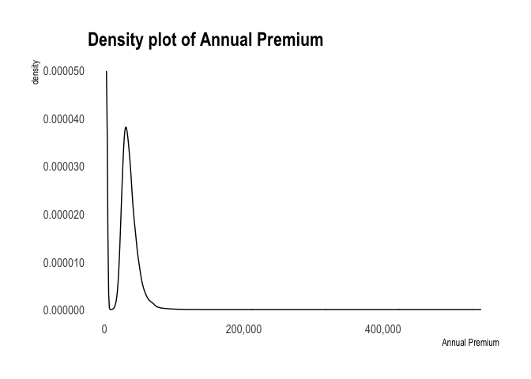

``` r
library(haven)
library(data.table)
library(tidyverse)
```

    ## ── Attaching packages ─────────────────────────────────────────────────────────────────────── tidyverse 1.3.0 ──

    ## ✓ ggplot2 3.3.2     ✓ purrr   0.3.4
    ## ✓ tibble  3.0.3     ✓ dplyr   1.0.2
    ## ✓ tidyr   1.1.0     ✓ stringr 1.4.0
    ## ✓ readr   1.3.1     ✓ forcats 0.5.0

    ## ── Conflicts ────────────────────────────────────────────────────────────────────────── tidyverse_conflicts() ──
    ## x dplyr::between()   masks data.table::between()
    ## x dplyr::filter()    masks stats::filter()
    ## x dplyr::first()     masks data.table::first()
    ## x dplyr::lag()       masks stats::lag()
    ## x dplyr::last()      masks data.table::last()
    ## x purrr::transpose() masks data.table::transpose()

``` r
library(dplyr)
train <- fread("data/insurance_train.csv")
test <- fread("data/insurance_test.csv")
```

#### Executive Summary

#### Inference Analysis

## Data Exploration and Cleaning

``` r
str(train)
```

    ## Classes 'data.table' and 'data.frame':   381109 obs. of  12 variables:
    ##  $ id                  : int  1 2 3 4 5 6 7 8 9 10 ...
    ##  $ Gender              : chr  "Male" "Male" "Male" "Male" ...
    ##  $ Age                 : int  44 76 47 21 29 24 23 56 24 32 ...
    ##  $ Driving_License     : int  1 1 1 1 1 1 1 1 1 1 ...
    ##  $ Region_Code         : num  28 3 28 11 41 33 11 28 3 6 ...
    ##  $ Previously_Insured  : int  0 0 0 1 1 0 0 0 1 1 ...
    ##  $ Vehicle_Age         : chr  "> 2 Years" "1-2 Year" "> 2 Years" "< 1 Year" ...
    ##  $ Vehicle_Damage      : chr  "Yes" "No" "Yes" "No" ...
    ##  $ Annual_Premium      : num  40454 33536 38294 28619 27496 ...
    ##  $ Policy_Sales_Channel: num  26 26 26 152 152 160 152 26 152 152 ...
    ##  $ Vintage             : int  217 183 27 203 39 176 249 72 28 80 ...
    ##  $ Response            : int  1 0 1 0 0 0 0 1 0 0 ...
    ##  - attr(*, ".internal.selfref")=<externalptr>

``` r
summary(train)
```

    ##        id            Gender               Age        Driving_License 
    ##  Min.   :     1   Length:381109      Min.   :20.00   Min.   :0.0000  
    ##  1st Qu.: 95278   Class :character   1st Qu.:25.00   1st Qu.:1.0000  
    ##  Median :190555   Mode  :character   Median :36.00   Median :1.0000  
    ##  Mean   :190555                      Mean   :38.82   Mean   :0.9979  
    ##  3rd Qu.:285832                      3rd Qu.:49.00   3rd Qu.:1.0000  
    ##  Max.   :381109                      Max.   :85.00   Max.   :1.0000  
    ##   Region_Code    Previously_Insured Vehicle_Age        Vehicle_Damage    
    ##  Min.   : 0.00   Min.   :0.0000     Length:381109      Length:381109     
    ##  1st Qu.:15.00   1st Qu.:0.0000     Class :character   Class :character  
    ##  Median :28.00   Median :0.0000     Mode  :character   Mode  :character  
    ##  Mean   :26.39   Mean   :0.4582                                          
    ##  3rd Qu.:35.00   3rd Qu.:1.0000                                          
    ##  Max.   :52.00   Max.   :1.0000                                          
    ##  Annual_Premium   Policy_Sales_Channel    Vintage         Response     
    ##  Min.   :  2630   Min.   :  1          Min.   : 10.0   Min.   :0.0000  
    ##  1st Qu.: 24405   1st Qu.: 29          1st Qu.: 82.0   1st Qu.:0.0000  
    ##  Median : 31669   Median :133          Median :154.0   Median :0.0000  
    ##  Mean   : 30564   Mean   :112          Mean   :154.3   Mean   :0.1226  
    ##  3rd Qu.: 39400   3rd Qu.:152          3rd Qu.:227.0   3rd Qu.:0.0000  
    ##  Max.   :540165   Max.   :163          Max.   :299.0   Max.   :1.0000

``` r
colnames(train) # check column names for the dataset
```

    ##  [1] "id"                   "Gender"               "Age"                 
    ##  [4] "Driving_License"      "Region_Code"          "Previously_Insured"  
    ##  [7] "Vehicle_Age"          "Vehicle_Damage"       "Annual_Premium"      
    ## [10] "Policy_Sales_Channel" "Vintage"              "Response"

``` r
library(scales)
```

    ## 
    ## Attaching package: 'scales'

    ## The following object is masked from 'package:purrr':
    ## 
    ##     discard

    ## The following object is masked from 'package:readr':
    ## 
    ##     col_factor

``` r
ggplot(train, aes(x=Annual_Premium)) + 
  geom_density(fill = "blue", alpha = 0.3) + # Use geom_density to get density plot
  theme_bw() + # Set theme for plot
  theme(panel.grid.major = element_blank(), # Turn of the background grid
        panel.grid.minor = element_blank(),
        panel.border = element_blank(),
        panel.background = element_blank()) +
  scale_x_continuous(labels=comma)+
  scale_y_continuous(labels=comma)+
  labs(x = "Annual Premium", # Set plot labels
       title = "Density plot of Annual Premium")
```

<!-- -->

``` r
ggplot(train, aes(x=Age)) + 
  geom_density(fill = "blue", alpha = 0.3) + # Use geom_density to get density plot
  theme_bw() + # Set theme for plot
  theme(panel.grid.major = element_blank(), # Turn of the background grid
        panel.grid.minor = element_blank(),
        panel.border = element_blank(),
        panel.background = element_blank()) +
  scale_y_continuous(labels=comma)+
  labs(x = "Age", # Set plot labels
       title = "Density plot of Age")
```

<!-- -->

``` r
train <- train%>%
  rename(Vehicle_Insured=Previously_Insured)%>%  #change the column name to vehicle_insured 
  mutate(id=as.character(id),
         Gender=as.factor(Gender),
         Driving_License=as.factor(Driving_License),
         Vehicle_Insured=as.factor(Vehicle_Insured),
         Vehicle_Age=as.factor(Vehicle_Age),
         Vehicle_Damage=as.factor(Vehicle_Damage),
         Policy_Sales_Channel=as.factor(as.character(Policy_Sales_Channel)),
         Region_Code=as.factor(as.character(Region_Code)),
         Response=as.factor(as.character(Response)))

train$Vehicle_Age <-  fct_relevel(train$Vehicle_Age,"< 1 Year","1-2 Year","> 2 Years") #reorder level
```

## Correlation between Numeric Variables

``` r
train_numeric <- train%>%
  dplyr::select(where(is.numeric))

cor(train_numeric)
```

    ##                         Age Annual_Premium       Vintage
    ## Age             1.000000000   0.0675070016 -0.0012640787
    ## Annual_Premium  0.067507002   1.0000000000 -0.0006084172
    ## Vintage        -0.001264079  -0.0006084172  1.0000000000

``` r
library(corrplot)
```

    ## corrplot 0.84 loaded

``` r
L <- cor(train_numeric)  # make correlation matrix
corrplot(L, type="lower")  # make correlation plot
```

<!-- -->

Not too much correlation between those three numeric variables

## Association between Categorical Variables

``` r
chisq.test(train$Response, train$Driving_License, correct = FALSE)
```

    ## 
    ##  Pearson's Chi-squared test
    ## 
    ## data:  train$Response and train$Driving_License
    ## X-squared = 39.303, df = 1, p-value = 3.629e-10

``` r
chisq.test(train$Response, train$Vehicle_Damage, correct = FALSE)
```

    ## 
    ##  Pearson's Chi-squared test
    ## 
    ## data:  train$Response and train$Vehicle_Damage
    ## X-squared = 47867, df = 1, p-value < 2.2e-16

``` r
chisq.test(train$Response, train$Vehicle_Insured,  correct = FALSE)
```

    ## 
    ##  Pearson's Chi-squared test
    ## 
    ## data:  train$Response and train$Vehicle_Insured
    ## X-squared = 44360, df = 1, p-value < 2.2e-16

``` r
chisq.test(train$Response, train$Vehicle_Age,  correct = FALSE)
```

    ## 
    ##  Pearson's Chi-squared test
    ## 
    ## data:  train$Response and train$Vehicle_Age
    ## X-squared = 18772, df = 2, p-value < 2.2e-16

Since all p values are less than 0.01, we have up to 99% confidence that
all four pairs of variables are associated. We can use assoc to see some
directions of the association.

``` r
train_factor <- train%>%
  dplyr::select(where(is.factor))

library(vcd)
```

    ## Loading required package: grid

``` r
train_factor%>%
  dplyr::select(Response,Driving_License)%>%
  assoc(shade=TRUE)
```

<!-- -->

``` r
train_factor%>%
  dplyr::select(Response, Vehicle_Damage)%>%
  assoc(shade=TRUE)
```

<!-- -->

``` r
train_factor%>%
  dplyr::select(Response,Vehicle_Insured)%>%
  assoc(shade=TRUE)
```

<!-- -->

``` r
train_factor%>%
  dplyr::select(Response,Vehicle_Age)%>%
  assoc(shade=TRUE)
```

<!-- -->

We can see customers without a driving license, they are way much less
likely to be interested in vehicle insurance, which totally makes sense.
A larger amount of customers are interested in the vehicle insurance if
their car had some damages in the past. And we can see customers who
does not have vehicle insurance are more likely to be interested in
company’s vehicle insurance. When Vehicles’ ages are 1-2 year or 2 years
older, customers are more likey to be interested in the vehicle
insurance.

## Interaction

``` r
intMod<- lm(Annual_Premium ~ Vehicle_Age*Gender , data = train)

summary(intMod)
```

    ## 
    ## Call:
    ## lm(formula = Annual_Premium ~ Vehicle_Age * Gender, data = train)
    ## 
    ## Residuals:
    ##    Min     1Q Median     3Q    Max 
    ## -33559  -6029   1182   8793 509866 
    ## 
    ## Coefficients:
    ##                                 Estimate Std. Error t value Pr(>|t|)    
    ## (Intercept)                     29974.88      56.85 527.305  < 2e-16 ***
    ## Vehicle_Age1-2 Year               714.25      83.76   8.528  < 2e-16 ***
    ## Vehicle_Age> 2 Years             6213.99     234.39  26.511  < 2e-16 ***
    ## GenderMale                        324.51      85.14   3.812 0.000138 ***
    ## Vehicle_Age1-2 Year:GenderMale   -595.61     115.95  -5.137 2.80e-07 ***
    ## Vehicle_Age> 2 Years:GenderMale -1154.96     295.98  -3.902 9.54e-05 ***
    ## ---
    ## Signif. codes:  0 '***' 0.001 '**' 0.01 '*' 0.05 '.' 0.1 ' ' 1
    ## 
    ## Residual standard error: 17180 on 381103 degrees of freedom
    ## Multiple R-squared:  0.004056,   Adjusted R-squared:  0.004043 
    ## F-statistic: 310.4 on 5 and 381103 DF,  p-value: < 2.2e-16

``` r
library(effects)
```

    ## Loading required package: carData

    ## lattice theme set by effectsTheme()
    ## See ?effectsTheme for details.

``` r
modEffects <- effect("Vehicle_Age*Gender", intMod)

plot(modEffects)
```

<!-- -->

We can see a huge comparison that the annual premium is much higher for
`> 2 years of vehicle age` than the other vehicle ages. Female pays
lower for \< 1 year of vehicle age than male do, however female pays
higher for \>2 years and 1-2 year of vehicle age than male do.

``` r
intMod3<- lm(Annual_Premium ~ Response*Vehicle_Insured , data = train)

summary(intMod3)
```

    ## 
    ## Call:
    ## lm(formula = Annual_Premium ~ Response * Vehicle_Insured, data = train)
    ## 
    ## Residuals:
    ##    Min     1Q Median     3Q    Max 
    ## -28990  -6197   1105   8838 509995 
    ## 
    ## Coefficients:
    ##                            Estimate Std. Error t value Pr(>|t|)    
    ## (Intercept)                30169.85      43.03 701.179  < 2e-16 ***
    ## Response1                   1450.24      90.62  16.004  < 2e-16 ***
    ## Vehicle_Insured1             477.83      59.57   8.022 1.05e-15 ***
    ## Response1:Vehicle_Insured1 -5207.22    1372.54  -3.794 0.000148 ***
    ## ---
    ## Signif. codes:  0 '***' 0.001 '**' 0.01 '*' 0.05 '.' 0.1 ' ' 1
    ## 
    ## Residual standard error: 17210 on 381105 degrees of freedom
    ## Multiple R-squared:  0.0007095,  Adjusted R-squared:  0.0007017 
    ## F-statistic:  90.2 on 3 and 381105 DF,  p-value: < 2.2e-16

``` r
#library(effects)

modEffects3 <- effect("Response*Vehicle_Insured", intMod3)

plot(modEffects3)
```

<!-- -->

When customers do not have vehicle insurance, customers who are
interested in the company’s insurance are willing to pay higher annual
premium than customers that have no interests.

## Mixed Models

``` r
library(lme4)
```

    ## Loading required package: Matrix

    ## 
    ## Attaching package: 'Matrix'

    ## The following objects are masked from 'package:tidyr':
    ## 
    ##     expand, pack, unpack

``` r
riMod <- lmer(Annual_Premium ~ Age+Driving_License+Vehicle_Insured+Vehicle_Age+Vehicle_Damage+(1|Region_Code), 
              data = train)

summary(riMod)
```

    ## Linear mixed model fit by REML ['lmerMod']
    ## Formula: 
    ## Annual_Premium ~ Age + Driving_License + Vehicle_Insured + Vehicle_Age +  
    ##     Vehicle_Damage + (1 | Region_Code)
    ##    Data: train
    ## 
    ## REML criterion at convergence: 8434758
    ## 
    ## Scaled residuals: 
    ##    Min     1Q Median     3Q    Max 
    ## -2.750 -0.362  0.083  0.496 32.499 
    ## 
    ## Random effects:
    ##  Groups      Name        Variance  Std.Dev.
    ##  Region_Code (Intercept)  57718281  7597   
    ##  Residual                239375116 15472   
    ## Number of obs: 381109, groups:  Region_Code, 53
    ## 
    ## Fixed effects:
    ##                       Estimate Std. Error t value
    ## (Intercept)          24332.083   1186.038  20.515
    ## Age                    101.728      2.669  38.111
    ## Driving_License1     -2295.120    545.729  -4.206
    ## Vehicle_Insured1      1443.688     89.722  16.091
    ## Vehicle_Age1-2 Year  -4196.045     87.253 -48.091
    ## Vehicle_Age> 2 Years -1611.922    159.702 -10.093
    ## Vehicle_DamageYes      348.658     89.776   3.884
    ## 
    ## Correlation of Fixed Effects:
    ##             (Intr) Age    Drv_L1 Vhc_I1 V_A1-Y V_A>2Y
    ## Age         -0.091                                   
    ## Drvng_Lcns1 -0.465  0.079                            
    ## Vhcl_Insrd1 -0.065 -0.028  0.000                     
    ## Vhcl_Ag1-2Y  0.041 -0.737 -0.036  0.083              
    ## Vhcl_Ag>2Yr  0.033 -0.508 -0.029  0.069  0.580       
    ## Vehcl_DmgYs -0.065  0.019  0.004  0.789 -0.091 -0.108

``` r
ranef(riMod)
```

    ## $Region_Code
    ##     (Intercept)
    ## 0  -20651.65273
    ## 1  -21213.16320
    ## 10   -147.68266
    ## 11   2726.53543
    ## 12  -1312.95276
    ## 13    -84.77034
    ## 14    914.33830
    ## 15   4843.00651
    ## 16  -1910.67697
    ## 17   6660.80414
    ## 18   2134.79338
    ## 19   2467.35038
    ## 2    2108.39115
    ## 20 -21278.33696
    ## 21     43.28032
    ## 22    -31.60830
    ## 23  -1041.83073
    ## 24   1407.56848
    ## 25    688.82709
    ## 26   4579.62448
    ## 27  -1981.15039
    ## 28  14476.55587
    ## 29   4695.36672
    ## 3     -10.41331
    ## 30    464.17926
    ## 31 -21582.39785
    ## 32   -800.18670
    ## 33   3037.85761
    ## 34   1968.77490
    ## 35   2194.71230
    ## 36   4590.67252
    ## 37   3671.25441
    ## 38   -437.57099
    ## 39   2497.26706
    ## 4    -567.60186
    ## 40   1877.55652
    ## 41   6191.66846
    ## 42     68.49937
    ## 43   1587.32187
    ## 44   -645.98843
    ## 45    684.52092
    ## 46   2591.93037
    ## 47   5577.74789
    ## 48 -21418.70083
    ## 49  -1242.72248
    ## 5    -553.59495
    ## 50   6161.94353
    ## 51   3558.81421
    ## 52   5800.67866
    ## 6     -67.50510
    ## 7    1201.12309
    ## 8   11837.26847
    ## 9    3670.27283
    ## 
    ## with conditional variances for "Region_Code"

``` r
MuMIn::r.squaredGLMM(riMod)
```

    ## Warning: 'r.squaredGLMM' now calculates a revised statistic. See the help page.

    ##              R2m       R2c
    ## [1,] 0.008368457 0.2010192

Here we have two values: the marginal R2 (R2m) and the conditional R2
(R2c). The marginal values as the standard type of R2 – it is the
variability explained by the fixed effects part of the model. The
conditional R2 is using both fixed and random effects. So in this case,
we would see that we are accounting for about 19% (0.2010-0.0084) of the
variation in region alone.

We can also use `lmerTest::lmer` to show the p values associated with
the riMod model.

``` r
riModP <- lmerTest::lmer(Annual_Premium ~ Age+Driving_License+Vehicle_Insured+Vehicle_Age+Vehicle_Damage+(1|Region_Code), 
              data = train) 

summary(riModP)
```

    ## Linear mixed model fit by REML. t-tests use Satterthwaite's method [
    ## lmerModLmerTest]
    ## Formula: 
    ## Annual_Premium ~ Age + Driving_License + Vehicle_Insured + Vehicle_Age +  
    ##     Vehicle_Damage + (1 | Region_Code)
    ##    Data: train
    ## 
    ## REML criterion at convergence: 8434758
    ## 
    ## Scaled residuals: 
    ##    Min     1Q Median     3Q    Max 
    ## -2.750 -0.362  0.083  0.496 32.499 
    ## 
    ## Random effects:
    ##  Groups      Name        Variance  Std.Dev.
    ##  Region_Code (Intercept)  57718281  7597   
    ##  Residual                239375116 15472   
    ## Number of obs: 381109, groups:  Region_Code, 53
    ## 
    ## Fixed effects:
    ##                        Estimate Std. Error         df t value Pr(>|t|)    
    ## (Intercept)           24332.083   1186.038     86.398  20.515  < 2e-16 ***
    ## Age                     101.728      2.669 381053.220  38.111  < 2e-16 ***
    ## Driving_License1      -2295.120    545.729 381050.254  -4.206  2.6e-05 ***
    ## Vehicle_Insured1       1443.688     89.722 381055.067  16.091  < 2e-16 ***
    ## Vehicle_Age1-2 Year   -4196.045     87.253 381071.164 -48.091  < 2e-16 ***
    ## Vehicle_Age> 2 Years  -1611.922    159.702 381058.495 -10.093  < 2e-16 ***
    ## Vehicle_DamageYes       348.658     89.776 381051.765   3.884 0.000103 ***
    ## ---
    ## Signif. codes:  0 '***' 0.001 '**' 0.01 '*' 0.05 '.' 0.1 ' ' 1
    ## 
    ## Correlation of Fixed Effects:
    ##             (Intr) Age    Drv_L1 Vhc_I1 V_A1-Y V_A>2Y
    ## Age         -0.091                                   
    ## Drvng_Lcns1 -0.465  0.079                            
    ## Vhcl_Insrd1 -0.065 -0.028  0.000                     
    ## Vhcl_Ag1-2Y  0.041 -0.737 -0.036  0.083              
    ## Vhcl_Ag>2Yr  0.033 -0.508 -0.029  0.069  0.580       
    ## Vehcl_DmgYs -0.065  0.019  0.004  0.789 -0.091 -0.108

``` r
library(sjPlot)

plot_model(riMod, type = "re") + 
  theme_minimal()
```

<!-- -->

``` r
library(merTools)
```

    ## Loading required package: arm

    ## Loading required package: MASS

    ## 
    ## Attaching package: 'MASS'

    ## The following object is masked from 'package:dplyr':
    ## 
    ##     select

    ## 
    ## arm (Version 1.11-2, built: 2020-7-27)

    ## Working directory is /Users/Caspar/Documents/GitHub_Project/insurance_cross_sell

    ## 
    ## Attaching package: 'arm'

    ## The following object is masked from 'package:corrplot':
    ## 
    ##     corrplot

    ## The following object is masked from 'package:scales':
    ## 
    ##     rescale

    ## Registered S3 method overwritten by 'broom.mixed':
    ##   method      from 
    ##   tidy.gamlss broom

``` r
plotREsim(REsim(riMod), labs = TRUE)
```

<!-- -->

From the two graphs above, we can see region 28 and 8’s annual premium
are significantly above average among all the regions. We can extract
region top 2 and bottom 2 data from the train data to do further
analysis.

``` r
region28 <- train[Region_Code=="28",]  #extract region 28

region8 <- train[Region_Code=="8",]  #extract region 8

region31 <- train[Region_Code=="31",] # extract region 31

region48 <- train[Region_Code=="48",]  #extract region 48
```

``` r
top_2_region <- rbind(region28,region8)
bottom_2_region <- rbind(region31,region48)

ggplot(data=top_2_region,aes(x=Annual_Premium,fill=Region_Code))+
  geom_histogram(alpha=0.5)+
  scale_x_continuous(labels = comma,lim=c(0,100000))+
  scale_y_continuous(labels = comma)+
  theme_minimal()
```

    ## `stat_bin()` using `bins = 30`. Pick better value with `binwidth`.

    ## Warning: Removed 588 rows containing non-finite values (stat_bin).

    ## Warning: Removed 4 rows containing missing values (geom_bar).

<!-- -->

``` r
ggplot(data=top_2_region,aes(x=Age,fill=Region_Code))+
  geom_histogram(alpha=0.5)+
  theme_minimal()
```

    ## `stat_bin()` using `bins = 30`. Pick better value with `binwidth`.

<!-- -->

``` r
ggplot(data=bottom_2_region,aes(x=Annual_Premium,fill=Region_Code))+
  geom_histogram(alpha=0.5)+
  scale_x_continuous(labels = comma,lim=c(2500,2700))+
  scale_y_continuous(labels = comma)+
  theme_minimal()
```

    ## `stat_bin()` using `bins = 30`. Pick better value with `binwidth`.

    ## Warning: Removed 14 rows containing non-finite values (stat_bin).

<!-- -->

``` r
ggplot(data=bottom_2_region,aes(x=Age,fill=Region_Code))+
  geom_histogram(alpha=0.5)+
  theme_minimal()
```

    ## `stat_bin()` using `bins = 30`. Pick better value with `binwidth`.

<!-- --> Top 2
regions: After we limit annual premium from 0 to 100K, we can see that
top 2 regions cover almost the same range from 25K to 75K for the
majority group of the annual premium. The age histogram shows almost the
same pattern that the peaks are similar shown in around 26yrs, 48yrs,
53yrs, 67yrs and 72 yrs old in both 28 and 8 regions. Thus, region 28
and 8 are not so different from each other.

Bottom 2 regions: And it is surprised to see the bottom 2 regions also
have similarities in annual premium and age too. There is only one price
for annual premium for both regions. We can see more close match in age
histogram.

#### Prediction Analysis (Machine Learning)
