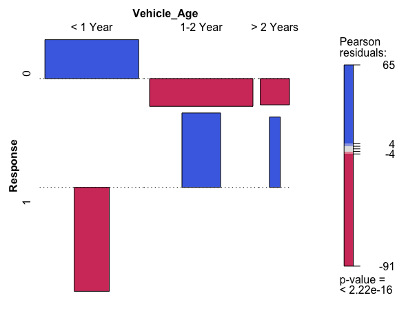

``` r
library(haven)
library(data.table)
library(tidyverse)
```

    ## ── Attaching packages ─────────────────────────────────────── tidyverse 1.3.0 ──

    ## ✓ ggplot2 3.3.2     ✓ purrr   0.3.4
    ## ✓ tibble  3.0.3     ✓ dplyr   1.0.2
    ## ✓ tidyr   1.1.0     ✓ stringr 1.4.0
    ## ✓ readr   1.3.1     ✓ forcats 0.5.0

    ## ── Conflicts ────────────────────────────────────────── tidyverse_conflicts() ──
    ## x dplyr::between()   masks data.table::between()
    ## x dplyr::filter()    masks stats::filter()
    ## x dplyr::first()     masks data.table::first()
    ## x dplyr::lag()       masks stats::lag()
    ## x dplyr::last()      masks data.table::last()
    ## x purrr::transpose() masks data.table::transpose()

``` r
library(dplyr)
train <- fread("data/insurance_train.csv")
test <- fread("data/insurance_test.csv")
```

# Executive Summary

This data set is from Kaggle
(<https://www.kaggle.com/anmolkumar/health-insurance-cross-sell-prediction>),
which describes a health insurance company collecting customers’
demographics, vehicle information, and some insurance policy. The
purpose of this project is to perform two types of analysis: inference
and prediction.

As for the inference perspective, we performed various analysis on
correlation (numeric), association (categorical), interaction, and mixed
models. One of the interesting insights from this data is that top 2
regions (28 and 8) and bottom 2 regions (31 and 48) shows almost the
same customers’ demographics. The only difference is that top 2 regions
have more population (data). Another insights is that when customers do
not have vehicle insurance, customers who are interested in the
company’s insurance are willing to pay higher annual premium than
customers that have no interests.

As for the prediction point of view, we built random forest model and
XGBoost models. We obtained 67.81% for accuracy and 94.78% for
sensitivity. That result demonstrates us a decent model. Surprisingly,
XGBoost model does not perform as well as random forest model in terms
of sensitivity score that is almost 15% lower than random forest model
performed. Furthermore, I think this modeling shows us sometimes the
orginal XGBoost setting works for the best. That also concludes why
programmers who created XGBoost model set those initial parameters as
the standard. However, XGBoost still generated AUC for 0.83. As we know
higher AUC can have better performance on differentiating positive and
negative classes. Therefore, we still think XGBoost model is not the
worst model but not as well as random forest especially for this data
set.

# Inference Analysis

## Data Exploration and Cleaning

``` r
str(train)
```

    ## Classes 'data.table' and 'data.frame':   381109 obs. of  12 variables:
    ##  $ id                  : int  1 2 3 4 5 6 7 8 9 10 ...
    ##  $ Gender              : chr  "Male" "Male" "Male" "Male" ...
    ##  $ Age                 : int  44 76 47 21 29 24 23 56 24 32 ...
    ##  $ Driving_License     : int  1 1 1 1 1 1 1 1 1 1 ...
    ##  $ Region_Code         : num  28 3 28 11 41 33 11 28 3 6 ...
    ##  $ Previously_Insured  : int  0 0 0 1 1 0 0 0 1 1 ...
    ##  $ Vehicle_Age         : chr  "> 2 Years" "1-2 Year" "> 2 Years" "< 1 Year" ...
    ##  $ Vehicle_Damage      : chr  "Yes" "No" "Yes" "No" ...
    ##  $ Annual_Premium      : num  40454 33536 38294 28619 27496 ...
    ##  $ Policy_Sales_Channel: num  26 26 26 152 152 160 152 26 152 152 ...
    ##  $ Vintage             : int  217 183 27 203 39 176 249 72 28 80 ...
    ##  $ Response            : int  1 0 1 0 0 0 0 1 0 0 ...
    ##  - attr(*, ".internal.selfref")=<externalptr>

``` r
summary(train)
```

    ##        id            Gender               Age        Driving_License 
    ##  Min.   :     1   Length:381109      Min.   :20.00   Min.   :0.0000  
    ##  1st Qu.: 95278   Class :character   1st Qu.:25.00   1st Qu.:1.0000  
    ##  Median :190555   Mode  :character   Median :36.00   Median :1.0000  
    ##  Mean   :190555                      Mean   :38.82   Mean   :0.9979  
    ##  3rd Qu.:285832                      3rd Qu.:49.00   3rd Qu.:1.0000  
    ##  Max.   :381109                      Max.   :85.00   Max.   :1.0000  
    ##   Region_Code    Previously_Insured Vehicle_Age        Vehicle_Damage    
    ##  Min.   : 0.00   Min.   :0.0000     Length:381109      Length:381109     
    ##  1st Qu.:15.00   1st Qu.:0.0000     Class :character   Class :character  
    ##  Median :28.00   Median :0.0000     Mode  :character   Mode  :character  
    ##  Mean   :26.39   Mean   :0.4582                                          
    ##  3rd Qu.:35.00   3rd Qu.:1.0000                                          
    ##  Max.   :52.00   Max.   :1.0000                                          
    ##  Annual_Premium   Policy_Sales_Channel    Vintage         Response     
    ##  Min.   :  2630   Min.   :  1          Min.   : 10.0   Min.   :0.0000  
    ##  1st Qu.: 24405   1st Qu.: 29          1st Qu.: 82.0   1st Qu.:0.0000  
    ##  Median : 31669   Median :133          Median :154.0   Median :0.0000  
    ##  Mean   : 30564   Mean   :112          Mean   :154.3   Mean   :0.1226  
    ##  3rd Qu.: 39400   3rd Qu.:152          3rd Qu.:227.0   3rd Qu.:0.0000  
    ##  Max.   :540165   Max.   :163          Max.   :299.0   Max.   :1.0000

``` r
colnames(train) # check column names for the dataset
```

    ##  [1] "id"                   "Gender"               "Age"                 
    ##  [4] "Driving_License"      "Region_Code"          "Previously_Insured"  
    ##  [7] "Vehicle_Age"          "Vehicle_Damage"       "Annual_Premium"      
    ## [10] "Policy_Sales_Channel" "Vintage"              "Response"

    ## 
    ## Attaching package: 'scales'

    ## The following object is masked from 'package:purrr':
    ## 
    ##     discard

    ## The following object is masked from 'package:readr':
    ## 
    ##     col_factor

<!-- --><!-- -->

``` r
train <- train%>%
  rename(Vehicle_Insured=Previously_Insured)%>%  #change the column name to vehicle_insured 
  mutate(id=as.character(id),
         Gender=as.factor(Gender),
         Driving_License=as.factor(Driving_License),
         Vehicle_Insured=as.factor(Vehicle_Insured),
         Vehicle_Age=as.factor(Vehicle_Age),
         Vehicle_Damage=as.factor(Vehicle_Damage),
         Policy_Sales_Channel=as.factor(as.character(Policy_Sales_Channel)),
         Region_Code=as.factor(as.character(Region_Code)),
         Response=as.factor(as.character(Response)))

train$Vehicle_Age <-  fct_relevel(train$Vehicle_Age,"< 1 Year","1-2 Year","> 2 Years") #reorder level
```

## Correlation between Numeric Variables

    ##                         Age Annual_Premium       Vintage
    ## Age             1.000000000   0.0675070016 -0.0012640787
    ## Annual_Premium  0.067507002   1.0000000000 -0.0006084172
    ## Vintage        -0.001264079  -0.0006084172  1.0000000000

    ## corrplot 0.84 loaded

<!-- -->

Not too much correlation between those three numeric variables

## Association between Categorical Variables

``` r
chisq.test(train$Response, train$Driving_License, correct = FALSE)
```

    ## 
    ##  Pearson's Chi-squared test
    ## 
    ## data:  train$Response and train$Driving_License
    ## X-squared = 39.303, df = 1, p-value = 3.629e-10

``` r
chisq.test(train$Response, train$Vehicle_Damage, correct = FALSE)
```

    ## 
    ##  Pearson's Chi-squared test
    ## 
    ## data:  train$Response and train$Vehicle_Damage
    ## X-squared = 47867, df = 1, p-value < 2.2e-16

``` r
chisq.test(train$Response, train$Vehicle_Insured,  correct = FALSE)
```

    ## 
    ##  Pearson's Chi-squared test
    ## 
    ## data:  train$Response and train$Vehicle_Insured
    ## X-squared = 44360, df = 1, p-value < 2.2e-16

``` r
chisq.test(train$Response, train$Vehicle_Age,  correct = FALSE)
```

    ## 
    ##  Pearson's Chi-squared test
    ## 
    ## data:  train$Response and train$Vehicle_Age
    ## X-squared = 18772, df = 2, p-value < 2.2e-16

Since all p values are less than 0.01, we have up to 99% confidence that
all four pairs of variables are associated. We can use assoc to see some
directions of the association.

    ## Loading required package: grid

<!-- --><!-- --><!-- --><!-- -->

We can see customers without a driving license, they are way much less
likely to be interested in vehicle insurance, which totally makes sense.
A larger amount of customers are interested in the vehicle insurance if
their car had some damages in the past. And we can see customers who
does not have vehicle insurance are more likely to be interested in
company’s vehicle insurance. When Vehicles’ ages are 1-2 year or 2 years
older, customers are more likey to be interested in the vehicle
insurance.

## Interaction

``` r
intMod<- lm(Annual_Premium ~ Vehicle_Age*Gender , data = train)

summary(intMod)
```

    ## 
    ## Call:
    ## lm(formula = Annual_Premium ~ Vehicle_Age * Gender, data = train)
    ## 
    ## Residuals:
    ##    Min     1Q Median     3Q    Max 
    ## -33559  -6029   1182   8793 509866 
    ## 
    ## Coefficients:
    ##                                 Estimate Std. Error t value Pr(>|t|)    
    ## (Intercept)                     29974.88      56.85 527.305  < 2e-16 ***
    ## Vehicle_Age1-2 Year               714.25      83.76   8.528  < 2e-16 ***
    ## Vehicle_Age> 2 Years             6213.99     234.39  26.511  < 2e-16 ***
    ## GenderMale                        324.51      85.14   3.812 0.000138 ***
    ## Vehicle_Age1-2 Year:GenderMale   -595.61     115.95  -5.137 2.80e-07 ***
    ## Vehicle_Age> 2 Years:GenderMale -1154.96     295.98  -3.902 9.54e-05 ***
    ## ---
    ## Signif. codes:  0 '***' 0.001 '**' 0.01 '*' 0.05 '.' 0.1 ' ' 1
    ## 
    ## Residual standard error: 17180 on 381103 degrees of freedom
    ## Multiple R-squared:  0.004056,   Adjusted R-squared:  0.004043 
    ## F-statistic: 310.4 on 5 and 381103 DF,  p-value: < 2.2e-16

``` r
library(effects)
```

    ## Loading required package: carData

    ## lattice theme set by effectsTheme()
    ## See ?effectsTheme for details.

``` r
modEffects <- effect("Vehicle_Age*Gender", intMod)

plot(modEffects)
```

<!-- -->

We can see a huge comparison that the annual premium is much higher for
`> 2 years of vehicle age` than the other vehicle ages. Female pays
lower for \< 1 year of vehicle age than male do, however female pays
higher for \>2 years and 1-2 year of vehicle age than male do.

``` r
intMod3<- lm(Annual_Premium ~ Response*Vehicle_Insured , data = train)

summary(intMod3)
```

    ## 
    ## Call:
    ## lm(formula = Annual_Premium ~ Response * Vehicle_Insured, data = train)
    ## 
    ## Residuals:
    ##    Min     1Q Median     3Q    Max 
    ## -28990  -6197   1105   8838 509995 
    ## 
    ## Coefficients:
    ##                            Estimate Std. Error t value Pr(>|t|)    
    ## (Intercept)                30169.85      43.03 701.179  < 2e-16 ***
    ## Response1                   1450.24      90.62  16.004  < 2e-16 ***
    ## Vehicle_Insured1             477.83      59.57   8.022 1.05e-15 ***
    ## Response1:Vehicle_Insured1 -5207.22    1372.54  -3.794 0.000148 ***
    ## ---
    ## Signif. codes:  0 '***' 0.001 '**' 0.01 '*' 0.05 '.' 0.1 ' ' 1
    ## 
    ## Residual standard error: 17210 on 381105 degrees of freedom
    ## Multiple R-squared:  0.0007095,  Adjusted R-squared:  0.0007017 
    ## F-statistic:  90.2 on 3 and 381105 DF,  p-value: < 2.2e-16

``` r
#library(effects)

modEffects3 <- effect("Response*Vehicle_Insured", intMod3)

plot(modEffects3)
```

<!-- -->

When customers do not have vehicle insurance, customers who are
interested in the company’s insurance are willing to pay higher annual
premium than customers that have no interests.

## Mixed Models

``` r
library(lme4)
```

    ## Loading required package: Matrix

    ## 
    ## Attaching package: 'Matrix'

    ## The following objects are masked from 'package:tidyr':
    ## 
    ##     expand, pack, unpack

``` r
riMod <- lmer(Annual_Premium ~ Age+Driving_License+Vehicle_Insured+Vehicle_Age+Vehicle_Damage+(1|Region_Code), 
              data = train)

summary(riMod)
```

    ## Linear mixed model fit by REML ['lmerMod']
    ## Formula: 
    ## Annual_Premium ~ Age + Driving_License + Vehicle_Insured + Vehicle_Age +  
    ##     Vehicle_Damage + (1 | Region_Code)
    ##    Data: train
    ## 
    ## REML criterion at convergence: 8434758
    ## 
    ## Scaled residuals: 
    ##    Min     1Q Median     3Q    Max 
    ## -2.750 -0.362  0.083  0.496 32.499 
    ## 
    ## Random effects:
    ##  Groups      Name        Variance  Std.Dev.
    ##  Region_Code (Intercept)  57718281  7597   
    ##  Residual                239375116 15472   
    ## Number of obs: 381109, groups:  Region_Code, 53
    ## 
    ## Fixed effects:
    ##                       Estimate Std. Error t value
    ## (Intercept)          24332.083   1186.038  20.515
    ## Age                    101.728      2.669  38.111
    ## Driving_License1     -2295.120    545.729  -4.206
    ## Vehicle_Insured1      1443.688     89.722  16.091
    ## Vehicle_Age1-2 Year  -4196.045     87.253 -48.091
    ## Vehicle_Age> 2 Years -1611.922    159.702 -10.093
    ## Vehicle_DamageYes      348.658     89.776   3.884
    ## 
    ## Correlation of Fixed Effects:
    ##             (Intr) Age    Drv_L1 Vhc_I1 V_A1-Y V_A>2Y
    ## Age         -0.091                                   
    ## Drvng_Lcns1 -0.465  0.079                            
    ## Vhcl_Insrd1 -0.065 -0.028  0.000                     
    ## Vhcl_Ag1-2Y  0.041 -0.737 -0.036  0.083              
    ## Vhcl_Ag>2Yr  0.033 -0.508 -0.029  0.069  0.580       
    ## Vehcl_DmgYs -0.065  0.019  0.004  0.789 -0.091 -0.108

``` r
ranef(riMod)
```

    ## $Region_Code
    ##     (Intercept)
    ## 0  -20651.65273
    ## 1  -21213.16320
    ## 10   -147.68266
    ## 11   2726.53543
    ## 12  -1312.95276
    ## 13    -84.77034
    ## 14    914.33830
    ## 15   4843.00651
    ## 16  -1910.67697
    ## 17   6660.80414
    ## 18   2134.79338
    ## 19   2467.35038
    ## 2    2108.39115
    ## 20 -21278.33696
    ## 21     43.28032
    ## 22    -31.60830
    ## 23  -1041.83073
    ## 24   1407.56848
    ## 25    688.82709
    ## 26   4579.62448
    ## 27  -1981.15039
    ## 28  14476.55587
    ## 29   4695.36672
    ## 3     -10.41331
    ## 30    464.17926
    ## 31 -21582.39785
    ## 32   -800.18670
    ## 33   3037.85761
    ## 34   1968.77490
    ## 35   2194.71230
    ## 36   4590.67252
    ## 37   3671.25441
    ## 38   -437.57099
    ## 39   2497.26706
    ## 4    -567.60186
    ## 40   1877.55652
    ## 41   6191.66846
    ## 42     68.49937
    ## 43   1587.32187
    ## 44   -645.98843
    ## 45    684.52092
    ## 46   2591.93037
    ## 47   5577.74789
    ## 48 -21418.70083
    ## 49  -1242.72248
    ## 5    -553.59495
    ## 50   6161.94353
    ## 51   3558.81421
    ## 52   5800.67866
    ## 6     -67.50510
    ## 7    1201.12309
    ## 8   11837.26847
    ## 9    3670.27283
    ## 
    ## with conditional variances for "Region_Code"

``` r
MuMIn::r.squaredGLMM(riMod)
```

    ## Warning: 'r.squaredGLMM' now calculates a revised statistic. See the help page.

    ##              R2m       R2c
    ## [1,] 0.008368457 0.2010192

Here we have two values: the marginal R2 (R2m) and the conditional R2
(R2c). The marginal values as the standard type of R2 – it is the
variability explained by the fixed effects part of the model. The
conditional R2 is using both fixed and random effects. So in this case,
we would see that we are accounting for about 19% (0.2010-0.0084) of the
variation in region alone.

We can also use `lmerTest::lmer` to show the p values associated with
the riMod model.

``` r
riModP <- lmerTest::lmer(Annual_Premium ~ Age+Driving_License+Vehicle_Insured+Vehicle_Age+Vehicle_Damage+(1|Region_Code), 
              data = train) 

summary(riModP)
```

    ## Linear mixed model fit by REML. t-tests use Satterthwaite's method [
    ## lmerModLmerTest]
    ## Formula: 
    ## Annual_Premium ~ Age + Driving_License + Vehicle_Insured + Vehicle_Age +  
    ##     Vehicle_Damage + (1 | Region_Code)
    ##    Data: train
    ## 
    ## REML criterion at convergence: 8434758
    ## 
    ## Scaled residuals: 
    ##    Min     1Q Median     3Q    Max 
    ## -2.750 -0.362  0.083  0.496 32.499 
    ## 
    ## Random effects:
    ##  Groups      Name        Variance  Std.Dev.
    ##  Region_Code (Intercept)  57718281  7597   
    ##  Residual                239375116 15472   
    ## Number of obs: 381109, groups:  Region_Code, 53
    ## 
    ## Fixed effects:
    ##                        Estimate Std. Error         df t value Pr(>|t|)    
    ## (Intercept)           24332.083   1186.038     86.398  20.515  < 2e-16 ***
    ## Age                     101.728      2.669 381053.220  38.111  < 2e-16 ***
    ## Driving_License1      -2295.120    545.729 381050.254  -4.206  2.6e-05 ***
    ## Vehicle_Insured1       1443.688     89.722 381055.067  16.091  < 2e-16 ***
    ## Vehicle_Age1-2 Year   -4196.045     87.253 381071.164 -48.091  < 2e-16 ***
    ## Vehicle_Age> 2 Years  -1611.922    159.702 381058.495 -10.093  < 2e-16 ***
    ## Vehicle_DamageYes       348.658     89.776 381051.765   3.884 0.000103 ***
    ## ---
    ## Signif. codes:  0 '***' 0.001 '**' 0.01 '*' 0.05 '.' 0.1 ' ' 1
    ## 
    ## Correlation of Fixed Effects:
    ##             (Intr) Age    Drv_L1 Vhc_I1 V_A1-Y V_A>2Y
    ## Age         -0.091                                   
    ## Drvng_Lcns1 -0.465  0.079                            
    ## Vhcl_Insrd1 -0.065 -0.028  0.000                     
    ## Vhcl_Ag1-2Y  0.041 -0.737 -0.036  0.083              
    ## Vhcl_Ag>2Yr  0.033 -0.508 -0.029  0.069  0.580       
    ## Vehcl_DmgYs -0.065  0.019  0.004  0.789 -0.091 -0.108

``` r
library(sjPlot)
```

    ## Learn more about sjPlot with 'browseVignettes("sjPlot")'.

``` r
plot_model(riMod, type = "re") + 
  theme_minimal()
```

<!-- -->

``` r
library(merTools)
```

    ## Loading required package: arm

    ## Loading required package: MASS

    ## 
    ## Attaching package: 'MASS'

    ## The following object is masked from 'package:dplyr':
    ## 
    ##     select

    ## 
    ## arm (Version 1.11-2, built: 2020-7-27)

    ## Working directory is /Users/Caspar/Documents/GitHub_Project/insurance_cross_sell

    ## 
    ## Attaching package: 'arm'

    ## The following object is masked from 'package:corrplot':
    ## 
    ##     corrplot

    ## The following object is masked from 'package:scales':
    ## 
    ##     rescale

    ## Registered S3 method overwritten by 'broom.mixed':
    ##   method      from 
    ##   tidy.gamlss broom

``` r
plotREsim(REsim(riMod), labs = TRUE)
```

<!-- -->

From the two graphs above, we can see region 28 and 8’s annual premium
are significantly above average among all the regions. We can extract
region top 2 and bottom 2 data from the train data to do further
analysis.

``` r
region28 <- train[Region_Code=="28",]  #extract region 28

region8 <- train[Region_Code=="8",]  #extract region 8

region31 <- train[Region_Code=="31",] # extract region 31

region48 <- train[Region_Code=="48",]  #extract region 48
```

    ## `stat_bin()` using `bins = 30`. Pick better value with `binwidth`.

    ## Warning: Removed 588 rows containing non-finite values (stat_bin).

    ## Warning: Removed 4 rows containing missing values (geom_bar).

<!-- -->

    ## `stat_bin()` using `bins = 30`. Pick better value with `binwidth`.

<!-- -->

    ## `stat_bin()` using `bins = 30`. Pick better value with `binwidth`.

    ## Warning: Removed 14 rows containing non-finite values (stat_bin).

<!-- -->

    ## `stat_bin()` using `bins = 30`. Pick better value with `binwidth`.

<!-- --> Top 2
regions: After we limit annual premium from 0 to 100K, we can see that
top 2 regions cover almost the same range from 25K to 75K for the
majority group of the annual premium. The age histogram shows almost the
same pattern that the peaks are similar shown in around 26yrs, 48yrs,
53yrs, 67yrs and 72 yrs old in both 28 and 8 regions. Thus, region 28
and 8 are not so different from each other.

Bottom 2 regions: And it is surprised to see the bottom 2 regions also
have similarities in annual premium and age too. There is only one price
for annual premium for both regions. We can see more close match in age
histogram.

# Prediction Analysis (Machine Learning)

We will use random forest and xgboost to build model respectively and
then we can determine which model is the best fit for the data, but we
need to create some dummy variables for some factor variables.

## Data Cleaning (Machine Learning purpose)

``` r
library(fastDummies)

train <- train%>%
  mutate(Vehicle_Age=ifelse(Vehicle_Age=="< 1 Year","1",
                            ifelse(Vehicle_Age=="1-2 Year","2","3")))
#mark "< 1 Year" as 1, "1-2 Year" as 2, "> 2 Years" as 3
                            
train_dum <- dummy_cols(train[,c("Gender","Driving_License","Vehicle_Insured","Vehicle_Age","Vehicle_Damage")]) #make dummy variables 

train_dum <- train_dum%>%
  dplyr::select(-c(1:5)) #get rid of some columns

train_data <- cbind(train[,c("Age","Annual_Premium","Vintage")],train_dum,train[,"Response"])
# combine dummy data and normal data together
```

``` r
train_data <- train_data%>% #adjust response(dependent) variable into human friendly text
  mutate(Response=ifelse(Response=="0","NOInterest","Interest"))%>%
  mutate(Response=as.factor(Response))

summary(train_data$Response) # we have a very imbalanced data set, around 14% of the customers are interested, around 86% of the customers are NOT interested. we can use SMOTE to deal with that later
```

    ##   Interest NOInterest 
    ##      46710     334399

``` r
set.seed(12345)
# for this project we only use 50000 subset to build the model
train_subset <- train_data[1:50000,]  # this train_subset would be imbalanced as well

test_subset <- train_data[50001:70000,] # we use the other 20000 subset for validation set 
```

## Random Forest

``` r
library(randomForest)
```

    ## randomForest 4.6-14

    ## Type rfNews() to see new features/changes/bug fixes.

    ## 
    ## Attaching package: 'randomForest'

    ## The following object is masked from 'package:dplyr':
    ## 
    ##     combine

    ## The following object is masked from 'package:ggplot2':
    ## 
    ##     margin

``` r
library(caret)
```

    ## Loading required package: lattice

    ## 
    ## Attaching package: 'caret'

    ## The following object is masked from 'package:purrr':
    ## 
    ##     lift

``` r
library(DMwR) # load the SMOTE dealing with imbalanced data
```

    ## Registered S3 method overwritten by 'quantmod':
    ##   method            from
    ##   as.zoo.data.frame zoo

``` r
smote_data <- SMOTE(Response ~ ., # Set prediction formula
train_subset, # Set dataset
perc.over = 100) # Select oversampling for minority class
summary(smote_data$Response) # check if the proportion of the response variable is the same
```

    ##   Interest NOInterest 
    ##      12248      12248

``` r
randomforest_mod <- randomForest(Response ~ ., # Set tree formula
                       data = smote_data, # Set dataset
                       ntree = 1000,
                       ) # Set number of trees to use
randomforest_mod
```

    ## 
    ## Call:
    ##  randomForest(formula = Response ~ ., data = smote_data, ntree = 1000,      ) 
    ##                Type of random forest: classification
    ##                      Number of trees: 1000
    ## No. of variables tried at each split: 3
    ## 
    ##         OOB estimate of  error rate: 20.22%
    ## Confusion matrix:
    ##            Interest NOInterest class.error
    ## Interest      11642        606  0.04947747
    ## NOInterest     4348       7900  0.35499673

Lets look at the out-of-bag error for the model over the 1000 trees:

``` r
oob_error <- randomforest_mod$err.rate[,1] # Extract oob error
plot_dat <- cbind.data.frame(rep(1:length(oob_error)), oob_error) # Create plot data
names(plot_dat) <- c("trees", "oob_error") # Name plot data

# Plot oob error
g_1 <- ggplot(plot_dat, aes(x = trees, y = oob_error)) + # Set x as trees and y as error
  geom_point(alpha = 0.3, color = "blue") + # Select geom point
  theme_bw() + # Set theme
  geom_smooth() + # Add smoothing line
  theme(panel.grid.major = element_blank(), # Remove grid
        panel.grid.minor = element_blank(), # Remove grid
        panel.border = element_blank(), # Remove grid
        panel.background = element_blank()) + # Remove grid 
  labs(x = "Number of Trees", title = "Error Rate v Number of Trees",
       y = "Error Rate")  # Set labels
g_1 # Print plot
```

    ## `geom_smooth()` using method = 'gam' and formula 'y ~ s(x, bs = "cs")'

<!-- --> The optimal
number of trees are from 700 to 800 trees from the graph above, we will
use 800 tress for tuning the model.

``` r
set.seed(111111)
randomforest_preds <- predict(randomforest_mod, test_subset, type = "prob") # Create predictions for random forest model

# Convert predictions to classes, using 0.5
randomforest_pred_class <- rep("NOInterest", nrow(randomforest_preds))
randomforest_pred_class[randomforest_preds[,1] >= 0.5] <- "Interest"

confusionMatrix(as.factor(randomforest_pred_class), 
                test_subset$Response, positive = "Interest") 
```

    ## Confusion Matrix and Statistics
    ## 
    ##             Reference
    ## Prediction   Interest NOInterest
    ##   Interest       2341       6272
    ##   NOInterest      131      11256
    ##                                           
    ##                Accuracy : 0.6798          
    ##                  95% CI : (0.6733, 0.6863)
    ##     No Information Rate : 0.8764          
    ##     P-Value [Acc > NIR] : 1               
    ##                                           
    ##                   Kappa : 0.285           
    ##                                           
    ##  Mcnemar's Test P-Value : <2e-16          
    ##                                           
    ##             Sensitivity : 0.9470          
    ##             Specificity : 0.6422          
    ##          Pos Pred Value : 0.2718          
    ##          Neg Pred Value : 0.9885          
    ##              Prevalence : 0.1236          
    ##          Detection Rate : 0.1171          
    ##    Detection Prevalence : 0.4306          
    ##       Balanced Accuracy : 0.7946          
    ##                                           
    ##        'Positive' Class : Interest        
    ## 

For our original random forest model we have 68.32% accuracy and 94.09%
sensitivity. We hope we can enhance accuracy rate and sensitivity rate
by tuning the model.

This model predicts 68.32% accuracy for all correct predictions
including true positive and true negative and predicts 94.09%
sensitivity for actual interested customers are correctly predicted as
interested

Note that for this problem we are particularly interested in predicting
the positive class corresponding to INTEREST customers, so we will look
at sensitivity as well as overall accuracy.

``` r
#start parallel processing to make machine learning much more efficiently (reduce running time)
library(doParallel)
```

    ## Loading required package: foreach

    ## 
    ## Attaching package: 'foreach'

    ## The following objects are masked from 'package:purrr':
    ## 
    ##     accumulate, when

    ## Loading required package: iterators

    ## Loading required package: parallel

``` r
cl <- makePSOCKcluster(5)
registerDoParallel(cl)
```

### Tuning the randomforest model

``` r
mtry_vals <- c(2, 4, 5, 7, 9, 11, 14) # last parameter is 14 because we only have 14 independent variables
nodesize_vals <- c(1, 10, 15, 50, 100, 150, 200, 500, 1000)

params <- expand.grid(mtry_vals, nodesize_vals) # make a table for two parameters 
names(params) <- c("mtry", "nodesize") # set up column names for the table we just created
acc_vec <- rep(NA, nrow(params)) # set up acc_vec output variable
sens_vec <- rep(NA, nrow(params)) # set up sens_vec output variable

for(i in 1:nrow(params)){
  rf_mod <- randomForest(Response ~., # Set tree formula
                         data = smote_data, # Set dataset
                         ntree = 800,
                         nodesize = params$nodesize[i],
                         mtry = params$mtry[i]) # Set number of trees to use
  rf_preds <-rf_mod$predicted # Create predictions for bagging model
  
  t <- table(rf_preds,   smote_data$Response) # Create table
  c <- confusionMatrix(t, positive = "Interest") # Produce confusion matrix
  
  acc_vec[i] <- c$overall[1]   # loop the accuracy results into acc_vec
  sens_vec[i] <- c$byClass[1]  # loop the sensitivity results into sens_vec
}
```

``` r
res_db <- cbind.data.frame(params, acc_vec, sens_vec) #columns bind togther
res_db$mtry <- as.factor(res_db$mtry) # Convert tree number to factor for plotting
res_db$nodesize <- as.factor(res_db$nodesize) # Convert node size to factor for plotting
g_1 <- ggplot(res_db, aes(y = mtry, x = nodesize, fill = acc_vec)) + # set aesthetics
  geom_tile() + # Use geom_tile for heatmap
  theme_bw() + # Set theme
  scale_fill_gradient2(low = "blue", # Choose low color
    mid = "white", # Choose mid color
    high = "red", # Choose high color
    midpoint =mean(res_db$acc_vec), # Choose mid point
    space = "Lab", 
    na.value ="grey", # Choose NA value
    guide = "colourbar", # Set color bar
    aesthetics = "fill") + # Select aesthetics to apply
  labs(x = "Node Size", y = "mtry", fill = "OOB Accuracy") # Set labels
g_1 # Generate plot
```

<!-- -->

``` r
g_2 <- ggplot(res_db, aes(y = mtry, x = nodesize, fill = sens_vec)) + # set aesthetics
  geom_tile() + # Use geom_tile for heatmap
  theme_bw() + # Set theme
  scale_fill_gradient2(low = "blue", # Choose low color
    mid = "white", # Choose mid color
    high = "red", # Choose high color
    midpoint =mean(res_db$sens_vec), # Choose mid point
    space = "Lab", 
    na.value ="grey", # Choose NA value
    guide = "colourbar", # Set color bar
    aesthetics = "fill") + # Select aesthetics to apply
  labs(x = "Node Size", y = "Mtry", fill = "OOB Sensitivity") # Set labels
g_2 # Generate plot
```

<!-- -->

Since we cannot use one set of parameter to satisfy both accuracy and
sensitivity, however we want to predict the positive class corresponding
to INTEREST customers, so we will focus on the highest sensitivity score
on second graph (g\_2). It looks like the best set of parameters for
this tree are mtry 2 and node size 10.

``` r
set.seed(111111)
rf_mod_final <- randomForest(Response ~ ., # Set tree formula
                       data = smote_data, # Set dataset
                       ntree = 800,
                       nodesize=10,
                       mtry=2 
                       ) # Set number of trees to use
rf_mod_final # final random forest model
```

    ## 
    ## Call:
    ##  randomForest(formula = Response ~ ., data = smote_data, ntree = 800,      nodesize = 10, mtry = 2) 
    ##                Type of random forest: classification
    ##                      Number of trees: 800
    ## No. of variables tried at each split: 2
    ## 
    ##         OOB estimate of  error rate: 20.76%
    ## Confusion matrix:
    ##            Interest NOInterest class.error
    ## Interest      11749        499  0.04074135
    ## NOInterest     4586       7662  0.37442848

``` r
rf_preds_final <- predict(rf_mod_final, test_subset, type = "prob") # Create predictions for random forest model

# Convert predictions to classes, using 0.5
rf_pred_class <- rep("NOInterest", nrow(rf_preds_final))
rf_pred_class[rf_preds_final[,1] >= 0.5] <- "Interest"

confusionMatrix(as.factor(rf_pred_class), 
                test_subset$Response, positive = "Interest") 
```

    ## Confusion Matrix and Statistics
    ## 
    ##             Reference
    ## Prediction   Interest NOInterest
    ##   Interest       2370       6640
    ##   NOInterest      102      10888
    ##                                           
    ##                Accuracy : 0.6629          
    ##                  95% CI : (0.6563, 0.6695)
    ##     No Information Rate : 0.8764          
    ##     P-Value [Acc > NIR] : 1               
    ##                                           
    ##                   Kappa : 0.2715          
    ##                                           
    ##  Mcnemar's Test P-Value : <2e-16          
    ##                                           
    ##             Sensitivity : 0.9587          
    ##             Specificity : 0.6212          
    ##          Pos Pred Value : 0.2630          
    ##          Neg Pred Value : 0.9907          
    ##              Prevalence : 0.1236          
    ##          Detection Rate : 0.1185          
    ##    Detection Prevalence : 0.4505          
    ##       Balanced Accuracy : 0.7900          
    ##                                           
    ##        'Positive' Class : Interest        
    ## 

From the confusion matrix, we got better sensitivity 94.78%, which was a
little bit higher than the naive random forest model. And it is
reasonable that accuracy is 67.81% since we did not choose the parameter
that were the best for enhancing accuracy score. Let’s keep those scores
in mind and we will use XGBoost to build the model to see how it will
go.

## XGBoost

``` r
library(xgboost) # load XGBoost
```

    ## 
    ## Attaching package: 'xgboost'

    ## The following object is masked from 'package:dplyr':
    ## 
    ##     slice

``` r
library(xgboostExplainer) # Load XGboost Explainer
library(pROC) # Load proc
```

    ## Type 'citation("pROC")' for a citation.

    ## 
    ## Attaching package: 'pROC'

    ## The following objects are masked from 'package:stats':
    ## 
    ##     cov, smooth, var

``` r
library(SHAPforxgboost) # Load shap for XGBoost
```

    ## Registered S3 methods overwritten by 'car':
    ##   method                          from
    ##   influence.merMod                lme4
    ##   cooks.distance.influence.merMod lme4
    ##   dfbeta.influence.merMod         lme4
    ##   dfbetas.influence.merMod        lme4

Prepare for train and test matrix for XGBoost model

``` r
#create train matrix
dtrain_ins <- xgb.DMatrix(data = as.matrix(smote_data[, 1:14]), 
                          label = as.numeric(smote_data$Response) - 1) 
# Create test matrix
dtest_ins <- xgb.DMatrix(data = as.matrix(test_subset[, 1:14]), 
                         label = as.numeric(test_subset$Response) - 1)
```

``` r
set.seed(111111)
bst_initial <- xgboost(data = dtrain_ins, # Set training data
               
               nrounds = 100, # Set number of rounds
               
               verbose = 1, # 1 - Prints out fit
                print_every_n = 20, # Prints out result every 20th iteration
               
               objective = "binary:logistic", # Set objective
               eval_metric = "auc",
               eval_metric = "error") # Set evaluation metric to use
```

    ## [1]  train-auc:0.848297  train-error:0.199992 
    ## [21] train-auc:0.890245  train-error:0.179213 
    ## [41] train-auc:0.923847  train-error:0.164884 
    ## [61] train-auc:0.940240  train-error:0.154352 
    ## [81] train-auc:0.950687  train-error:0.141778 
    ## [100]    train-auc:0.956885  train-error:0.132593

Instead of using 0.5 as cut off point, we will use `OptimalCutpoints`
package to decide which is the best optimal points for our confusion
matrix

``` r
library(OptimalCutpoints) # load package for setting up optimal points
boost_preds <- predict(bst_initial, dtrain_ins) # Create predictions for xgboost model (dtrain_ins)
# Join predictions and actual
pred_dat <- cbind.data.frame(boost_preds, as.numeric(smote_data$Response)-1)
names(pred_dat) <- c("predictions", "response")

# use train train to determine the best optimal cut point
oc<- optimal.cutpoints(X = "predictions",   
                       status = "response",
                       tag.healthy = 0,
                       data = pred_dat,
                       methods = "MaxEfficiency")

boost_preds_1 <- predict(bst_initial, dtest_ins) # Create predictions for xgboost model (dtest_ins)

pred_dat <- cbind.data.frame(boost_preds_1 , as.numeric(test_subset$Response)-1)
# Convert predictions to classes, using optimal cut-off
boost_pred_class <- rep(0, length(boost_preds_1))  #create one column of 0 
boost_pred_class[boost_preds_1 >= oc$MaxEfficiency$Global$optimal.cutoff$cutoff[1]] <- 1
# replace those larger than cut off point as 1

t <- table(boost_pred_class, as.numeric(test_subset$Response)-1) # Create table
confusionMatrix(t, positive = "1") # Produce confusion matrix
```

    ## Confusion Matrix and Statistics
    ## 
    ##                 
    ## boost_pred_class     0     1
    ##                0  1715  3958
    ##                1   757 13570
    ##                                           
    ##                Accuracy : 0.7642          
    ##                  95% CI : (0.7583, 0.7701)
    ##     No Information Rate : 0.8764          
    ##     P-Value [Acc > NIR] : 1               
    ##                                           
    ##                   Kappa : 0.3007          
    ##                                           
    ##  Mcnemar's Test P-Value : <2e-16          
    ##                                           
    ##             Sensitivity : 0.7742          
    ##             Specificity : 0.6938          
    ##          Pos Pred Value : 0.9472          
    ##          Neg Pred Value : 0.3023          
    ##              Prevalence : 0.8764          
    ##          Detection Rate : 0.6785          
    ##    Detection Prevalence : 0.7164          
    ##       Balanced Accuracy : 0.7340          
    ##                                           
    ##        'Positive' Class : 1               
    ## 

For our original XGBoost model we have 77% accuracy and 78.88%
sensitivity. We hope we can enhance accuracy rate and sensitivity rate
by tuning the model.

This model predicts 77% accuracy for all correct predictions including
true positive and true negative and predicts 78.88% sensitivity for
actual interested customers are correctly predicted as interested

Note that for this problem we are particularly interested in predicting
the positive class corresponding to INTEREST customers, so we will look
at sensitivity as well as overall accuracy.

As you may have the question, why not use 0.5 as cut point? I did try
with 0.5 as cut point with very low accuracy and sensitivity. Thus we
will keep use optimal cut point for later process.

``` r
 boost_preds_1_ins05 <- predict(bst_initial, dtest_ins) # Create predictions for xgboost model

 pred_dat_ins05 <- cbind.data.frame(boost_preds_1_ins05, test_subset$Response)

 boost_pred_class_ins05 <- rep("NOInterest", length(boost_preds_1_ins05))
 boost_pred_class_ins05[boost_preds_1_ins05 >= 0.5] <- "Interest"

 confusionMatrix(as.factor(boost_pred_class_ins05),
                 test_subset$Response, positive = "Interest")
```

    ## Confusion Matrix and Statistics
    ## 
    ##             Reference
    ## Prediction   Interest NOInterest
    ##   Interest        413      12446
    ##   NOInterest     2059       5082
    ##                                          
    ##                Accuracy : 0.2748         
    ##                  95% CI : (0.2686, 0.281)
    ##     No Information Rate : 0.8764         
    ##     P-Value [Acc > NIR] : 1              
    ##                                          
    ##                   Kappa : -0.1936        
    ##                                          
    ##  Mcnemar's Test P-Value : <2e-16         
    ##                                          
    ##             Sensitivity : 0.16707        
    ##             Specificity : 0.28994        
    ##          Pos Pred Value : 0.03212        
    ##          Neg Pred Value : 0.71167        
    ##              Prevalence : 0.12360        
    ##          Detection Rate : 0.02065        
    ##    Detection Prevalence : 0.64295        
    ##       Balanced Accuracy : 0.22850        
    ##                                          
    ##        'Positive' Class : Interest       
    ## 

``` r
# when cutoff point is 0.5, we got very low accuracy and sensitivity rate 
```

Visualize and decide the optimal number of iterations for XGBoost

``` r
# Use xgb.cv to run cross-validation inside xgboost
set.seed(111111)
bst <- xgb.cv(data = dtrain_ins, # Set training data
              
              nfold = 5, # Use 5 fold cross-validation
               
               eta = 0.1, # Set learning rate
              
               nrounds = 1500, # Set number of rounds
               early_stopping_rounds = 50, # Set number of rounds to stop at if there is no improvement
               
               verbose = 1, # 1 - Prints out fit
               nthread = 1, # Set number of parallel threads
               print_every_n = 20, # Prints out result every 20th iteration
              
               objective = "binary:logistic", # Set objective
               eval_metric = "auc",  # auc means area under the curve
               eval_metric = "error") # Set evaluation metric to use
```

    ## [1]  train-auc:0.848329+0.001910 train-error:0.198992+0.001205   test-auc:0.844126+0.003492  test-error:0.203257+0.005395 
    ## Multiple eval metrics are present. Will use test_error for early stopping.
    ## Will train until test_error hasn't improved in 50 rounds.
    ## 
    ## [21] train-auc:0.867685+0.002333 train-error:0.191654+0.001637   test-auc:0.860289+0.003814  test-error:0.197379+0.005559 
    ## [41] train-auc:0.883708+0.002227 train-error:0.185816+0.001714   test-auc:0.869952+0.002939  test-error:0.194235+0.005916 
    ## [61] train-auc:0.894116+0.002131 train-error:0.181682+0.001910   test-auc:0.875168+0.003383  test-error:0.192398+0.005526 
    ## [81] train-auc:0.905652+0.001871 train-error:0.175733+0.001747   test-auc:0.880775+0.004101  test-error:0.190112+0.005201 
    ## [101]    train-auc:0.914525+0.003179 train-error:0.170732+0.002168   test-auc:0.884278+0.003235  test-error:0.188479+0.005547 
    ## [121]    train-auc:0.923430+0.003319 train-error:0.166752+0.002043   test-auc:0.888065+0.003378  test-error:0.188357+0.005441 
    ## [141]    train-auc:0.931637+0.002243 train-error:0.163241+0.002265   test-auc:0.891702+0.004424  test-error:0.186765+0.005595 
    ## [161]    train-auc:0.936994+0.002059 train-error:0.159638+0.001810   test-auc:0.894024+0.003839  test-error:0.186316+0.004592 
    ## [181]    train-auc:0.942168+0.001614 train-error:0.154648+0.001512   test-auc:0.896084+0.003630  test-error:0.185213+0.005036 
    ## [201]    train-auc:0.946495+0.001229 train-error:0.150218+0.001539   test-auc:0.898196+0.003498  test-error:0.184234+0.005144 
    ## [221]    train-auc:0.950287+0.000911 train-error:0.146687+0.001786   test-auc:0.899705+0.002930  test-error:0.182968+0.005423 
    ## [241]    train-auc:0.953672+0.000778 train-error:0.142492+0.002083   test-auc:0.900915+0.002638  test-error:0.182437+0.004726 
    ## [261]    train-auc:0.956753+0.000779 train-error:0.138329+0.001907   test-auc:0.902134+0.002639  test-error:0.181580+0.004902 
    ## [281]    train-auc:0.959373+0.000466 train-error:0.135369+0.001907   test-auc:0.902935+0.002542  test-error:0.180723+0.004804 
    ## [301]    train-auc:0.961801+0.000428 train-error:0.131909+0.001503   test-auc:0.903902+0.002332  test-error:0.180927+0.004110 
    ## [321]    train-auc:0.963981+0.000532 train-error:0.128276+0.001936   test-auc:0.904704+0.002323  test-error:0.179743+0.004316 
    ## [341]    train-auc:0.965978+0.000523 train-error:0.124898+0.002418   test-auc:0.905426+0.002390  test-error:0.179458+0.004422 
    ## [361]    train-auc:0.967617+0.000572 train-error:0.121673+0.002141   test-auc:0.905855+0.002626  test-error:0.178845+0.004298 
    ## [381]    train-auc:0.969430+0.000530 train-error:0.118040+0.001972   test-auc:0.906318+0.002720  test-error:0.178233+0.004581 
    ## [401]    train-auc:0.970797+0.000690 train-error:0.115182+0.001699   test-auc:0.906481+0.002785  test-error:0.177906+0.004760 
    ## [421]    train-auc:0.972345+0.000742 train-error:0.112182+0.001494   test-auc:0.906652+0.002640  test-error:0.178559+0.004550 
    ## [441]    train-auc:0.973702+0.000683 train-error:0.108977+0.001305   test-auc:0.907027+0.002702  test-error:0.178600+0.004449 
    ## Stopping. Best iteration:
    ## [402]    train-auc:0.970899+0.000703 train-error:0.114957+0.001541   test-auc:0.906468+0.002785  test-error:0.177865+0.004777

We can plot the results with ggplot:

``` r
ggplot(bst$evaluation_log, aes(x=iter,y=test_error_mean))+
  geom_point()+
  geom_smooth()
```

    ## `geom_smooth()` using method = 'loess' and formula 'y ~ x'

<!-- --> Based on the
graph and results, the optimal number of iterations is 402. We will set
the number of iterations to 500

Next, we will tune `max depth values` and `min child values`

``` r
max_depth_vals <- c(3, 5, 7, 10, 15) # Create vector of max depth values
min_child_weight <- c(1,3,5,7, 10, 15) # Create vector of min child values

# Expand grid of parameter values
cv_params <- expand.grid(max_depth_vals, min_child_weight)
names(cv_params) <- c("max_depth", "min_child_weight")
# Create results vector
auc_vec <- error_vec <- rep(NA, nrow(cv_params)) 
# Loop through results
for(i in 1:nrow(cv_params)){
  set.seed(111111)
  bst_tune <- xgb.cv(data = dtrain_ins, # Set training data
              
              nfold = 5, # Use 5 fold cross-validation
               
              eta = 0.1, # Set learning rate
              max.depth = cv_params$max_depth[i], # Set max depth
              min_child_weight = cv_params$min_child_weight[i], # Set minimum number of samples in node to split
             
               
              nrounds = 500, # Set number of rounds
              early_stopping_rounds = 20, # Set number of rounds to stop at if there is no improvement
               
              verbose = 1, # 1 - Prints out fit
              nthread = 1, # Set number of parallel threads
              print_every_n = 20, # Prints out result every 20th iteration
               
              objective = "binary:logistic", # Set objective
              eval_metric = "auc", # Set evaluation metric to use
              eval_metric = "error") # Set evaluation metric to use
  auc_vec[i] <- bst_tune$evaluation_log$test_auc_mean[bst_tune$best_ntreelimit]
  error_vec[i] <- bst_tune$evaluation_log$test_error_mean[bst_tune$best_ntreelimit]
  
}
```

    ## [1]  train-auc:0.817107+0.001612 train-error:0.211096+0.002082   test-auc:0.816306+0.003253  test-error:0.211381+0.004116 
    ## Multiple eval metrics are present. Will use test_error for early stopping.
    ## Will train until test_error hasn't improved in 20 rounds.
    ## 
    ## [21] train-auc:0.844910+0.001395 train-error:0.204972+0.001695   test-auc:0.842750+0.002846  test-error:0.205094+0.005697 
    ## [41] train-auc:0.852484+0.000702 train-error:0.202104+0.002097   test-auc:0.848419+0.003388  test-error:0.203175+0.006064 
    ## [61] train-auc:0.859832+0.001619 train-error:0.197614+0.001091   test-auc:0.854409+0.001751  test-error:0.200277+0.006344 
    ## [81] train-auc:0.866239+0.001950 train-error:0.194185+0.001463   test-auc:0.859332+0.001481  test-error:0.198113+0.005447 
    ## [101]    train-auc:0.871303+0.002426 train-error:0.191695+0.001219   test-auc:0.862395+0.001546  test-error:0.197133+0.005795 
    ## [121]    train-auc:0.876087+0.002109 train-error:0.190194+0.001405   test-auc:0.865191+0.002232  test-error:0.196113+0.005670 
    ## [141]    train-auc:0.879519+0.001709 train-error:0.188888+0.001434   test-auc:0.866778+0.002627  test-error:0.194848+0.005207 
    ## [161]    train-auc:0.882473+0.001212 train-error:0.187755+0.001546   test-auc:0.867927+0.002713  test-error:0.194725+0.004272 
    ## [181]    train-auc:0.886029+0.001184 train-error:0.186888+0.001722   test-auc:0.870415+0.002651  test-error:0.194276+0.004697 
    ## [201]    train-auc:0.889296+0.001035 train-error:0.185193+0.001609   test-auc:0.872637+0.003160  test-error:0.193745+0.004758 
    ## [221]    train-auc:0.892562+0.000661 train-error:0.183520+0.001304   test-auc:0.874506+0.003303  test-error:0.193051+0.004359 
    ## [241]    train-auc:0.895619+0.001027 train-error:0.182346+0.001043   test-auc:0.876680+0.002799  test-error:0.191949+0.004603 
    ## [261]    train-auc:0.899015+0.001601 train-error:0.181152+0.001035   test-auc:0.879153+0.002170  test-error:0.191704+0.005199 
    ## [281]    train-auc:0.901841+0.001199 train-error:0.180101+0.001074   test-auc:0.881278+0.002389  test-error:0.191296+0.004851 
    ## [301]    train-auc:0.904484+0.001149 train-error:0.179325+0.001158   test-auc:0.883035+0.002709  test-error:0.190643+0.004857 
    ## [321]    train-auc:0.907009+0.001137 train-error:0.178397+0.001316   test-auc:0.884703+0.002546  test-error:0.190357+0.004560 
    ## [341]    train-auc:0.909117+0.001440 train-error:0.177356+0.001019   test-auc:0.886230+0.002384  test-error:0.190561+0.004539 
    ## Stopping. Best iteration:
    ## [323]    train-auc:0.907241+0.001198 train-error:0.178305+0.001336   test-auc:0.884801+0.002443  test-error:0.190194+0.004590
    ## 
    ## [1]  train-auc:0.840780+0.003594 train-error:0.203492+0.001396   test-auc:0.838920+0.003657  test-error:0.206033+0.006826 
    ## Multiple eval metrics are present. Will use test_error for early stopping.
    ## Will train until test_error hasn't improved in 20 rounds.
    ## 
    ## [21] train-auc:0.859469+0.001669 train-error:0.197144+0.002705   test-auc:0.855160+0.002846  test-error:0.200114+0.006424 
    ## [41] train-auc:0.871720+0.002140 train-error:0.191878+0.002711   test-auc:0.863016+0.002365  test-error:0.196766+0.006167 
    ## [61] train-auc:0.881382+0.002409 train-error:0.187622+0.001757   test-auc:0.868325+0.003509  test-error:0.194072+0.005343 
    ## [81] train-auc:0.890569+0.001655 train-error:0.182509+0.001908   test-auc:0.873333+0.004244  test-error:0.191786+0.005890 
    ## [101]    train-auc:0.899220+0.002133 train-error:0.179346+0.001802   test-auc:0.877215+0.004390  test-error:0.189949+0.005541 
    ## [121]    train-auc:0.905716+0.002071 train-error:0.176549+0.001617   test-auc:0.879762+0.004171  test-error:0.189132+0.005989 
    ## [141]    train-auc:0.912667+0.001669 train-error:0.173008+0.001094   test-auc:0.883367+0.004018  test-error:0.188357+0.004672 
    ## [161]    train-auc:0.918190+0.001859 train-error:0.169803+0.001321   test-auc:0.885566+0.003680  test-error:0.188601+0.004456 
    ## Stopping. Best iteration:
    ## [146]    train-auc:0.914406+0.001770 train-error:0.172151+0.001243   test-auc:0.884158+0.004046  test-error:0.187949+0.004470
    ## 
    ## [1]  train-auc:0.853746+0.001768 train-error:0.196216+0.001607   test-auc:0.847455+0.002892  test-error:0.203584+0.005349 
    ## Multiple eval metrics are present. Will use test_error for early stopping.
    ## Will train until test_error hasn't improved in 20 rounds.
    ## 
    ## [21] train-auc:0.877137+0.000786 train-error:0.183969+0.002031   test-auc:0.867853+0.003171  test-error:0.193500+0.006478 
    ## [41] train-auc:0.896294+0.001909 train-error:0.178968+0.001296   test-auc:0.876923+0.003381  test-error:0.192112+0.005322 
    ## [61] train-auc:0.908406+0.001277 train-error:0.173049+0.001870   test-auc:0.882859+0.004341  test-error:0.190316+0.004288 
    ## [81] train-auc:0.919440+0.000562 train-error:0.167527+0.001613   test-auc:0.886971+0.004293  test-error:0.188520+0.004949 
    ## [101]    train-auc:0.930761+0.001219 train-error:0.162373+0.001794   test-auc:0.890811+0.002637  test-error:0.186438+0.004848 
    ## [121]    train-auc:0.938869+0.000760 train-error:0.157066+0.001760   test-auc:0.893403+0.002391  test-error:0.186111+0.005228 
    ## [141]    train-auc:0.945056+0.000944 train-error:0.151831+0.002040   test-auc:0.895207+0.002467  test-error:0.184805+0.004842 
    ## [161]    train-auc:0.951121+0.000573 train-error:0.145850+0.001676   test-auc:0.898184+0.002379  test-error:0.184641+0.005406 
    ## [181]    train-auc:0.955376+0.000852 train-error:0.140278+0.001495   test-auc:0.899692+0.002069  test-error:0.182519+0.005027 
    ## [201]    train-auc:0.959717+0.001216 train-error:0.135124+0.002069   test-auc:0.901540+0.002329  test-error:0.182968+0.005243 
    ## Stopping. Best iteration:
    ## [184]    train-auc:0.956068+0.000973 train-error:0.139288+0.001681   test-auc:0.900052+0.002186  test-error:0.182233+0.005197
    ## 
    ## [1]  train-auc:0.871933+0.001840 train-error:0.181172+0.001405   test-auc:0.852806+0.005063  test-error:0.201951+0.004348 
    ## Multiple eval metrics are present. Will use test_error for early stopping.
    ## Will train until test_error hasn't improved in 20 rounds.
    ## 
    ## [21] train-auc:0.906134+0.002841 train-error:0.162506+0.002570   test-auc:0.880209+0.004384  test-error:0.188357+0.003747 
    ## [41] train-auc:0.930351+0.001915 train-error:0.154760+0.001898   test-auc:0.888905+0.003127  test-error:0.186356+0.004900 
    ## [61] train-auc:0.943617+0.001683 train-error:0.147371+0.001034   test-auc:0.892475+0.003927  test-error:0.184111+0.005220 
    ## [81] train-auc:0.956046+0.002350 train-error:0.139196+0.001025   test-auc:0.896527+0.003749  test-error:0.182029+0.004827 
    ## [101]    train-auc:0.966243+0.001577 train-error:0.128725+0.002063   test-auc:0.899666+0.003027  test-error:0.179131+0.004291 
    ## [121]    train-auc:0.973224+0.001232 train-error:0.118795+0.002076   test-auc:0.901823+0.002772  test-error:0.178437+0.004575 
    ## [141]    train-auc:0.978402+0.000518 train-error:0.109722+0.002162   test-auc:0.903548+0.002684  test-error:0.178804+0.004875 
    ## Stopping. Best iteration:
    ## [128]    train-auc:0.975135+0.001094 train-error:0.115274+0.002395   test-auc:0.902435+0.002898  test-error:0.177906+0.004638
    ## 
    ## [1]  train-auc:0.908441+0.002692 train-error:0.149677+0.003947   test-auc:0.861168+0.003788  test-error:0.202726+0.006206 
    ## Multiple eval metrics are present. Will use test_error for early stopping.
    ## Will train until test_error hasn't improved in 20 rounds.
    ## 
    ## [21] train-auc:0.954680+0.002221 train-error:0.128317+0.002354   test-auc:0.892808+0.001670  test-error:0.182805+0.004824 
    ## [41] train-auc:0.974015+0.001780 train-error:0.115070+0.000517   test-auc:0.899482+0.002799  test-error:0.180764+0.003904 
    ## [61] train-auc:0.984515+0.001448 train-error:0.098679+0.001501   test-auc:0.902819+0.003230  test-error:0.178028+0.005475 
    ## [81] train-auc:0.990017+0.001575 train-error:0.084065+0.005059   test-auc:0.905156+0.003293  test-error:0.177375+0.005335 
    ## [101]    train-auc:0.993717+0.000546 train-error:0.069501+0.002415   test-auc:0.906281+0.002493  test-error:0.177008+0.004964 
    ## [121]    train-auc:0.995744+0.000342 train-error:0.057101+0.003232   test-auc:0.907694+0.002788  test-error:0.174926+0.004408 
    ## [141]    train-auc:0.997139+0.000183 train-error:0.046273+0.001783   test-auc:0.908593+0.002591  test-error:0.173701+0.004695 
    ## [161]    train-auc:0.997902+0.000178 train-error:0.038792+0.002395   test-auc:0.908905+0.002374  test-error:0.172722+0.005014 
    ## [181]    train-auc:0.998504+0.000154 train-error:0.032903+0.002787   test-auc:0.909309+0.002611  test-error:0.171456+0.005604 
    ## Stopping. Best iteration:
    ## [178]    train-auc:0.998379+0.000179 train-error:0.034057+0.002760   test-auc:0.909205+0.002623  test-error:0.171170+0.005656
    ## 
    ## [1]  train-auc:0.817107+0.001612 train-error:0.211096+0.002082   test-auc:0.816306+0.003253  test-error:0.211381+0.004116 
    ## Multiple eval metrics are present. Will use test_error for early stopping.
    ## Will train until test_error hasn't improved in 20 rounds.
    ## 
    ## [21] train-auc:0.844893+0.001402 train-error:0.204972+0.001695   test-auc:0.842752+0.002846  test-error:0.205094+0.005697 
    ## [41] train-auc:0.852481+0.000704 train-error:0.202104+0.002097   test-auc:0.848420+0.003386  test-error:0.203175+0.006064 
    ## [61] train-auc:0.859692+0.000935 train-error:0.198155+0.001238   test-auc:0.854448+0.002536  test-error:0.200563+0.006263 
    ## [81] train-auc:0.865146+0.000878 train-error:0.194226+0.001144   test-auc:0.858355+0.002635  test-error:0.197868+0.006305 
    ## [101]    train-auc:0.870027+0.000538 train-error:0.191919+0.001667   test-auc:0.861197+0.002636  test-error:0.197011+0.005862 
    ## [121]    train-auc:0.874185+0.000685 train-error:0.190102+0.001700   test-auc:0.863753+0.002783  test-error:0.196154+0.005163 
    ## [141]    train-auc:0.878343+0.000861 train-error:0.189255+0.001580   test-auc:0.865758+0.003506  test-error:0.195501+0.004962 
    ## [161]    train-auc:0.881981+0.000318 train-error:0.187796+0.001575   test-auc:0.867615+0.003788  test-error:0.195052+0.004796 
    ## [181]    train-auc:0.885860+0.000864 train-error:0.186581+0.002222   test-auc:0.870257+0.003538  test-error:0.194195+0.004181 
    ## [201]    train-auc:0.890445+0.001546 train-error:0.185081+0.002003   test-auc:0.873321+0.002588  test-error:0.193296+0.004093 
    ## [221]    train-auc:0.893434+0.001909 train-error:0.183755+0.001380   test-auc:0.875578+0.002201  test-error:0.192929+0.003805 
    ## Stopping. Best iteration:
    ## [215]    train-auc:0.892490+0.001617 train-error:0.184091+0.001427   test-auc:0.874770+0.002385  test-error:0.192806+0.004216
    ## 
    ## [1]  train-auc:0.840638+0.003516 train-error:0.203717+0.001332   test-auc:0.838841+0.003791  test-error:0.206115+0.006931 
    ## Multiple eval metrics are present. Will use test_error for early stopping.
    ## Will train until test_error hasn't improved in 20 rounds.
    ## 
    ## [21] train-auc:0.859199+0.001597 train-error:0.197563+0.002171   test-auc:0.855205+0.002710  test-error:0.200848+0.006269 
    ## [41] train-auc:0.870858+0.002644 train-error:0.192205+0.001847   test-auc:0.862263+0.002049  test-error:0.196888+0.006386 
    ## [61] train-auc:0.882647+0.002257 train-error:0.188388+0.002076   test-auc:0.869669+0.003562  test-error:0.195500+0.006134 
    ## [81] train-auc:0.891735+0.001697 train-error:0.183765+0.002006   test-auc:0.874214+0.003864  test-error:0.193541+0.004679 
    ## [101]    train-auc:0.898846+0.001424 train-error:0.180611+0.002125   test-auc:0.877516+0.004740  test-error:0.192684+0.003842 
    ## [121]    train-auc:0.905869+0.001374 train-error:0.177457+0.001994   test-auc:0.880136+0.004269  test-error:0.191459+0.003737 
    ## [141]    train-auc:0.912457+0.000866 train-error:0.174600+0.001995   test-auc:0.883160+0.004063  test-error:0.190071+0.004034 
    ## [161]    train-auc:0.918122+0.001306 train-error:0.172446+0.001065   test-auc:0.886510+0.003873  test-error:0.189377+0.004548 
    ## [181]    train-auc:0.922275+0.001637 train-error:0.169977+0.001130   test-auc:0.888323+0.003777  test-error:0.188316+0.004090 
    ## [201]    train-auc:0.925677+0.001725 train-error:0.167650+0.001316   test-auc:0.890009+0.003454  test-error:0.188030+0.003801 
    ## Stopping. Best iteration:
    ## [195]    train-auc:0.924654+0.001725 train-error:0.168507+0.001322   test-auc:0.889684+0.003510  test-error:0.187663+0.003906
    ## 
    ## [1]  train-auc:0.853221+0.002063 train-error:0.197012+0.001528   test-auc:0.846794+0.003293  test-error:0.203339+0.004614 
    ## Multiple eval metrics are present. Will use test_error for early stopping.
    ## Will train until test_error hasn't improved in 20 rounds.
    ## 
    ## [21] train-auc:0.876353+0.000466 train-error:0.185469+0.002282   test-auc:0.866781+0.003782  test-error:0.194439+0.006728 
    ## [41] train-auc:0.892944+0.002404 train-error:0.180570+0.002239   test-auc:0.874966+0.002738  test-error:0.191785+0.005878 
    ## [61] train-auc:0.905883+0.003672 train-error:0.176488+0.001631   test-auc:0.881554+0.002384  test-error:0.190194+0.004905 
    ## [81] train-auc:0.917046+0.003171 train-error:0.170650+0.002480   test-auc:0.885718+0.002589  test-error:0.189622+0.005136 
    ## [101]    train-auc:0.925821+0.002052 train-error:0.165935+0.002006   test-auc:0.889218+0.002205  test-error:0.188316+0.005063 
    ## [121]    train-auc:0.933078+0.001560 train-error:0.161863+0.002117   test-auc:0.891150+0.002630  test-error:0.187172+0.005148 
    ## [141]    train-auc:0.939381+0.001715 train-error:0.157107+0.002347   test-auc:0.892816+0.002185  test-error:0.186234+0.004615 
    ## [161]    train-auc:0.944068+0.001744 train-error:0.152800+0.002188   test-auc:0.894491+0.002212  test-error:0.185213+0.005119 
    ## Stopping. Best iteration:
    ## [155]    train-auc:0.942670+0.002199 train-error:0.154117+0.002669   test-auc:0.893825+0.002057  test-error:0.184438+0.005278
    ## 
    ## [1]  train-auc:0.870412+0.002113 train-error:0.184193+0.001688   test-auc:0.852077+0.005854  test-error:0.202890+0.005181 
    ## Multiple eval metrics are present. Will use test_error for early stopping.
    ## Will train until test_error hasn't improved in 20 rounds.
    ## 
    ## [21] train-auc:0.901292+0.002068 train-error:0.167435+0.002070   test-auc:0.878736+0.003831  test-error:0.189704+0.005423 
    ## [41] train-auc:0.922446+0.001454 train-error:0.161567+0.002085   test-auc:0.886083+0.003542  test-error:0.188356+0.004424 
    ## [61] train-auc:0.936327+0.001130 train-error:0.155158+0.002600   test-auc:0.890492+0.003451  test-error:0.187132+0.005354 
    ## [81] train-auc:0.947841+0.001364 train-error:0.148157+0.002113   test-auc:0.894314+0.004105  test-error:0.185825+0.005627 
    ## [101]    train-auc:0.955457+0.002248 train-error:0.141921+0.003466   test-auc:0.896622+0.003328  test-error:0.184437+0.005324 
    ## [121]    train-auc:0.962314+0.001416 train-error:0.134124+0.003220   test-auc:0.898533+0.003635  test-error:0.182845+0.005886 
    ## [141]    train-auc:0.967045+0.001445 train-error:0.126000+0.003678   test-auc:0.900785+0.003087  test-error:0.183172+0.006186 
    ## [161]    train-auc:0.970724+0.001601 train-error:0.118989+0.004325   test-auc:0.902127+0.003114  test-error:0.182396+0.006001 
    ## Stopping. Best iteration:
    ## [151]    train-auc:0.968920+0.001423 train-error:0.122367+0.003794   test-auc:0.901833+0.003035  test-error:0.181743+0.005956
    ## 
    ## [1]  train-auc:0.899063+0.001461 train-error:0.167099+0.001955   test-auc:0.858695+0.005307  test-error:0.205544+0.006481 
    ## Multiple eval metrics are present. Will use test_error for early stopping.
    ## Will train until test_error hasn't improved in 20 rounds.
    ## 
    ## [21] train-auc:0.939417+0.003677 train-error:0.145942+0.001593   test-auc:0.890139+0.003473  test-error:0.185376+0.005370 
    ## [41] train-auc:0.958216+0.001406 train-error:0.135165+0.000668   test-auc:0.896896+0.003087  test-error:0.184274+0.003939 
    ## [61] train-auc:0.967714+0.000916 train-error:0.123734+0.001791   test-auc:0.899501+0.003127  test-error:0.182723+0.003415 
    ## [81] train-auc:0.974272+0.001017 train-error:0.112467+0.002292   test-auc:0.901491+0.002618  test-error:0.181621+0.003238 
    ## [101]    train-auc:0.979799+0.000747 train-error:0.100425+0.002732   test-auc:0.902807+0.002810  test-error:0.181009+0.003063 
    ## [121]    train-auc:0.982805+0.000693 train-error:0.092056+0.002726   test-auc:0.903819+0.003280  test-error:0.180315+0.003536 
    ## [141]    train-auc:0.985342+0.000800 train-error:0.084085+0.003047   test-auc:0.904272+0.003341  test-error:0.179376+0.004241 
    ## Stopping. Best iteration:
    ## [130]    train-auc:0.983984+0.000855 train-error:0.088341+0.002940   test-auc:0.904073+0.003520  test-error:0.178886+0.003435
    ## 
    ## [1]  train-auc:0.817107+0.001612 train-error:0.211096+0.002082   test-auc:0.816306+0.003253  test-error:0.211381+0.004116 
    ## Multiple eval metrics are present. Will use test_error for early stopping.
    ## Will train until test_error hasn't improved in 20 rounds.
    ## 
    ## [21] train-auc:0.844893+0.001402 train-error:0.204972+0.001695   test-auc:0.842752+0.002846  test-error:0.205094+0.005697 
    ## [41] train-auc:0.852468+0.000715 train-error:0.202339+0.001962   test-auc:0.848419+0.003384  test-error:0.203257+0.006129 
    ## [61] train-auc:0.860194+0.001744 train-error:0.198318+0.001481   test-auc:0.854734+0.001626  test-error:0.200930+0.006150 
    ## [81] train-auc:0.866309+0.001265 train-error:0.194695+0.001267   test-auc:0.859048+0.002585  test-error:0.198889+0.007157 
    ## [101]    train-auc:0.871573+0.002146 train-error:0.192317+0.001182   test-auc:0.862704+0.003391  test-error:0.197134+0.005566 
    ## [121]    train-auc:0.875584+0.001797 train-error:0.190847+0.001112   test-auc:0.864902+0.003346  test-error:0.197011+0.004674 
    ## [141]    train-auc:0.879299+0.001223 train-error:0.189388+0.001063   test-auc:0.866806+0.003043  test-error:0.195950+0.004008 
    ## [161]    train-auc:0.883130+0.001420 train-error:0.188071+0.001409   test-auc:0.869454+0.002979  test-error:0.194970+0.003631 
    ## [181]    train-auc:0.886206+0.001221 train-error:0.186877+0.001633   test-auc:0.871350+0.002771  test-error:0.195052+0.004457 
    ## [201]    train-auc:0.888681+0.001609 train-error:0.185857+0.001379   test-auc:0.872621+0.002673  test-error:0.195011+0.004289 
    ## [221]    train-auc:0.891104+0.001406 train-error:0.184928+0.001849   test-auc:0.874630+0.003189  test-error:0.193787+0.003477 
    ## [241]    train-auc:0.893600+0.001503 train-error:0.183591+0.001534   test-auc:0.876375+0.002739  test-error:0.193051+0.003100 
    ## [261]    train-auc:0.896050+0.001911 train-error:0.182846+0.001767   test-auc:0.877829+0.002261  test-error:0.192643+0.002828 
    ## [281]    train-auc:0.898583+0.002214 train-error:0.182091+0.001571   test-auc:0.879818+0.002287  test-error:0.192235+0.003176 
    ## [301]    train-auc:0.900448+0.002428 train-error:0.181448+0.001376   test-auc:0.880665+0.002320  test-error:0.192072+0.003014 
    ## Stopping. Best iteration:
    ## [297]    train-auc:0.900023+0.002584 train-error:0.181560+0.001328   test-auc:0.880418+0.002226  test-error:0.191827+0.003177
    ## 
    ## [1]  train-auc:0.840622+0.003502 train-error:0.203727+0.001316   test-auc:0.838840+0.003791  test-error:0.206115+0.006931 
    ## Multiple eval metrics are present. Will use test_error for early stopping.
    ## Will train until test_error hasn't improved in 20 rounds.
    ## 
    ## [21] train-auc:0.859171+0.002005 train-error:0.198063+0.001853   test-auc:0.854949+0.002854  test-error:0.201175+0.006547 
    ## [41] train-auc:0.871483+0.002218 train-error:0.192491+0.002212   test-auc:0.862353+0.001621  test-error:0.196562+0.006783 
    ## [61] train-auc:0.882143+0.002002 train-error:0.187582+0.001559   test-auc:0.869692+0.002266  test-error:0.194603+0.004910 
    ## [81] train-auc:0.891985+0.001133 train-error:0.183203+0.001316   test-auc:0.875214+0.002633  test-error:0.193092+0.004457 
    ## [101]    train-auc:0.899509+0.001184 train-error:0.180642+0.001314   test-auc:0.878627+0.003167  test-error:0.192072+0.004162 
    ## [121]    train-auc:0.905054+0.001187 train-error:0.178539+0.001154   test-auc:0.881271+0.002998  test-error:0.191133+0.003871 
    ## [141]    train-auc:0.908955+0.001458 train-error:0.176192+0.001247   test-auc:0.883147+0.002986  test-error:0.189541+0.003636 
    ## [161]    train-auc:0.912947+0.002108 train-error:0.174508+0.001598   test-auc:0.885432+0.003132  test-error:0.188928+0.003300 
    ## [181]    train-auc:0.917127+0.002429 train-error:0.172436+0.001751   test-auc:0.887037+0.002382  test-error:0.188153+0.003396 
    ## [201]    train-auc:0.920401+0.002641 train-error:0.170599+0.001319   test-auc:0.888306+0.003026  test-error:0.188193+0.004327 
    ## [221]    train-auc:0.923552+0.002476 train-error:0.168579+0.001243   test-auc:0.889764+0.003304  test-error:0.186887+0.003894 
    ## [241]    train-auc:0.926116+0.001598 train-error:0.166700+0.001286   test-auc:0.891010+0.003134  test-error:0.186438+0.004342 
    ## Stopping. Best iteration:
    ## [237]    train-auc:0.925519+0.001651 train-error:0.167201+0.001253   test-auc:0.890758+0.003074  test-error:0.186438+0.004133
    ## 
    ## [1]  train-auc:0.853065+0.002093 train-error:0.197134+0.001308   test-auc:0.846666+0.003085  test-error:0.202931+0.004855 
    ## Multiple eval metrics are present. Will use test_error for early stopping.
    ## Will train until test_error hasn't improved in 20 rounds.
    ## 
    ## [21] train-auc:0.875170+0.001240 train-error:0.186439+0.002029   test-auc:0.866324+0.003293  test-error:0.195215+0.007442 
    ## [41] train-auc:0.892451+0.001512 train-error:0.182111+0.002026   test-auc:0.874974+0.003626  test-error:0.192235+0.006290 
    ## [61] train-auc:0.905472+0.001795 train-error:0.177111+0.002240   test-auc:0.881588+0.004372  test-error:0.191051+0.005030 
    ## [81] train-auc:0.915777+0.001451 train-error:0.172844+0.001681   test-auc:0.886245+0.003767  test-error:0.190724+0.005123 
    ## [101]    train-auc:0.922898+0.001318 train-error:0.169119+0.001310   test-auc:0.888581+0.003808  test-error:0.188765+0.004773 
    ## [121]    train-auc:0.928180+0.001121 train-error:0.165190+0.001315   test-auc:0.890221+0.003613  test-error:0.187500+0.004805 
    ## [141]    train-auc:0.932690+0.001344 train-error:0.161965+0.001329   test-auc:0.891484+0.003388  test-error:0.187091+0.004289 
    ## [161]    train-auc:0.936993+0.001609 train-error:0.157832+0.001877   test-auc:0.893077+0.003128  test-error:0.185581+0.004688 
    ## [181]    train-auc:0.940378+0.001662 train-error:0.154729+0.001906   test-auc:0.893998+0.002717  test-error:0.185621+0.004462 
    ## Stopping. Best iteration:
    ## [169]    train-auc:0.938460+0.001730 train-error:0.156791+0.001751   test-auc:0.893468+0.002946  test-error:0.185050+0.004522
    ## 
    ## [1]  train-auc:0.869605+0.001947 train-error:0.186092+0.001296   test-auc:0.852439+0.006010  test-error:0.200930+0.005681 
    ## Multiple eval metrics are present. Will use test_error for early stopping.
    ## Will train until test_error hasn't improved in 20 rounds.
    ## 
    ## [21] train-auc:0.902703+0.001765 train-error:0.171038+0.002218   test-auc:0.879558+0.004129  test-error:0.190683+0.005849 
    ## [41] train-auc:0.919849+0.001653 train-error:0.165251+0.001619   test-auc:0.886472+0.004737  test-error:0.187785+0.006524 
    ## [61] train-auc:0.932439+0.000889 train-error:0.159781+0.001419   test-auc:0.890912+0.004004  test-error:0.187214+0.005760 
    ## [81] train-auc:0.941438+0.001768 train-error:0.154454+0.001583   test-auc:0.893790+0.002983  test-error:0.186561+0.005692 
    ## [101]    train-auc:0.948225+0.002172 train-error:0.148341+0.001711   test-auc:0.895968+0.002912  test-error:0.185458+0.004706 
    ## [121]    train-auc:0.953369+0.001859 train-error:0.143289+0.002009   test-auc:0.897596+0.002442  test-error:0.185785+0.004375 
    ## [141]    train-auc:0.957037+0.000994 train-error:0.137982+0.000996   test-auc:0.898244+0.002620  test-error:0.184274+0.004452 
    ## [161]    train-auc:0.960533+0.001281 train-error:0.132246+0.001472   test-auc:0.899022+0.002711  test-error:0.184029+0.005271 
    ## [181]    train-auc:0.963240+0.001451 train-error:0.128041+0.002295   test-auc:0.899571+0.002928  test-error:0.184642+0.004642 
    ## Stopping. Best iteration:
    ## [164]    train-auc:0.960859+0.001302 train-error:0.131838+0.001480   test-auc:0.899093+0.002761  test-error:0.183989+0.005090
    ## 
    ## [1]  train-auc:0.893486+0.002202 train-error:0.175233+0.001879   test-auc:0.859135+0.005795  test-error:0.206319+0.007962 
    ## Multiple eval metrics are present. Will use test_error for early stopping.
    ## Will train until test_error hasn't improved in 20 rounds.
    ## 
    ## [21] train-auc:0.928389+0.003489 train-error:0.156760+0.001076   test-auc:0.887065+0.004494  test-error:0.186437+0.007359 
    ## [41] train-auc:0.947401+0.001456 train-error:0.147800+0.001224   test-auc:0.894317+0.003413  test-error:0.185499+0.006399 
    ## [61] train-auc:0.957474+0.001987 train-error:0.138339+0.000754   test-auc:0.896728+0.002897  test-error:0.185132+0.006092 
    ## [81] train-auc:0.964126+0.001065 train-error:0.128480+0.000970   test-auc:0.899004+0.002565  test-error:0.183580+0.005178 
    ## [101]    train-auc:0.968392+0.000905 train-error:0.120612+0.001113   test-auc:0.899865+0.002879  test-error:0.182723+0.004281 
    ## [121]    train-auc:0.972284+0.000955 train-error:0.113304+0.000672   test-auc:0.900966+0.003568  test-error:0.182478+0.004708 
    ## [141]    train-auc:0.975384+0.000468 train-error:0.105946+0.001271   test-auc:0.901542+0.003564  test-error:0.180968+0.004669 
    ## [161]    train-auc:0.977485+0.000537 train-error:0.100516+0.001163   test-auc:0.901700+0.003842  test-error:0.181580+0.005193 
    ## Stopping. Best iteration:
    ## [144]    train-auc:0.975649+0.000549 train-error:0.105170+0.001491   test-auc:0.901579+0.003578  test-error:0.180805+0.004910
    ## 
    ## [1]  train-auc:0.817107+0.001612 train-error:0.211096+0.002082   test-auc:0.816306+0.003253  test-error:0.211381+0.004116 
    ## Multiple eval metrics are present. Will use test_error for early stopping.
    ## Will train until test_error hasn't improved in 20 rounds.
    ## 
    ## [21] train-auc:0.844893+0.001402 train-error:0.204972+0.001695   test-auc:0.842752+0.002846  test-error:0.205094+0.005697 
    ## [41] train-auc:0.852640+0.000598 train-error:0.202390+0.001960   test-auc:0.848637+0.003157  test-error:0.202889+0.006489 
    ## [61] train-auc:0.859830+0.002046 train-error:0.197634+0.001437   test-auc:0.854601+0.001207  test-error:0.200440+0.006795 
    ## [81] train-auc:0.865432+0.001781 train-error:0.194522+0.001732   test-auc:0.858807+0.002033  test-error:0.198726+0.005923 
    ## [101]    train-auc:0.870402+0.001595 train-error:0.192664+0.001392   test-auc:0.861928+0.002676  test-error:0.197623+0.005346 
    ## [121]    train-auc:0.874899+0.001036 train-error:0.190796+0.001142   test-auc:0.864572+0.003026  test-error:0.196031+0.005271 
    ## [141]    train-auc:0.878756+0.001003 train-error:0.189102+0.001393   test-auc:0.866743+0.002987  test-error:0.195950+0.005130 
    ## [161]    train-auc:0.882468+0.001515 train-error:0.188337+0.001851   test-auc:0.868960+0.003070  test-error:0.195052+0.004019 
    ## [181]    train-auc:0.885708+0.002317 train-error:0.186745+0.001736   test-auc:0.870861+0.003533  test-error:0.195134+0.003876 
    ## Stopping. Best iteration:
    ## [171]    train-auc:0.884034+0.002226 train-error:0.187000+0.001392   test-auc:0.869914+0.003352  test-error:0.194521+0.003978
    ## 
    ## [1]  train-auc:0.840566+0.003497 train-error:0.203891+0.001373   test-auc:0.838837+0.003820  test-error:0.206033+0.006923 
    ## Multiple eval metrics are present. Will use test_error for early stopping.
    ## Will train until test_error hasn't improved in 20 rounds.
    ## 
    ## [21] train-auc:0.859117+0.001884 train-error:0.198073+0.002108   test-auc:0.854966+0.002560  test-error:0.200848+0.006221 
    ## [41] train-auc:0.870946+0.001976 train-error:0.191582+0.002025   test-auc:0.862447+0.001518  test-error:0.195950+0.005371 
    ## [61] train-auc:0.881802+0.002730 train-error:0.188081+0.002092   test-auc:0.868895+0.002612  test-error:0.195011+0.005254 
    ## [81] train-auc:0.890062+0.002537 train-error:0.184234+0.001692   test-auc:0.872180+0.002330  test-error:0.193500+0.004186 
    ## [101]    train-auc:0.897696+0.001336 train-error:0.181111+0.001772   test-auc:0.876300+0.003738  test-error:0.192643+0.004734 
    ## [121]    train-auc:0.903009+0.002840 train-error:0.178937+0.002097   test-auc:0.878465+0.003704  test-error:0.191623+0.003130 
    ## [141]    train-auc:0.907577+0.002698 train-error:0.176529+0.001715   test-auc:0.880285+0.003080  test-error:0.191868+0.003067 
    ## [161]    train-auc:0.911323+0.003120 train-error:0.174865+0.002168   test-auc:0.882400+0.002944  test-error:0.191378+0.002557 
    ## [181]    train-auc:0.914815+0.003117 train-error:0.173539+0.002186   test-auc:0.884249+0.002420  test-error:0.191500+0.003280 
    ## Stopping. Best iteration:
    ## [171]    train-auc:0.912800+0.002464 train-error:0.174202+0.001945   test-auc:0.883171+0.002604  test-error:0.190847+0.002632
    ## 
    ## [1]  train-auc:0.852790+0.002062 train-error:0.197552+0.001319   test-auc:0.846619+0.002962  test-error:0.203379+0.006370 
    ## Multiple eval metrics are present. Will use test_error for early stopping.
    ## Will train until test_error hasn't improved in 20 rounds.
    ## 
    ## [21] train-auc:0.876255+0.002256 train-error:0.186561+0.001819   test-auc:0.867485+0.003865  test-error:0.195092+0.005779 
    ## [41] train-auc:0.891270+0.002326 train-error:0.181621+0.001362   test-auc:0.874812+0.002765  test-error:0.191990+0.005919 
    ## [61] train-auc:0.902720+0.002605 train-error:0.177263+0.001882   test-auc:0.880593+0.002393  test-error:0.190683+0.005051 
    ## [81] train-auc:0.912337+0.001750 train-error:0.173436+0.002162   test-auc:0.884679+0.002999  test-error:0.188969+0.003584 
    ## [101]    train-auc:0.920515+0.002617 train-error:0.170017+0.001417   test-auc:0.887804+0.003178  test-error:0.188520+0.004166 
    ## [121]    train-auc:0.925171+0.002603 train-error:0.167139+0.001852   test-auc:0.889201+0.003232  test-error:0.188724+0.004297 
    ## Stopping. Best iteration:
    ## [116]    train-auc:0.924150+0.002432 train-error:0.167660+0.001784   test-auc:0.889072+0.003080  test-error:0.187989+0.004063
    ## 
    ## [1]  train-auc:0.868415+0.002273 train-error:0.187725+0.001272   test-auc:0.851469+0.005589  test-error:0.203012+0.007067 
    ## Multiple eval metrics are present. Will use test_error for early stopping.
    ## Will train until test_error hasn't improved in 20 rounds.
    ## 
    ## [21] train-auc:0.898717+0.001533 train-error:0.173671+0.002653   test-auc:0.878236+0.004818  test-error:0.190438+0.005126 
    ## [41] train-auc:0.916847+0.001546 train-error:0.168119+0.001432   test-auc:0.884875+0.003840  test-error:0.187907+0.006172 
    ## [61] train-auc:0.927661+0.001197 train-error:0.164200+0.001421   test-auc:0.889320+0.003970  test-error:0.188561+0.005642 
    ## Stopping. Best iteration:
    ## [53] train-auc:0.923353+0.001202 train-error:0.165904+0.001471   test-auc:0.887531+0.004189  test-error:0.187499+0.006111
    ## 
    ## [1]  train-auc:0.889239+0.001952 train-error:0.180509+0.002090   test-auc:0.857750+0.004922  test-error:0.206931+0.007240 
    ## Multiple eval metrics are present. Will use test_error for early stopping.
    ## Will train until test_error hasn't improved in 20 rounds.
    ## 
    ## [21] train-auc:0.924797+0.001685 train-error:0.162884+0.001218   test-auc:0.887351+0.003682  test-error:0.188846+0.006044 
    ## [41] train-auc:0.941167+0.001080 train-error:0.154219+0.001458   test-auc:0.893212+0.003168  test-error:0.188193+0.006499 
    ## [61] train-auc:0.950004+0.001137 train-error:0.145758+0.001541   test-auc:0.895081+0.002435  test-error:0.186928+0.005002 
    ## [81] train-auc:0.955911+0.000642 train-error:0.138676+0.001057   test-auc:0.897069+0.002443  test-error:0.185295+0.004552 
    ## [101]    train-auc:0.959581+0.000495 train-error:0.132185+0.001318   test-auc:0.898215+0.002479  test-error:0.185377+0.005276 
    ## Stopping. Best iteration:
    ## [88] train-auc:0.957279+0.000606 train-error:0.136369+0.001379   test-auc:0.897451+0.002659  test-error:0.184478+0.005789
    ## 
    ## [1]  train-auc:0.817107+0.001612 train-error:0.211096+0.002082   test-auc:0.816306+0.003253  test-error:0.211381+0.004116 
    ## Multiple eval metrics are present. Will use test_error for early stopping.
    ## Will train until test_error hasn't improved in 20 rounds.
    ## 
    ## [21] train-auc:0.844901+0.001391 train-error:0.204972+0.001695   test-auc:0.842772+0.002862  test-error:0.205094+0.005697 
    ## [41] train-auc:0.852278+0.000398 train-error:0.202543+0.001975   test-auc:0.848021+0.002622  test-error:0.202726+0.006697 
    ## [61] train-auc:0.859124+0.001555 train-error:0.197634+0.000931   test-auc:0.854014+0.001564  test-error:0.200195+0.005976 
    ## [81] train-auc:0.865468+0.002188 train-error:0.194950+0.001235   test-auc:0.858803+0.002677  test-error:0.198644+0.005794 
    ## [101]    train-auc:0.870119+0.001573 train-error:0.192664+0.001633   test-auc:0.861863+0.002563  test-error:0.197215+0.005016 
    ## [121]    train-auc:0.874472+0.001412 train-error:0.191613+0.001755   test-auc:0.864266+0.002699  test-error:0.197297+0.004565 
    ## [141]    train-auc:0.878633+0.001443 train-error:0.190643+0.002008   test-auc:0.866786+0.002732  test-error:0.195787+0.004568 
    ## [161]    train-auc:0.881822+0.001286 train-error:0.189684+0.001751   test-auc:0.868260+0.003098  test-error:0.195705+0.004623 
    ## [181]    train-auc:0.884797+0.001827 train-error:0.188459+0.001924   test-auc:0.870050+0.003309  test-error:0.194440+0.004327 
    ## [201]    train-auc:0.887643+0.002167 train-error:0.187479+0.002236   test-auc:0.872368+0.003701  test-error:0.194888+0.004686 
    ## Stopping. Best iteration:
    ## [185]    train-auc:0.885446+0.001792 train-error:0.188571+0.002245   test-auc:0.870628+0.003221  test-error:0.194235+0.004502
    ## 
    ## [1]  train-auc:0.840481+0.003552 train-error:0.203931+0.001363   test-auc:0.838840+0.003820  test-error:0.206033+0.006923 
    ## Multiple eval metrics are present. Will use test_error for early stopping.
    ## Will train until test_error hasn't improved in 20 rounds.
    ## 
    ## [21] train-auc:0.859166+0.001555 train-error:0.198287+0.001528   test-auc:0.855036+0.002944  test-error:0.200359+0.006887 
    ## [41] train-auc:0.870312+0.001700 train-error:0.192766+0.002746   test-auc:0.861681+0.002932  test-error:0.197174+0.005562 
    ## [61] train-auc:0.878620+0.002746 train-error:0.189082+0.002172   test-auc:0.866441+0.002618  test-error:0.195542+0.005631 
    ## [81] train-auc:0.887904+0.002311 train-error:0.185020+0.001990   test-auc:0.871435+0.003947  test-error:0.192970+0.004107 
    ## [101]    train-auc:0.894354+0.002776 train-error:0.181744+0.001662   test-auc:0.874601+0.003859  test-error:0.192194+0.003484 
    ## [121]    train-auc:0.898869+0.003543 train-error:0.179642+0.002728   test-auc:0.876849+0.003092  test-error:0.192194+0.002327 
    ## [141]    train-auc:0.902918+0.003693 train-error:0.178498+0.002599   test-auc:0.878796+0.003517  test-error:0.191255+0.002551 
    ## [161]    train-auc:0.906466+0.002827 train-error:0.177315+0.002874   test-auc:0.880321+0.003052  test-error:0.190275+0.003141 
    ## [181]    train-auc:0.909693+0.002343 train-error:0.176263+0.002434   test-auc:0.882222+0.003393  test-error:0.189990+0.002813 
    ## [201]    train-auc:0.912098+0.001758 train-error:0.174967+0.002487   test-auc:0.883339+0.003099  test-error:0.190112+0.003020 
    ## Stopping. Best iteration:
    ## [186]    train-auc:0.910352+0.002037 train-error:0.175855+0.002350   test-auc:0.882475+0.003297  test-error:0.189500+0.002764
    ## 
    ## [1]  train-auc:0.851738+0.001550 train-error:0.198206+0.000705   test-auc:0.846024+0.002433  test-error:0.203135+0.005175 
    ## Multiple eval metrics are present. Will use test_error for early stopping.
    ## Will train until test_error hasn't improved in 20 rounds.
    ## 
    ## [21] train-auc:0.875551+0.001749 train-error:0.187745+0.001942   test-auc:0.866738+0.002800  test-error:0.195215+0.004344 
    ## [41] train-auc:0.888427+0.002291 train-error:0.183346+0.001818   test-auc:0.871972+0.003044  test-error:0.193214+0.005040 
    ## [61] train-auc:0.899580+0.002409 train-error:0.179070+0.001802   test-auc:0.877155+0.002477  test-error:0.192765+0.004659 
    ## [81] train-auc:0.906928+0.002838 train-error:0.175917+0.002106   test-auc:0.880692+0.001711  test-error:0.191092+0.004694 
    ## [101]    train-auc:0.913746+0.002409 train-error:0.173130+0.002192   test-auc:0.883033+0.001579  test-error:0.189377+0.004110 
    ## [121]    train-auc:0.918094+0.002357 train-error:0.170916+0.002037   test-auc:0.884304+0.002033  test-error:0.188561+0.003867 
    ## [141]    train-auc:0.922070+0.002014 train-error:0.168966+0.002147   test-auc:0.885736+0.002133  test-error:0.188153+0.004482 
    ## [161]    train-auc:0.925492+0.001923 train-error:0.166803+0.001221   test-auc:0.886826+0.002188  test-error:0.188683+0.005180 
    ## Stopping. Best iteration:
    ## [144]    train-auc:0.922714+0.001994 train-error:0.168456+0.001729   test-auc:0.885964+0.002021  test-error:0.187703+0.004410
    ## 
    ## [1]  train-auc:0.865017+0.001937 train-error:0.190664+0.001526   test-auc:0.850024+0.004299  test-error:0.203012+0.005551 
    ## Multiple eval metrics are present. Will use test_error for early stopping.
    ## Will train until test_error hasn't improved in 20 rounds.
    ## 
    ## [21] train-auc:0.896711+0.002597 train-error:0.176804+0.001501   test-auc:0.876932+0.003508  test-error:0.192316+0.005805 
    ## [41] train-auc:0.912374+0.001415 train-error:0.172069+0.001752   test-auc:0.883409+0.004583  test-error:0.189663+0.005918 
    ## [61] train-auc:0.921366+0.001224 train-error:0.167487+0.001170   test-auc:0.885648+0.003637  test-error:0.189050+0.006431 
    ## [81] train-auc:0.927865+0.002065 train-error:0.163639+0.001679   test-auc:0.887695+0.003023  test-error:0.188152+0.005748 
    ## Stopping. Best iteration:
    ## [78] train-auc:0.926697+0.002430 train-error:0.164435+0.001853   test-auc:0.887371+0.003412  test-error:0.187663+0.006359
    ## 
    ## [1]  train-auc:0.882499+0.001665 train-error:0.186786+0.001901   test-auc:0.856428+0.005081  test-error:0.205380+0.004503 
    ## Multiple eval metrics are present. Will use test_error for early stopping.
    ## Will train until test_error hasn't improved in 20 rounds.
    ## 
    ## [21] train-auc:0.920026+0.001626 train-error:0.169313+0.001616   test-auc:0.882621+0.003579  test-error:0.190234+0.006467 
    ## [41] train-auc:0.933125+0.000362 train-error:0.161608+0.001799   test-auc:0.888464+0.002297  test-error:0.187132+0.005722 
    ## [61] train-auc:0.939180+0.000463 train-error:0.156250+0.001063   test-auc:0.890295+0.002372  test-error:0.186846+0.004729 
    ## [81] train-auc:0.943740+0.001059 train-error:0.151994+0.002545   test-auc:0.892252+0.002117  test-error:0.186275+0.004684 
    ## [101]    train-auc:0.947531+0.001784 train-error:0.147136+0.002753   test-auc:0.893351+0.002246  test-error:0.186152+0.004667 
    ## Stopping. Best iteration:
    ## [87] train-auc:0.945074+0.001148 train-error:0.150147+0.002439   test-auc:0.892691+0.002174  test-error:0.185458+0.004898
    ## 
    ## [1]  train-auc:0.817107+0.001612 train-error:0.211096+0.002082   test-auc:0.816306+0.003253  test-error:0.211381+0.004116 
    ## Multiple eval metrics are present. Will use test_error for early stopping.
    ## Will train until test_error hasn't improved in 20 rounds.
    ## 
    ## [21] train-auc:0.844837+0.001375 train-error:0.204972+0.001695   test-auc:0.842849+0.002980  test-error:0.205094+0.005697 
    ## [41] train-auc:0.852070+0.000669 train-error:0.203308+0.001580   test-auc:0.848062+0.002795  test-error:0.204237+0.006237 
    ## [61] train-auc:0.858557+0.001385 train-error:0.199584+0.001057   test-auc:0.852939+0.001534  test-error:0.202277+0.006154 
    ## [81] train-auc:0.864086+0.001776 train-error:0.197042+0.001258   test-auc:0.857259+0.002450  test-error:0.201257+0.005321 
    ## [101]    train-auc:0.869210+0.001268 train-error:0.195011+0.001044   test-auc:0.860444+0.002263  test-error:0.199134+0.004461 
    ## [121]    train-auc:0.872950+0.000556 train-error:0.193348+0.000878   test-auc:0.862531+0.002795  test-error:0.199093+0.004442 
    ## [141]    train-auc:0.875941+0.000563 train-error:0.192246+0.000918   test-auc:0.864275+0.003199  test-error:0.198481+0.004697 
    ## [161]    train-auc:0.878448+0.000393 train-error:0.190735+0.000748   test-auc:0.865666+0.003174  test-error:0.197175+0.004909 
    ## [181]    train-auc:0.880633+0.000599 train-error:0.190041+0.001300   test-auc:0.866882+0.003616  test-error:0.196644+0.004333 
    ## [201]    train-auc:0.882511+0.000794 train-error:0.188817+0.001228   test-auc:0.867907+0.004017  test-error:0.196276+0.004566 
    ## [221]    train-auc:0.883946+0.000825 train-error:0.188265+0.001158   test-auc:0.868434+0.004073  test-error:0.195338+0.004876 
    ## [241]    train-auc:0.886092+0.000918 train-error:0.187551+0.001340   test-auc:0.869708+0.004351  test-error:0.195542+0.003896 
    ## Stopping. Best iteration:
    ## [221]    train-auc:0.883946+0.000825 train-error:0.188265+0.001158   test-auc:0.868434+0.004073  test-error:0.195338+0.004876
    ## 
    ## [1]  train-auc:0.839701+0.004124 train-error:0.203696+0.001364   test-auc:0.837961+0.003988  test-error:0.206605+0.004947 
    ## Multiple eval metrics are present. Will use test_error for early stopping.
    ## Will train until test_error hasn't improved in 20 rounds.
    ## 
    ## [21] train-auc:0.858247+0.001261 train-error:0.199655+0.001867   test-auc:0.854134+0.002690  test-error:0.202277+0.006807 
    ## [41] train-auc:0.868000+0.002248 train-error:0.195277+0.001123   test-auc:0.859833+0.002075  test-error:0.199705+0.006843 
    ## [61] train-auc:0.876068+0.002616 train-error:0.191174+0.001574   test-auc:0.864515+0.001768  test-error:0.198072+0.005167 
    ## [81] train-auc:0.882906+0.002091 train-error:0.187602+0.001789   test-auc:0.867921+0.002510  test-error:0.196032+0.005148 
    ## [101]    train-auc:0.888376+0.001375 train-error:0.184979+0.001553   test-auc:0.870887+0.003104  test-error:0.194521+0.005257 
    ## [121]    train-auc:0.892439+0.001524 train-error:0.183622+0.001536   test-auc:0.872311+0.003883  test-error:0.194725+0.004936 
    ## [141]    train-auc:0.896180+0.001788 train-error:0.182020+0.001365   test-auc:0.874173+0.003764  test-error:0.193909+0.005648 
    ## [161]    train-auc:0.899794+0.001498 train-error:0.180090+0.001693   test-auc:0.875962+0.003513  test-error:0.192929+0.005016 
    ## [181]    train-auc:0.903018+0.001509 train-error:0.178896+0.002010   test-auc:0.877463+0.003384  test-error:0.192970+0.005290 
    ## [201]    train-auc:0.906400+0.001480 train-error:0.177468+0.002247   test-auc:0.879375+0.003541  test-error:0.192561+0.004232 
    ## Stopping. Best iteration:
    ## [184]    train-auc:0.903680+0.001572 train-error:0.178376+0.001979   test-auc:0.877957+0.003301  test-error:0.192071+0.005349
    ## 
    ## [1]  train-auc:0.851004+0.001563 train-error:0.198706+0.000653   test-auc:0.845298+0.002032  test-error:0.204849+0.003932 
    ## Multiple eval metrics are present. Will use test_error for early stopping.
    ## Will train until test_error hasn't improved in 20 rounds.
    ## 
    ## [21] train-auc:0.873724+0.001365 train-error:0.190705+0.001352   test-auc:0.863132+0.002031  test-error:0.198725+0.006911 
    ## [41] train-auc:0.885273+0.002006 train-error:0.186500+0.001864   test-auc:0.868498+0.002392  test-error:0.195460+0.005965 
    ## [61] train-auc:0.893906+0.001690 train-error:0.182774+0.001855   test-auc:0.872263+0.002754  test-error:0.194439+0.004764 
    ## [81] train-auc:0.900009+0.001799 train-error:0.179529+0.001331   test-auc:0.876141+0.001919  test-error:0.192806+0.005277 
    ## [101]    train-auc:0.905283+0.000963 train-error:0.177151+0.001296   test-auc:0.878662+0.002621  test-error:0.192317+0.005050 
    ## [121]    train-auc:0.909378+0.000385 train-error:0.175334+0.001376   test-auc:0.880505+0.002906  test-error:0.191010+0.005036 
    ## [141]    train-auc:0.913050+0.000924 train-error:0.173222+0.001272   test-auc:0.881936+0.002833  test-error:0.190520+0.005085 
    ## Stopping. Best iteration:
    ## [130]    train-auc:0.910985+0.000660 train-error:0.174396+0.001110   test-auc:0.881027+0.003025  test-error:0.190275+0.005221
    ## 
    ## [1]  train-auc:0.862150+0.001556 train-error:0.194042+0.001460   test-auc:0.849466+0.003434  test-error:0.203992+0.004507 
    ## Multiple eval metrics are present. Will use test_error for early stopping.
    ## Will train until test_error hasn't improved in 20 rounds.
    ## 
    ## [21] train-auc:0.892383+0.001543 train-error:0.181866+0.001251   test-auc:0.871340+0.002284  test-error:0.196154+0.005437 
    ## [41] train-auc:0.904476+0.001661 train-error:0.177570+0.001350   test-auc:0.877926+0.003055  test-error:0.192602+0.005002 
    ## [61] train-auc:0.911148+0.001810 train-error:0.174457+0.001160   test-auc:0.881249+0.002166  test-error:0.190969+0.004111 
    ## [81] train-auc:0.916281+0.001660 train-error:0.171579+0.001564   test-auc:0.883584+0.002148  test-error:0.189867+0.003543 
    ## [101]    train-auc:0.920857+0.001376 train-error:0.169038+0.001429   test-auc:0.885041+0.002348  test-error:0.189133+0.003139 
    ## [121]    train-auc:0.924347+0.001342 train-error:0.166548+0.001106   test-auc:0.886071+0.002705  test-error:0.188602+0.004286 
    ## [141]    train-auc:0.927697+0.001211 train-error:0.164394+0.001075   test-auc:0.887070+0.002931  test-error:0.187949+0.004784 
    ## [161]    train-auc:0.930329+0.000881 train-error:0.162537+0.001811   test-auc:0.887939+0.003170  test-error:0.187173+0.004478 
    ## [181]    train-auc:0.933361+0.001040 train-error:0.159944+0.001798   test-auc:0.889190+0.003014  test-error:0.187336+0.004690 
    ## Stopping. Best iteration:
    ## [161]    train-auc:0.930329+0.000881 train-error:0.162537+0.001811   test-auc:0.887939+0.003170  test-error:0.187173+0.004478
    ## 
    ## [1]  train-auc:0.876785+0.001369 train-error:0.193154+0.001155   test-auc:0.854713+0.003071  test-error:0.205993+0.002854 
    ## Multiple eval metrics are present. Will use test_error for early stopping.
    ## Will train until test_error hasn't improved in 20 rounds.
    ## 
    ## [21] train-auc:0.909798+0.002004 train-error:0.177682+0.001253   test-auc:0.877173+0.002294  test-error:0.194031+0.005265 
    ## [41] train-auc:0.920655+0.001387 train-error:0.171661+0.000850   test-auc:0.882024+0.002258  test-error:0.191745+0.006015 
    ## [61] train-auc:0.925964+0.000846 train-error:0.168140+0.000756   test-auc:0.885105+0.002807  test-error:0.190765+0.005763 
    ## [81] train-auc:0.930042+0.000670 train-error:0.164476+0.000683   test-auc:0.887745+0.002706  test-error:0.189418+0.005774 
    ## [101]    train-auc:0.933982+0.001337 train-error:0.160822+0.000878   test-auc:0.889522+0.002780  test-error:0.188030+0.005760 
    ## [121]    train-auc:0.937540+0.000817 train-error:0.157301+0.001218   test-auc:0.890529+0.002797  test-error:0.188152+0.005819 
    ## Stopping. Best iteration:
    ## [103]    train-auc:0.934187+0.001302 train-error:0.160751+0.001179   test-auc:0.889718+0.002814  test-error:0.187948+0.005969

We can now the visualize the result of tuning these parameters:

<!-- --><!-- -->

Very low max depth values (1) perform poorly as the interactions in this
dataset involve multiple variables. The level of interactions is
controlled by the depth of the tree, it seems that high value of
interaction depth (15) works the best.

Extreme high values of min child weight and appear to perform poorly, it
is better for model to focus on small differences between samples.

Here we see that we have more optimal results for both highest accuracy
rate (auc\_vec) and lowest error rate when setting `max depth` to 15,
and a `minimum child weight` to 1.

Next lets tune `gamma`, the minimum loss reduction necessary to make a
further partition in a node.

``` r
gamma_vals <- c(0, 0.05, 0.1, 0.15, 0.2) # Create vector of gamma values

# Be Careful - This can take a very long time to run
set.seed(111111)
auc_vec <- error_vec <- rep(NA, length(gamma_vals))
for(i in 1:length(gamma_vals)){
  bst_tune <- xgb.cv(data = dtrain_ins, # Set training data
              
              nfold = 5, # Use 5 fold cross-validation
               
              eta = 0.1, # Set learning rate
              max.depth = 15, # Set max depth
              min_child_weight = 1, # Set minimum number of samples in node to split
              gamma = gamma_vals[i], # Set minimum loss reduction for split

              
               
              nrounds = 500, # Set number of rounds
              early_stopping_rounds = 20, # Set number of rounds to stop at if there is no improvement
               
              verbose = 1, # 1 - Prints out fit
              nthread = 1, # Set number of parallel threads
              print_every_n = 20, # Prints out result every 20th iteration
               
              objective = "binary:logistic", # Set objective
              eval_metric = "auc", # Set evaluation metric to use
              eval_metric = "error") # Set evaluation metric to use
  auc_vec[i] <- bst_tune$evaluation_log$test_auc_mean[bst_tune$best_ntreelimit]
  error_vec[i] <- bst_tune$evaluation_log$test_error_mean[bst_tune$best_ntreelimit]
  
}
```

    ## [1]  train-auc:0.908441+0.002692 train-error:0.149677+0.003947   test-auc:0.861168+0.003788  test-error:0.202726+0.006206 
    ## Multiple eval metrics are present. Will use test_error for early stopping.
    ## Will train until test_error hasn't improved in 20 rounds.
    ## 
    ## [21] train-auc:0.954680+0.002221 train-error:0.128317+0.002354   test-auc:0.892808+0.001670  test-error:0.182805+0.004824 
    ## [41] train-auc:0.974015+0.001780 train-error:0.115070+0.000517   test-auc:0.899482+0.002799  test-error:0.180764+0.003904 
    ## [61] train-auc:0.984515+0.001448 train-error:0.098679+0.001501   test-auc:0.902819+0.003230  test-error:0.178028+0.005475 
    ## [81] train-auc:0.990017+0.001575 train-error:0.084065+0.005059   test-auc:0.905156+0.003293  test-error:0.177375+0.005335 
    ## [101]    train-auc:0.993717+0.000546 train-error:0.069501+0.002415   test-auc:0.906281+0.002493  test-error:0.177008+0.004964 
    ## [121]    train-auc:0.995744+0.000342 train-error:0.057101+0.003232   test-auc:0.907694+0.002788  test-error:0.174926+0.004408 
    ## [141]    train-auc:0.997139+0.000183 train-error:0.046273+0.001783   test-auc:0.908593+0.002591  test-error:0.173701+0.004695 
    ## [161]    train-auc:0.997902+0.000178 train-error:0.038792+0.002395   test-auc:0.908905+0.002374  test-error:0.172722+0.005014 
    ## [181]    train-auc:0.998504+0.000154 train-error:0.032903+0.002787   test-auc:0.909309+0.002611  test-error:0.171456+0.005604 
    ## Stopping. Best iteration:
    ## [178]    train-auc:0.998379+0.000179 train-error:0.034057+0.002760   test-auc:0.909205+0.002623  test-error:0.171170+0.005656
    ## 
    ## [1]  train-auc:0.908222+0.002330 train-error:0.151025+0.001003   test-auc:0.868568+0.003393  test-error:0.196603+0.003727 
    ## Multiple eval metrics are present. Will use test_error for early stopping.
    ## Will train until test_error hasn't improved in 20 rounds.
    ## 
    ## [21] train-auc:0.953697+0.003689 train-error:0.128889+0.002621   test-auc:0.892795+0.003874  test-error:0.181050+0.002568 
    ## [41] train-auc:0.974734+0.001350 train-error:0.115284+0.002128   test-auc:0.900374+0.003007  test-error:0.179336+0.001728 
    ## [61] train-auc:0.984368+0.001310 train-error:0.100088+0.002154   test-auc:0.902623+0.002172  test-error:0.177988+0.001597 
    ## [81] train-auc:0.990521+0.000418 train-error:0.082217+0.001126   test-auc:0.904973+0.001965  test-error:0.176315+0.001848 
    ## [101]    train-auc:0.993650+0.000367 train-error:0.067848+0.002555   test-auc:0.906760+0.001624  test-error:0.175172+0.002118 
    ## [121]    train-auc:0.995786+0.000255 train-error:0.055550+0.002142   test-auc:0.908073+0.001297  test-error:0.173824+0.001692 
    ## [141]    train-auc:0.997081+0.000225 train-error:0.046416+0.002193   test-auc:0.908544+0.001265  test-error:0.173130+0.002136 
    ## [161]    train-auc:0.997931+0.000179 train-error:0.038813+0.001688   test-auc:0.909216+0.001373  test-error:0.172151+0.002061 
    ## [181]    train-auc:0.998558+0.000126 train-error:0.032556+0.001737   test-auc:0.909792+0.001418  test-error:0.171661+0.002185 
    ## [201]    train-auc:0.998966+0.000085 train-error:0.027035+0.001931   test-auc:0.910344+0.001276  test-error:0.170763+0.002410 
    ## [221]    train-auc:0.999223+0.000052 train-error:0.022595+0.001784   test-auc:0.910672+0.001100  test-error:0.169987+0.003177 
    ## [241]    train-auc:0.999414+0.000051 train-error:0.019126+0.001733   test-auc:0.910922+0.000931  test-error:0.169987+0.002972 
    ## Stopping. Best iteration:
    ## [228]    train-auc:0.999299+0.000035 train-error:0.021320+0.001298   test-auc:0.910758+0.001089  test-error:0.169824+0.002634
    ## 
    ## [1]  train-auc:0.908150+0.003452 train-error:0.152147+0.001497   test-auc:0.863640+0.005416  test-error:0.202279+0.006014 
    ## Multiple eval metrics are present. Will use test_error for early stopping.
    ## Will train until test_error hasn't improved in 20 rounds.
    ## 
    ## [21] train-auc:0.953484+0.001919 train-error:0.129399+0.001494   test-auc:0.892817+0.003842  test-error:0.183989+0.003705 
    ## [41] train-auc:0.973489+0.000607 train-error:0.115141+0.001648   test-auc:0.899582+0.004017  test-error:0.182316+0.004777 
    ## [61] train-auc:0.983799+0.000511 train-error:0.099424+0.001288   test-auc:0.902471+0.003985  test-error:0.180397+0.004579 
    ## [81] train-auc:0.990170+0.000896 train-error:0.083442+0.001987   test-auc:0.904734+0.004040  test-error:0.179499+0.003832 
    ## [101]    train-auc:0.993379+0.000650 train-error:0.070164+0.003154   test-auc:0.906252+0.004086  test-error:0.177090+0.003997 
    ## [121]    train-auc:0.995470+0.000445 train-error:0.059183+0.004080   test-auc:0.906996+0.004085  test-error:0.175008+0.004783 
    ## [141]    train-auc:0.996859+0.000411 train-error:0.049814+0.003739   test-auc:0.907642+0.004109  test-error:0.173416+0.004712 
    ## [161]    train-auc:0.997858+0.000268 train-error:0.040323+0.002942   test-auc:0.908686+0.003954  test-error:0.172600+0.004309 
    ## [181]    train-auc:0.998476+0.000192 train-error:0.033383+0.003331   test-auc:0.908878+0.004012  test-error:0.172641+0.003632 
    ## [201]    train-auc:0.998870+0.000160 train-error:0.027872+0.002996   test-auc:0.909319+0.003941  test-error:0.171906+0.003615 
    ## [221]    train-auc:0.999147+0.000130 train-error:0.023585+0.002265   test-auc:0.909544+0.003982  test-error:0.171212+0.003741 
    ## [241]    train-auc:0.999377+0.000091 train-error:0.019371+0.002018   test-auc:0.909813+0.004082  test-error:0.171824+0.003233 
    ## Stopping. Best iteration:
    ## [224]    train-auc:0.999178+0.000123 train-error:0.023045+0.002366   test-auc:0.909607+0.004008  test-error:0.170804+0.003505
    ## 
    ## [1]  train-auc:0.904054+0.005506 train-error:0.152218+0.002045   test-auc:0.860653+0.004508  test-error:0.198359+0.001157 
    ## Multiple eval metrics are present. Will use test_error for early stopping.
    ## Will train until test_error hasn't improved in 20 rounds.
    ## 
    ## [21] train-auc:0.952260+0.003117 train-error:0.129644+0.001260   test-auc:0.892063+0.002538  test-error:0.183336+0.001055 
    ## [41] train-auc:0.973839+0.001092 train-error:0.115754+0.002381   test-auc:0.899341+0.002210  test-error:0.182111+0.002268 
    ## [61] train-auc:0.984705+0.001002 train-error:0.098200+0.002585   test-auc:0.903322+0.002224  test-error:0.179662+0.002223 
    ## [81] train-auc:0.990280+0.001144 train-error:0.082738+0.004142   test-auc:0.905273+0.002469  test-error:0.178559+0.001760 
    ## [101]    train-auc:0.993461+0.000833 train-error:0.068664+0.003139   test-auc:0.906802+0.002267  test-error:0.176641+0.001989 
    ## [121]    train-auc:0.995691+0.000467 train-error:0.055989+0.002805   test-auc:0.907809+0.001771  test-error:0.174886+0.001502 
    ## [141]    train-auc:0.997020+0.000220 train-error:0.046396+0.000948   test-auc:0.908825+0.001991  test-error:0.173008+0.002849 
    ## [161]    train-auc:0.997888+0.000240 train-error:0.038853+0.001300   test-auc:0.909635+0.001863  test-error:0.170885+0.003172 
    ## Stopping. Best iteration:
    ## [159]    train-auc:0.997832+0.000243 train-error:0.039527+0.001179   test-auc:0.909548+0.001886  test-error:0.170762+0.003397
    ## 
    ## [1]  train-auc:0.907462+0.002766 train-error:0.150555+0.003197   test-auc:0.864001+0.005618  test-error:0.200930+0.006069 
    ## Multiple eval metrics are present. Will use test_error for early stopping.
    ## Will train until test_error hasn't improved in 20 rounds.
    ## 
    ## [21] train-auc:0.951721+0.002944 train-error:0.128296+0.002217   test-auc:0.893238+0.005686  test-error:0.183866+0.007554 
    ## [41] train-auc:0.973136+0.001948 train-error:0.116815+0.001744   test-auc:0.901164+0.005400  test-error:0.180477+0.007036 
    ## [61] train-auc:0.984402+0.001485 train-error:0.099547+0.003126   test-auc:0.904852+0.004975  test-error:0.178314+0.006474 
    ## [81] train-auc:0.990053+0.000943 train-error:0.084616+0.003368   test-auc:0.906428+0.004891  test-error:0.177171+0.006752 
    ## [101]    train-auc:0.993261+0.000684 train-error:0.071410+0.004138   test-auc:0.907937+0.004979  test-error:0.176559+0.007430 
    ## [121]    train-auc:0.995606+0.000491 train-error:0.057397+0.003451   test-auc:0.909150+0.004705  test-error:0.175252+0.007289 
    ## [141]    train-auc:0.996848+0.000255 train-error:0.048539+0.001741   test-auc:0.910044+0.004443  test-error:0.173497+0.007267 
    ## [161]    train-auc:0.997807+0.000213 train-error:0.040149+0.002468   test-auc:0.910784+0.004551  test-error:0.173701+0.007335 
    ## Stopping. Best iteration:
    ## [141]    train-auc:0.996848+0.000255 train-error:0.048539+0.001741   test-auc:0.910044+0.004443  test-error:0.173497+0.007267

Lets view our results to identify the value of `gamma` to use:

``` r
# Join gamma to values
cbind.data.frame(gamma_vals, auc_vec, error_vec)
```

    ##   gamma_vals   auc_vec error_vec
    ## 1       0.00 0.9092052 0.1711704
    ## 2       0.05 0.9107578 0.1698236
    ## 3       0.10 0.9096066 0.1708036
    ## 4       0.15 0.9095484 0.1707622
    ## 5       0.20 0.9100444 0.1734970

It seems that a `gamma` value of 0 gives us the highest accuracy rate
(auc\_vec) and lowest error rate. Before we proceed lets re-calibrate
the number of rounds to use for an optimal model here:

``` r
# Use xgb.cv to run cross-validation inside xgboost
set.seed(111111)
bst <- xgb.cv(data = dtrain_ins, # Set training data
              
              nfold = 5, # Use 5 fold cross-validation
               
              eta = 0.1, # Set learning rate
              max.depth = 15, # Set max depth
              min_child_weight = 1, # Set minimum number of samples in node to split
              gamma = 0, # Set minimum loss reduction for split
             
               
              nrounds = 1000, # Set number of rounds
              early_stopping_rounds = 50, # Set number of rounds to stop at if there is no improvement
               
              verbose = 1, # 1 - Prints out fit
              nthread = 1, # Set number of parallel threads
              print_every_n = 20, # Prints out result every 20th iteration
               
              objective = "binary:logistic", # Set objective
              eval_metric = "auc",
              eval_metric = "error") # Set evaluation metric to use
```

    ## [1]  train-auc:0.908441+0.002692 train-error:0.149677+0.003947   test-auc:0.861168+0.003788  test-error:0.202726+0.006206 
    ## Multiple eval metrics are present. Will use test_error for early stopping.
    ## Will train until test_error hasn't improved in 50 rounds.
    ## 
    ## [21] train-auc:0.954680+0.002221 train-error:0.128317+0.002354   test-auc:0.892808+0.001670  test-error:0.182805+0.004824 
    ## [41] train-auc:0.974015+0.001780 train-error:0.115070+0.000517   test-auc:0.899482+0.002799  test-error:0.180764+0.003904 
    ## [61] train-auc:0.984515+0.001448 train-error:0.098679+0.001501   test-auc:0.902819+0.003230  test-error:0.178028+0.005475 
    ## [81] train-auc:0.990017+0.001575 train-error:0.084065+0.005059   test-auc:0.905156+0.003293  test-error:0.177375+0.005335 
    ## [101]    train-auc:0.993717+0.000546 train-error:0.069501+0.002415   test-auc:0.906281+0.002493  test-error:0.177008+0.004964 
    ## [121]    train-auc:0.995744+0.000342 train-error:0.057101+0.003232   test-auc:0.907694+0.002788  test-error:0.174926+0.004408 
    ## [141]    train-auc:0.997139+0.000183 train-error:0.046273+0.001783   test-auc:0.908593+0.002591  test-error:0.173701+0.004695 
    ## [161]    train-auc:0.997902+0.000178 train-error:0.038792+0.002395   test-auc:0.908905+0.002374  test-error:0.172722+0.005014 
    ## [181]    train-auc:0.998504+0.000154 train-error:0.032903+0.002787   test-auc:0.909309+0.002611  test-error:0.171456+0.005604 
    ## [201]    train-auc:0.998881+0.000139 train-error:0.028097+0.003050   test-auc:0.909529+0.002660  test-error:0.172232+0.005933 
    ## [221]    train-auc:0.999151+0.000072 train-error:0.023841+0.001977   test-auc:0.909927+0.002366  test-error:0.171987+0.005030 
    ## Stopping. Best iteration:
    ## [178]    train-auc:0.998379+0.000179 train-error:0.034057+0.002760   test-auc:0.909205+0.002623  test-error:0.171170+0.005656

From the result we see the optimal number of trees to use with our
current set of parameters is 300 so we are still fitting an appropriate
number of trees. We will change number of trees to 450 instead of 500.

We will now tune the `subsample` and `colsample_by_tree` parameters:

``` r
subsample <- c(0.6, 0.7, 0.8, 0.9, 1) # Create vector of subsample values
colsample_by_tree <- c(0.6, 0.7, 0.8, 0.9, 1) # Create vector of col sample values

# Expand grid of tuning parameters
cv_params <- expand.grid(subsample, colsample_by_tree)
names(cv_params) <- c("subsample", "colsample_by_tree")
# Create vectors to store results
auc_vec <- error_vec <- rep(NA, nrow(cv_params)) 
# Loop through parameter values
for(i in 1:nrow(cv_params)){
  set.seed(111111)
  bst_tune <- xgb.cv(data = dtrain_ins, # Set training data
              
              nfold = 5, # Use 5 fold cross-validation
               
              eta = 0.1, # Set learning rate
              max.depth = 15, # Set max depth
              min_child_weight = 1, # Set minimum number of samples in node to split
              gamma = 0, # Set minimum loss reduction for split
              subsample = cv_params$subsample[i], # Set proportion of training data to use in tree
              colsample_bytree = cv_params$colsample_by_tree[i], # Set number of variables to use in each tree
               
              nrounds = 450, # Set number of rounds
              early_stopping_rounds = 20, # Set number of rounds to stop at if there is no improvement
               
              verbose = 1, # 1 - Prints out fit
              nthread = 1, # Set number of parallel threads
              print_every_n = 20, # Prints out result every 20th iteration
               
              objective = "binary:logistic", # Set objective
              eval_metric = "auc", # Set evaluation metric to use
              eval_metric = "error") # Set evaluation metric to use
  auc_vec[i] <- bst_tune$evaluation_log$test_auc_mean[bst_tune$best_ntreelimit]
  error_vec[i] <- bst_tune$evaluation_log$test_error_mean[bst_tune$best_ntreelimit]
  
}
```

    ## [1]  train-auc:0.884256+0.005210 train-error:0.176539+0.009682   test-auc:0.858966+0.005115  test-error:0.205911+0.005517 
    ## Multiple eval metrics are present. Will use test_error for early stopping.
    ## Will train until test_error hasn't improved in 20 rounds.
    ## 
    ## [21] train-auc:0.948263+0.005444 train-error:0.150065+0.004524   test-auc:0.895084+0.004692  test-error:0.183948+0.004917 
    ## [41] train-auc:0.965647+0.001615 train-error:0.132338+0.003169   test-auc:0.900596+0.003318  test-error:0.179621+0.005155 
    ## [61] train-auc:0.976395+0.001619 train-error:0.110610+0.003725   test-auc:0.904558+0.002825  test-error:0.177947+0.004898 
    ## [81] train-auc:0.983074+0.001045 train-error:0.091852+0.004014   test-auc:0.906105+0.002472  test-error:0.176477+0.004376 
    ## [101]    train-auc:0.987946+0.000638 train-error:0.075676+0.003265   test-auc:0.907588+0.002319  test-error:0.173987+0.003924 
    ## [121]    train-auc:0.991602+0.000743 train-error:0.060316+0.001605   test-auc:0.908155+0.001761  test-error:0.174722+0.004393 
    ## Stopping. Best iteration:
    ## [101]    train-auc:0.987946+0.000638 train-error:0.075676+0.003265   test-auc:0.907588+0.002319  test-error:0.173987+0.003924
    ## 
    ## [1]  train-auc:0.889935+0.005906 train-error:0.173253+0.009971   test-auc:0.859733+0.008098  test-error:0.210646+0.006498 
    ## Multiple eval metrics are present. Will use test_error for early stopping.
    ## Will train until test_error hasn't improved in 20 rounds.
    ## 
    ## [21] train-auc:0.951804+0.003793 train-error:0.145279+0.003993   test-auc:0.895651+0.003154  test-error:0.183213+0.005288 
    ## [41] train-auc:0.967289+0.000794 train-error:0.129450+0.002037   test-auc:0.901741+0.002574  test-error:0.181213+0.004652 
    ## [61] train-auc:0.977706+0.001355 train-error:0.109426+0.004585   test-auc:0.905461+0.001916  test-error:0.177171+0.003518 
    ## [81] train-auc:0.984351+0.000828 train-error:0.091739+0.003632   test-auc:0.907047+0.002154  test-error:0.175743+0.002776 
    ## [101]    train-auc:0.989204+0.000401 train-error:0.074533+0.001991   test-auc:0.908138+0.002475  test-error:0.174681+0.003234 
    ## [121]    train-auc:0.992699+0.000591 train-error:0.058754+0.001917   test-auc:0.909035+0.002183  test-error:0.173579+0.003358 
    ## [141]    train-auc:0.994911+0.000341 train-error:0.047477+0.001459   test-auc:0.909876+0.001956  test-error:0.173252+0.004845 
    ## [161]    train-auc:0.996249+0.000232 train-error:0.038384+0.001584   test-auc:0.910199+0.001911  test-error:0.172926+0.004921 
    ## Stopping. Best iteration:
    ## [150]    train-auc:0.995508+0.000289 train-error:0.043997+0.000932   test-auc:0.910273+0.001777  test-error:0.172109+0.004964
    ## 
    ## [1]  train-auc:0.892273+0.005664 train-error:0.168956+0.011753   test-auc:0.864864+0.010403  test-error:0.203053+0.004978 
    ## Multiple eval metrics are present. Will use test_error for early stopping.
    ## Will train until test_error hasn't improved in 20 rounds.
    ## 
    ## [21] train-auc:0.953718+0.003124 train-error:0.142646+0.002697   test-auc:0.896829+0.003670  test-error:0.183213+0.003139 
    ## [41] train-auc:0.968828+0.001040 train-error:0.128297+0.000364   test-auc:0.903065+0.001850  test-error:0.180478+0.004229 
    ## [61] train-auc:0.978961+0.001604 train-error:0.109263+0.002972   test-auc:0.907263+0.001623  test-error:0.177416+0.002862 
    ## [81] train-auc:0.985496+0.000869 train-error:0.091903+0.002855   test-auc:0.908803+0.001485  test-error:0.175130+0.003095 
    ## [101]    train-auc:0.989948+0.000559 train-error:0.075522+0.001844   test-auc:0.909930+0.001573  test-error:0.173334+0.002157 
    ## [121]    train-auc:0.992959+0.000870 train-error:0.060755+0.003827   test-auc:0.910926+0.001307  test-error:0.171048+0.002870 
    ## [141]    train-auc:0.995152+0.000548 train-error:0.048610+0.003034   test-auc:0.911638+0.001581  test-error:0.169660+0.002959 
    ## Stopping. Best iteration:
    ## [139]    train-auc:0.995007+0.000566 train-error:0.049355+0.003249   test-auc:0.911673+0.001662  test-error:0.169538+0.002742
    ## 
    ## [1]  train-auc:0.895429+0.009873 train-error:0.166548+0.012859   test-auc:0.864016+0.006024  test-error:0.201175+0.006959 
    ## Multiple eval metrics are present. Will use test_error for early stopping.
    ## Will train until test_error hasn't improved in 20 rounds.
    ## 
    ## [21] train-auc:0.953742+0.003917 train-error:0.139778+0.002819   test-auc:0.896735+0.003441  test-error:0.180886+0.003767 
    ## [41] train-auc:0.969167+0.002431 train-error:0.123684+0.001248   test-auc:0.902945+0.002224  test-error:0.179049+0.004362 
    ## [61] train-auc:0.979317+0.001884 train-error:0.108752+0.002278   test-auc:0.906827+0.001551  test-error:0.177294+0.004402 
    ## [81] train-auc:0.985641+0.001318 train-error:0.093158+0.002417   test-auc:0.908544+0.001692  test-error:0.176069+0.003175 
    ## [101]    train-auc:0.990192+0.000890 train-error:0.077860+0.002581   test-auc:0.909981+0.001601  test-error:0.173742+0.003936 
    ## [121]    train-auc:0.993001+0.000899 train-error:0.064409+0.002972   test-auc:0.910773+0.001238  test-error:0.174314+0.002760 
    ## Stopping. Best iteration:
    ## [102]    train-auc:0.990429+0.000869 train-error:0.077155+0.002600   test-auc:0.910108+0.001551  test-error:0.173293+0.003912
    ## 
    ## [1]  train-auc:0.867169+0.033229 train-error:0.185275+0.021890   test-auc:0.838725+0.014650  test-error:0.214647+0.004415 
    ## Multiple eval metrics are present. Will use test_error for early stopping.
    ## Will train until test_error hasn't improved in 20 rounds.
    ## 
    ## [21] train-auc:0.952753+0.002195 train-error:0.139043+0.005467   test-auc:0.896901+0.003117  test-error:0.183131+0.004187 
    ## [41] train-auc:0.965263+0.002003 train-error:0.125602+0.002995   test-auc:0.904203+0.001670  test-error:0.179743+0.003220 
    ## [61] train-auc:0.975688+0.001851 train-error:0.110855+0.001678   test-auc:0.907756+0.001862  test-error:0.176763+0.002470 
    ## [81] train-auc:0.983270+0.001768 train-error:0.096107+0.002427   test-auc:0.909925+0.001842  test-error:0.175702+0.002383 
    ## [101]    train-auc:0.988387+0.001276 train-error:0.083207+0.002953   test-auc:0.910592+0.001731  test-error:0.174151+0.001700 
    ## [121]    train-auc:0.991094+0.001171 train-error:0.073798+0.002032   test-auc:0.911555+0.001824  test-error:0.172967+0.001792 
    ## [141]    train-auc:0.992871+0.000979 train-error:0.066368+0.002177   test-auc:0.911879+0.002061  test-error:0.172885+0.002374 
    ## Stopping. Best iteration:
    ## [132]    train-auc:0.992232+0.001002 train-error:0.069093+0.002109   test-auc:0.911852+0.001917  test-error:0.172028+0.001700
    ## 
    ## [1]  train-auc:0.886702+0.005570 train-error:0.174243+0.007868   test-auc:0.859163+0.009859  test-error:0.205013+0.007416 
    ## Multiple eval metrics are present. Will use test_error for early stopping.
    ## Will train until test_error hasn't improved in 20 rounds.
    ## 
    ## [21] train-auc:0.951254+0.004439 train-error:0.146800+0.002713   test-auc:0.894252+0.002634  test-error:0.183091+0.004211 
    ## [41] train-auc:0.968192+0.000712 train-error:0.128144+0.001993   test-auc:0.900397+0.001392  test-error:0.179947+0.004597 
    ## [61] train-auc:0.978942+0.001009 train-error:0.105517+0.002824   test-auc:0.903773+0.001653  test-error:0.177416+0.004691 
    ## [81] train-auc:0.985569+0.000525 train-error:0.085606+0.001766   test-auc:0.905607+0.001559  test-error:0.176600+0.002761 
    ## [101]    train-auc:0.990163+0.000333 train-error:0.068532+0.001926   test-auc:0.906852+0.001536  test-error:0.175620+0.002848 
    ## [121]    train-auc:0.993314+0.000447 train-error:0.054049+0.001558   test-auc:0.907308+0.001286  test-error:0.173334+0.004023 
    ## [141]    train-auc:0.995279+0.000238 train-error:0.043813+0.000949   test-auc:0.907861+0.001743  test-error:0.172681+0.003341 
    ## Stopping. Best iteration:
    ## [135]    train-auc:0.994751+0.000361 train-error:0.046875+0.001724   test-auc:0.907968+0.001648  test-error:0.172028+0.003628
    ## 
    ## [1]  train-auc:0.890677+0.005944 train-error:0.170946+0.008321   test-auc:0.857832+0.009718  test-error:0.208972+0.010765 
    ## Multiple eval metrics are present. Will use test_error for early stopping.
    ## Will train until test_error hasn't improved in 20 rounds.
    ## 
    ## [21] train-auc:0.953014+0.004072 train-error:0.141431+0.003546   test-auc:0.894375+0.002607  test-error:0.182682+0.004550 
    ## [41] train-auc:0.969916+0.000530 train-error:0.125531+0.002437   test-auc:0.901600+0.002586  test-error:0.179866+0.004633 
    ## [61] train-auc:0.980481+0.001273 train-error:0.105548+0.003329   test-auc:0.904930+0.002500  test-error:0.177661+0.003403 
    ## [81] train-auc:0.987073+0.000690 train-error:0.085494+0.003048   test-auc:0.906808+0.002655  test-error:0.175007+0.004443 
    ## [101]    train-auc:0.991579+0.000298 train-error:0.066235+0.001383   test-auc:0.908089+0.002634  test-error:0.172885+0.004542 
    ## [121]    train-auc:0.994462+0.000477 train-error:0.051059+0.001995   test-auc:0.909095+0.002033  test-error:0.171620+0.003224 
    ## [141]    train-auc:0.996194+0.000212 train-error:0.040200+0.001023   test-auc:0.909691+0.001934  test-error:0.170395+0.002777 
    ## Stopping. Best iteration:
    ## [140]    train-auc:0.996105+0.000239 train-error:0.040762+0.001085   test-auc:0.909750+0.001919  test-error:0.170313+0.003305
    ## 
    ## [1]  train-auc:0.893857+0.005865 train-error:0.166160+0.010283   test-auc:0.862391+0.011168  test-error:0.202563+0.005944 
    ## Multiple eval metrics are present. Will use test_error for early stopping.
    ## Will train until test_error hasn't improved in 20 rounds.
    ## 
    ## [21] train-auc:0.955026+0.003919 train-error:0.139625+0.002858   test-auc:0.897233+0.002959  test-error:0.182887+0.004237 
    ## [41] train-auc:0.971285+0.001796 train-error:0.123316+0.002543   test-auc:0.903388+0.002296  test-error:0.178641+0.005037 
    ## [61] train-auc:0.981159+0.001605 train-error:0.104701+0.002612   test-auc:0.906828+0.001893  test-error:0.175865+0.004785 
    ## [81] train-auc:0.988177+0.000875 train-error:0.084555+0.002939   test-auc:0.908518+0.001662  test-error:0.173742+0.003976 
    ## [101]    train-auc:0.992291+0.000555 train-error:0.066807+0.002559   test-auc:0.910127+0.001653  test-error:0.173497+0.004201 
    ## [121]    train-auc:0.994810+0.000538 train-error:0.052611+0.002358   test-auc:0.910764+0.001700  test-error:0.171129+0.003270 
    ## [141]    train-auc:0.996490+0.000358 train-error:0.041364+0.002064   test-auc:0.911461+0.001726  test-error:0.170109+0.003071 
    ## [161]    train-auc:0.997526+0.000228 train-error:0.032883+0.002135   test-auc:0.911602+0.001716  test-error:0.168803+0.002669 
    ## [181]    train-auc:0.998253+0.000137 train-error:0.026657+0.001565   test-auc:0.911459+0.001780  test-error:0.170150+0.002921 
    ## Stopping. Best iteration:
    ## [165]    train-auc:0.997698+0.000192 train-error:0.031465+0.001893   test-auc:0.911490+0.001839  test-error:0.168599+0.002663
    ## 
    ## [1]  train-auc:0.898686+0.008396 train-error:0.162639+0.011361   test-auc:0.863977+0.007343  test-error:0.199379+0.008615 
    ## Multiple eval metrics are present. Will use test_error for early stopping.
    ## Will train until test_error hasn't improved in 20 rounds.
    ## 
    ## [21] train-auc:0.955896+0.003772 train-error:0.136859+0.002477   test-auc:0.897080+0.003234  test-error:0.181009+0.004986 
    ## [41] train-auc:0.971816+0.001124 train-error:0.120530+0.001363   test-auc:0.903363+0.000745  test-error:0.178682+0.003851 
    ## [61] train-auc:0.981767+0.000986 train-error:0.103905+0.001932   test-auc:0.906925+0.001369  test-error:0.175865+0.005175 
    ## [81] train-auc:0.988470+0.000907 train-error:0.085147+0.001669   test-auc:0.909029+0.001655  test-error:0.174354+0.005126 
    ## [101]    train-auc:0.992269+0.000303 train-error:0.069879+0.000649   test-auc:0.910489+0.001506  test-error:0.173416+0.003602 
    ## [121]    train-auc:0.994770+0.000523 train-error:0.056315+0.002353   test-auc:0.911195+0.001374  test-error:0.171579+0.003035 
    ## [141]    train-auc:0.996365+0.000313 train-error:0.045303+0.002647   test-auc:0.911822+0.001455  test-error:0.169415+0.003718 
    ## [161]    train-auc:0.997358+0.000267 train-error:0.036700+0.002371   test-auc:0.911943+0.001327  test-error:0.169333+0.002991 
    ## [181]    train-auc:0.998063+0.000175 train-error:0.030372+0.001931   test-auc:0.912028+0.001275  test-error:0.168639+0.003134 
    ## [201]    train-auc:0.998592+0.000109 train-error:0.024320+0.001700   test-auc:0.912308+0.001592  test-error:0.168353+0.003179 
    ## Stopping. Best iteration:
    ## [197]    train-auc:0.998489+0.000125 train-error:0.025484+0.001514   test-auc:0.912307+0.001534  test-error:0.167741+0.003481
    ## 
    ## [1]  train-auc:0.876831+0.024119 train-error:0.179294+0.021383   test-auc:0.841583+0.015302  test-error:0.213423+0.002510 
    ## Multiple eval metrics are present. Will use test_error for early stopping.
    ## Will train until test_error hasn't improved in 20 rounds.
    ## 
    ## [21] train-auc:0.956884+0.003207 train-error:0.133532+0.003580   test-auc:0.897467+0.001132  test-error:0.181744+0.002973 
    ## [41] train-auc:0.968471+0.002173 train-error:0.121346+0.002721   test-auc:0.904380+0.001318  test-error:0.178641+0.003246 
    ## [61] train-auc:0.978611+0.002428 train-error:0.106579+0.002455   test-auc:0.908059+0.001774  test-error:0.176437+0.002612 
    ## [81] train-auc:0.986317+0.001449 train-error:0.090484+0.003332   test-auc:0.909699+0.001345  test-error:0.174844+0.003077 
    ## [101]    train-auc:0.989951+0.001122 train-error:0.079737+0.001590   test-auc:0.910495+0.001603  test-error:0.174518+0.003908 
    ## [121]    train-auc:0.992349+0.001003 train-error:0.070614+0.001723   test-auc:0.911123+0.001544  test-error:0.173661+0.002109 
    ## [141]    train-auc:0.994282+0.000600 train-error:0.062030+0.000420   test-auc:0.911666+0.001449  test-error:0.172926+0.002982 
    ## [161]    train-auc:0.995608+0.000373 train-error:0.053937+0.000869   test-auc:0.912241+0.001640  test-error:0.172518+0.002995 
    ## [181]    train-auc:0.996568+0.000386 train-error:0.047416+0.001616   test-auc:0.912515+0.001714  test-error:0.171415+0.004220 
    ## [201]    train-auc:0.997345+0.000257 train-error:0.041445+0.001243   test-auc:0.912493+0.001689  test-error:0.172517+0.004498 
    ## Stopping. Best iteration:
    ## [183]    train-auc:0.996668+0.000389 train-error:0.046589+0.001528   test-auc:0.912488+0.001718  test-error:0.171252+0.004235
    ## 
    ## [1]  train-auc:0.887413+0.005957 train-error:0.171426+0.004869   test-auc:0.854066+0.002860  test-error:0.208237+0.006741 
    ## Multiple eval metrics are present. Will use test_error for early stopping.
    ## Will train until test_error hasn't improved in 20 rounds.
    ## 
    ## [21] train-auc:0.952566+0.003209 train-error:0.141390+0.001792   test-auc:0.891325+0.004484  test-error:0.183825+0.004793 
    ## [41] train-auc:0.972161+0.001391 train-error:0.119938+0.001870   test-auc:0.898783+0.002642  test-error:0.180968+0.004998 
    ## [61] train-auc:0.982839+0.000956 train-error:0.095965+0.002083   test-auc:0.902430+0.002421  test-error:0.177253+0.004336 
    ## [81] train-auc:0.988932+0.000330 train-error:0.074778+0.000624   test-auc:0.903923+0.002009  test-error:0.177090+0.004084 
    ## [101]    train-auc:0.993057+0.000232 train-error:0.057040+0.001413   test-auc:0.905653+0.002048  test-error:0.174151+0.002550 
    ## [121]    train-auc:0.995564+0.000469 train-error:0.043395+0.002282   test-auc:0.906325+0.002454  test-error:0.172191+0.002984 
    ## [141]    train-auc:0.997081+0.000244 train-error:0.033975+0.001511   test-auc:0.906815+0.002481  test-error:0.171130+0.002536 
    ## [161]    train-auc:0.998097+0.000176 train-error:0.025392+0.001334   test-auc:0.907425+0.002489  test-error:0.171579+0.002225 
    ## Stopping. Best iteration:
    ## [148]    train-auc:0.997506+0.000226 train-error:0.030760+0.001583   test-auc:0.907087+0.002560  test-error:0.170844+0.002555
    ## 
    ## [1]  train-auc:0.893625+0.003874 train-error:0.166303+0.004170   test-auc:0.852733+0.005088  test-error:0.210115+0.010053 
    ## Multiple eval metrics are present. Will use test_error for early stopping.
    ## Will train until test_error hasn't improved in 20 rounds.
    ## 
    ## [21] train-auc:0.955216+0.002399 train-error:0.138063+0.001822   test-auc:0.893324+0.004219  test-error:0.182070+0.005249 
    ## [41] train-auc:0.973123+0.000851 train-error:0.120183+0.001425   test-auc:0.901234+0.002511  test-error:0.179947+0.005057 
    ## [61] train-auc:0.983982+0.000997 train-error:0.096883+0.002145   test-auc:0.904783+0.002131  test-error:0.176518+0.003877 
    ## [81] train-auc:0.990028+0.000785 train-error:0.075573+0.002549   test-auc:0.906298+0.002098  test-error:0.173865+0.004108 
    ## [101]    train-auc:0.993892+0.000543 train-error:0.056519+0.002049   test-auc:0.907557+0.002214  test-error:0.172354+0.003739 
    ## [121]    train-auc:0.996318+0.000429 train-error:0.041017+0.002331   test-auc:0.908168+0.002434  test-error:0.171130+0.004319 
    ## Stopping. Best iteration:
    ## [114]    train-auc:0.995686+0.000414 train-error:0.045742+0.001803   test-auc:0.908129+0.002277  test-error:0.170313+0.003491
    ## 
    ## [1]  train-auc:0.895807+0.002761 train-error:0.161139+0.004751   test-auc:0.857243+0.009337  test-error:0.201706+0.005184 
    ## Multiple eval metrics are present. Will use test_error for early stopping.
    ## Will train until test_error hasn't improved in 20 rounds.
    ## 
    ## [21] train-auc:0.958915+0.001664 train-error:0.133767+0.001658   test-auc:0.895287+0.002830  test-error:0.182111+0.005276 
    ## [41] train-auc:0.974436+0.001232 train-error:0.116652+0.002487   test-auc:0.902729+0.001448  test-error:0.178233+0.003780 
    ## [61] train-auc:0.984947+0.000661 train-error:0.096026+0.003455   test-auc:0.905675+0.000933  test-error:0.175906+0.003277 
    ## [81] train-auc:0.990870+0.000650 train-error:0.075941+0.004582   test-auc:0.907148+0.001580  test-error:0.174314+0.004212 
    ## [101]    train-auc:0.994391+0.000400 train-error:0.057060+0.002902   test-auc:0.909044+0.001577  test-error:0.171007+0.003468 
    ## [121]    train-auc:0.996404+0.000413 train-error:0.043538+0.002665   test-auc:0.909789+0.001578  test-error:0.170885+0.002852 
    ## [141]    train-auc:0.997667+0.000191 train-error:0.033557+0.001558   test-auc:0.910545+0.001659  test-error:0.169823+0.003387 
    ## Stopping. Best iteration:
    ## [136]    train-auc:0.997410+0.000181 train-error:0.035761+0.001440   test-auc:0.910368+0.001601  test-error:0.168966+0.002967
    ## 
    ## [1]  train-auc:0.901511+0.005441 train-error:0.157127+0.005088   test-auc:0.858378+0.003181  test-error:0.201420+0.007997 
    ## Multiple eval metrics are present. Will use test_error for early stopping.
    ## Will train until test_error hasn't improved in 20 rounds.
    ## 
    ## [21] train-auc:0.958775+0.002696 train-error:0.131572+0.002764   test-auc:0.895781+0.002180  test-error:0.181662+0.005102 
    ## [41] train-auc:0.975322+0.000773 train-error:0.115549+0.002643   test-auc:0.903906+0.002048  test-error:0.178600+0.004892 
    ## [61] train-auc:0.985499+0.000614 train-error:0.096699+0.000921   test-auc:0.907695+0.001483  test-error:0.175783+0.004378 
    ## [81] train-auc:0.991191+0.000710 train-error:0.077615+0.003280   test-auc:0.909337+0.001321  test-error:0.174110+0.003332 
    ## [101]    train-auc:0.994452+0.000367 train-error:0.061683+0.002446   test-auc:0.910873+0.001343  test-error:0.172477+0.003760 
    ## [121]    train-auc:0.996440+0.000134 train-error:0.047610+0.001793   test-auc:0.911529+0.000839  test-error:0.171171+0.004167 
    ## [141]    train-auc:0.997620+0.000077 train-error:0.037180+0.002002   test-auc:0.912225+0.000661  test-error:0.170640+0.003215 
    ## [161]    train-auc:0.998343+0.000112 train-error:0.029556+0.001833   test-auc:0.912374+0.000575  test-error:0.168313+0.003509 
    ## [181]    train-auc:0.998900+0.000067 train-error:0.023106+0.001203   test-auc:0.912494+0.000771  test-error:0.168762+0.003087 
    ## Stopping. Best iteration:
    ## [161]    train-auc:0.998343+0.000112 train-error:0.029556+0.001833   test-auc:0.912374+0.000575  test-error:0.168313+0.003509
    ## 
    ## [1]  train-auc:0.881878+0.022877 train-error:0.170364+0.019578   test-auc:0.839579+0.015178  test-error:0.212974+0.003126 
    ## Multiple eval metrics are present. Will use test_error for early stopping.
    ## Will train until test_error hasn't improved in 20 rounds.
    ## 
    ## [21] train-auc:0.957529+0.004071 train-error:0.128940+0.002576   test-auc:0.894828+0.001962  test-error:0.182233+0.005469 
    ## [41] train-auc:0.972231+0.002167 train-error:0.115570+0.002018   test-auc:0.902935+0.002328  test-error:0.179090+0.004705 
    ## [61] train-auc:0.982451+0.001248 train-error:0.101425+0.003096   test-auc:0.906463+0.002073  test-error:0.177579+0.004322 
    ## [81] train-auc:0.988777+0.000887 train-error:0.086289+0.002004   test-auc:0.908182+0.002491  test-error:0.175457+0.003876 
    ## [101]    train-auc:0.992680+0.000570 train-error:0.072451+0.001442   test-auc:0.909353+0.002344  test-error:0.173661+0.004456 
    ## [121]    train-auc:0.995123+0.000449 train-error:0.060244+0.003262   test-auc:0.909879+0.001939  test-error:0.173415+0.004092 
    ## [141]    train-auc:0.996406+0.000385 train-error:0.052019+0.002983   test-auc:0.910274+0.001841  test-error:0.172926+0.004512 
    ## [161]    train-auc:0.997262+0.000217 train-error:0.044915+0.002476   test-auc:0.910795+0.001537  test-error:0.171905+0.003928 
    ## [181]    train-auc:0.997866+0.000228 train-error:0.039323+0.002512   test-auc:0.911075+0.001567  test-error:0.170926+0.004129 
    ## [201]    train-auc:0.998356+0.000205 train-error:0.033812+0.002909   test-auc:0.911429+0.001615  test-error:0.169905+0.004722 
    ## [221]    train-auc:0.998745+0.000176 train-error:0.028862+0.003125   test-auc:0.911781+0.001268  test-error:0.169742+0.003084 
    ## Stopping. Best iteration:
    ## [218]    train-auc:0.998692+0.000184 train-error:0.029403+0.003053   test-auc:0.911776+0.001340  test-error:0.169415+0.003325
    ## 
    ## [1]  train-auc:0.887841+0.006328 train-error:0.171334+0.004890   test-auc:0.854615+0.002713  test-error:0.208156+0.006714 
    ## Multiple eval metrics are present. Will use test_error for early stopping.
    ## Will train until test_error hasn't improved in 20 rounds.
    ## 
    ## [21] train-auc:0.952964+0.002421 train-error:0.139788+0.002029   test-auc:0.891150+0.003592  test-error:0.184111+0.005850 
    ## [41] train-auc:0.972336+0.000889 train-error:0.119019+0.002240   test-auc:0.897940+0.003018  test-error:0.179866+0.005207 
    ## [61] train-auc:0.983227+0.000744 train-error:0.095709+0.002523   test-auc:0.900989+0.001379  test-error:0.176192+0.003929 
    ## [81] train-auc:0.989751+0.000606 train-error:0.073012+0.002548   test-auc:0.903189+0.001645  test-error:0.175701+0.003923 
    ## [101]    train-auc:0.993797+0.000415 train-error:0.054591+0.003200   test-auc:0.904590+0.002217  test-error:0.173252+0.003636 
    ## [121]    train-auc:0.996143+0.000342 train-error:0.041149+0.002613   test-auc:0.905261+0.002227  test-error:0.172110+0.002414 
    ## [141]    train-auc:0.997486+0.000168 train-error:0.031311+0.001854   test-auc:0.905866+0.002335  test-error:0.171905+0.002046 
    ## [161]    train-auc:0.998453+0.000045 train-error:0.023096+0.000789   test-auc:0.906545+0.002660  test-error:0.171620+0.002085 
    ## Stopping. Best iteration:
    ## [156]    train-auc:0.998267+0.000078 train-error:0.024984+0.001219   test-auc:0.906529+0.002646  test-error:0.170272+0.002488
    ## 
    ## [1]  train-auc:0.894450+0.004497 train-error:0.166150+0.004253   test-auc:0.853151+0.005115  test-error:0.209339+0.010351 
    ## Multiple eval metrics are present. Will use test_error for early stopping.
    ## Will train until test_error hasn't improved in 20 rounds.
    ## 
    ## [21] train-auc:0.956169+0.001310 train-error:0.136849+0.002087   test-auc:0.892535+0.004444  test-error:0.183336+0.005179 
    ## [41] train-auc:0.975048+0.000572 train-error:0.117775+0.001988   test-auc:0.899310+0.003102  test-error:0.180723+0.004031 
    ## [61] train-auc:0.985135+0.000753 train-error:0.093260+0.003057   test-auc:0.902589+0.002355  test-error:0.177498+0.003729 
    ## [81] train-auc:0.990962+0.000426 train-error:0.071777+0.002587   test-auc:0.905023+0.001933  test-error:0.175212+0.005297 
    ## [101]    train-auc:0.994656+0.000177 train-error:0.052866+0.002127   test-auc:0.905907+0.002237  test-error:0.173946+0.002677 
    ## [121]    train-auc:0.996745+0.000312 train-error:0.038741+0.002288   test-auc:0.906509+0.001952  test-error:0.171660+0.004546 
    ## [141]    train-auc:0.998011+0.000192 train-error:0.028505+0.002072   test-auc:0.907078+0.001694  test-error:0.171579+0.003995 
    ## [161]    train-auc:0.998799+0.000035 train-error:0.020708+0.001226   test-auc:0.907423+0.001736  test-error:0.170436+0.002164 
    ## Stopping. Best iteration:
    ## [156]    train-auc:0.998645+0.000082 train-error:0.022412+0.001466   test-auc:0.907420+0.001800  test-error:0.170068+0.002846
    ## 
    ## [1]  train-auc:0.896342+0.002740 train-error:0.160945+0.004780   test-auc:0.856937+0.009423  test-error:0.202277+0.005301 
    ## Multiple eval metrics are present. Will use test_error for early stopping.
    ## Will train until test_error hasn't improved in 20 rounds.
    ## 
    ## [21] train-auc:0.958698+0.001750 train-error:0.133838+0.001061   test-auc:0.895040+0.003235  test-error:0.181213+0.004496 
    ## [41] train-auc:0.976011+0.000759 train-error:0.115050+0.001482   test-auc:0.901968+0.003264  test-error:0.178355+0.004442 
    ## [61] train-auc:0.985958+0.000554 train-error:0.093270+0.002537   test-auc:0.904941+0.002155  test-error:0.177090+0.005473 
    ## [81] train-auc:0.991913+0.000805 train-error:0.071583+0.004021   test-auc:0.906973+0.002430  test-error:0.173742+0.005129 
    ## [101]    train-auc:0.995113+0.000432 train-error:0.053478+0.002593   test-auc:0.908734+0.002247  test-error:0.172232+0.004690 
    ## [121]    train-auc:0.996997+0.000203 train-error:0.040354+0.001715   test-auc:0.909140+0.002234  test-error:0.170272+0.002610 
    ## [141]    train-auc:0.998065+0.000191 train-error:0.030168+0.001384   test-auc:0.909813+0.002297  test-error:0.168966+0.003418 
    ## Stopping. Best iteration:
    ## [140]    train-auc:0.998011+0.000197 train-error:0.030954+0.001274   test-auc:0.909821+0.002329  test-error:0.168762+0.003174
    ## 
    ## [1]  train-auc:0.902213+0.005550 train-error:0.156801+0.005214   test-auc:0.858062+0.003654  test-error:0.201338+0.007959 
    ## Multiple eval metrics are present. Will use test_error for early stopping.
    ## Will train until test_error hasn't improved in 20 rounds.
    ## 
    ## [21] train-auc:0.957401+0.002205 train-error:0.131440+0.002252   test-auc:0.894849+0.002869  test-error:0.182437+0.004345 
    ## [41] train-auc:0.975986+0.000778 train-error:0.113243+0.001809   test-auc:0.901943+0.002592  test-error:0.179294+0.005178 
    ## [61] train-auc:0.986340+0.000853 train-error:0.095261+0.001407   test-auc:0.905665+0.002371  test-error:0.177947+0.003841 
    ## [81] train-auc:0.992218+0.000505 train-error:0.074063+0.002642   test-auc:0.907867+0.002127  test-error:0.175579+0.004202 
    ## [101]    train-auc:0.995188+0.000413 train-error:0.057417+0.001968   test-auc:0.909562+0.002096  test-error:0.174559+0.003613 
    ## [121]    train-auc:0.996909+0.000265 train-error:0.044712+0.000912   test-auc:0.910199+0.001932  test-error:0.173089+0.003215 
    ## [141]    train-auc:0.997961+0.000168 train-error:0.034771+0.002066   test-auc:0.910763+0.002033  test-error:0.171416+0.002855 
    ## [161]    train-auc:0.998663+0.000080 train-error:0.026300+0.001114   test-auc:0.911231+0.001969  test-error:0.170966+0.003463 
    ## [181]    train-auc:0.999092+0.000074 train-error:0.020483+0.001021   test-auc:0.911554+0.001776  test-error:0.170395+0.002358 
    ## [201]    train-auc:0.999397+0.000065 train-error:0.015727+0.001117   test-auc:0.911927+0.001913  test-error:0.169579+0.001441 
    ## [221]    train-auc:0.999582+0.000034 train-error:0.012665+0.000874   test-auc:0.911787+0.001846  test-error:0.169415+0.001902 
    ## Stopping. Best iteration:
    ## [204]    train-auc:0.999432+0.000059 train-error:0.015206+0.000956   test-auc:0.911901+0.001889  test-error:0.168680+0.001552
    ## 
    ## [1]  train-auc:0.885603+0.020297 train-error:0.166456+0.017209   test-auc:0.837205+0.016771  test-error:0.212279+0.002711 
    ## Multiple eval metrics are present. Will use test_error for early stopping.
    ## Will train until test_error hasn't improved in 20 rounds.
    ## 
    ## [21] train-auc:0.956974+0.005120 train-error:0.128102+0.001313   test-auc:0.894738+0.001794  test-error:0.183376+0.004819 
    ## [41] train-auc:0.974394+0.001306 train-error:0.114294+0.002243   test-auc:0.902503+0.002359  test-error:0.179906+0.003439 
    ## [61] train-auc:0.983616+0.001159 train-error:0.100200+0.002749   test-auc:0.904994+0.002254  test-error:0.178437+0.003094 
    ## [81] train-auc:0.990071+0.000808 train-error:0.083932+0.001234   test-auc:0.906978+0.001949  test-error:0.175702+0.003270 
    ## [101]    train-auc:0.993303+0.000253 train-error:0.071369+0.001938   test-auc:0.908210+0.001804  test-error:0.175743+0.002855 
    ## [121]    train-auc:0.995318+0.000302 train-error:0.060367+0.001288   test-auc:0.908833+0.001941  test-error:0.174028+0.002944 
    ## [141]    train-auc:0.996744+0.000189 train-error:0.049977+0.002230   test-auc:0.909595+0.001766  test-error:0.172681+0.003801 
    ## [161]    train-auc:0.997631+0.000203 train-error:0.042221+0.003013   test-auc:0.909994+0.001833  test-error:0.172395+0.003069 
    ## [181]    train-auc:0.998239+0.000196 train-error:0.035618+0.002371   test-auc:0.910241+0.001751  test-error:0.172272+0.003500 
    ## [201]    train-auc:0.998677+0.000178 train-error:0.031138+0.002443   test-auc:0.910465+0.001626  test-error:0.171987+0.003351 
    ## [221]    train-auc:0.998992+0.000196 train-error:0.026678+0.002513   test-auc:0.910638+0.001492  test-error:0.172028+0.003015 
    ## [241]    train-auc:0.999221+0.000143 train-error:0.023106+0.002062   test-auc:0.910718+0.001535  test-error:0.172191+0.002903 
    ## Stopping. Best iteration:
    ## [225]    train-auc:0.999036+0.000191 train-error:0.025841+0.002347   test-auc:0.910690+0.001464  test-error:0.171538+0.002754
    ## 
    ## [1]  train-auc:0.888056+0.004284 train-error:0.172436+0.003211   test-auc:0.853541+0.007340  test-error:0.210769+0.002670 
    ## Multiple eval metrics are present. Will use test_error for early stopping.
    ## Will train until test_error hasn't improved in 20 rounds.
    ## 
    ## [21] train-auc:0.953276+0.002380 train-error:0.139288+0.001248   test-auc:0.889977+0.003814  test-error:0.182560+0.005818 
    ## [41] train-auc:0.974762+0.001255 train-error:0.115600+0.002679   test-auc:0.896811+0.002808  test-error:0.179008+0.005950 
    ## [61] train-auc:0.985349+0.000780 train-error:0.088974+0.001881   test-auc:0.899887+0.002749  test-error:0.177293+0.005160 
    ## [81] train-auc:0.991469+0.000309 train-error:0.065960+0.001328   test-auc:0.901381+0.002595  test-error:0.173987+0.004517 
    ## [101]    train-auc:0.994872+0.000218 train-error:0.048294+0.001386   test-auc:0.902825+0.002531  test-error:0.173497+0.004698 
    ## Stopping. Best iteration:
    ## [83] train-auc:0.991859+0.000233 train-error:0.063878+0.001415   test-auc:0.901606+0.002498  test-error:0.172681+0.004706
    ## 
    ## [1]  train-auc:0.895681+0.004249 train-error:0.164813+0.001803   test-auc:0.857779+0.004818  test-error:0.209748+0.007155 
    ## Multiple eval metrics are present. Will use test_error for early stopping.
    ## Will train until test_error hasn't improved in 20 rounds.
    ## 
    ## [21] train-auc:0.955804+0.001802 train-error:0.136175+0.001352   test-auc:0.891456+0.004172  test-error:0.182968+0.004863 
    ## [41] train-auc:0.976419+0.000760 train-error:0.115294+0.000849   test-auc:0.898659+0.003292  test-error:0.179825+0.005380 
    ## [61] train-auc:0.986869+0.000305 train-error:0.088882+0.001171   test-auc:0.901501+0.002851  test-error:0.177906+0.005871 
    ## [81] train-auc:0.992521+0.000172 train-error:0.064888+0.001065   test-auc:0.903373+0.002650  test-error:0.176028+0.004044 
    ## [101]    train-auc:0.995682+0.000194 train-error:0.046957+0.002060   test-auc:0.904491+0.002104  test-error:0.173007+0.004394 
    ## [121]    train-auc:0.997404+0.000121 train-error:0.034005+0.001390   test-auc:0.905114+0.002276  test-error:0.171742+0.004165 
    ## [141]    train-auc:0.998407+0.000096 train-error:0.024882+0.000681   test-auc:0.905433+0.002307  test-error:0.171334+0.003229 
    ## [161]    train-auc:0.999045+0.000070 train-error:0.018187+0.000659   test-auc:0.905805+0.002350  test-error:0.171742+0.003655 
    ## Stopping. Best iteration:
    ## [150]    train-auc:0.998718+0.000057 train-error:0.021738+0.000806   test-auc:0.905693+0.002412  test-error:0.171089+0.003278
    ## 
    ## [1]  train-auc:0.897351+0.004994 train-error:0.160608+0.004036   test-auc:0.858365+0.006418  test-error:0.202441+0.005589 
    ## Multiple eval metrics are present. Will use test_error for early stopping.
    ## Will train until test_error hasn't improved in 20 rounds.
    ## 
    ## [21] train-auc:0.958825+0.001573 train-error:0.132307+0.000944   test-auc:0.894664+0.003040  test-error:0.182193+0.002987 
    ## [41] train-auc:0.977347+0.000337 train-error:0.113273+0.000702   test-auc:0.900880+0.002272  test-error:0.179213+0.002274 
    ## [61] train-auc:0.987464+0.000343 train-error:0.088259+0.001313   test-auc:0.903752+0.001948  test-error:0.175987+0.003257 
    ## [81] train-auc:0.993067+0.000380 train-error:0.065235+0.001317   test-auc:0.906027+0.001853  test-error:0.174355+0.002527 
    ## [101]    train-auc:0.995859+0.000391 train-error:0.048682+0.001918   test-auc:0.907252+0.002052  test-error:0.171865+0.002201 
    ## [121]    train-auc:0.997524+0.000186 train-error:0.036261+0.001920   test-auc:0.908277+0.002135  test-error:0.170762+0.003393 
    ## [141]    train-auc:0.998478+0.000125 train-error:0.027270+0.001688   test-auc:0.908364+0.002253  test-error:0.170680+0.003450 
    ## [161]    train-auc:0.999088+0.000092 train-error:0.019605+0.001036   test-auc:0.908781+0.002359  test-error:0.169701+0.003569 
    ## [181]    train-auc:0.999424+0.000051 train-error:0.014788+0.000582   test-auc:0.908896+0.002376  test-error:0.169334+0.002811 
    ## Stopping. Best iteration:
    ## [165]    train-auc:0.999169+0.000081 train-error:0.018625+0.001039   test-auc:0.908896+0.002414  test-error:0.169129+0.003817
    ## 
    ## [1]  train-auc:0.903653+0.006214 train-error:0.156393+0.004484   test-auc:0.858860+0.004817  test-error:0.204359+0.006453 
    ## Multiple eval metrics are present. Will use test_error for early stopping.
    ## Will train until test_error hasn't improved in 20 rounds.
    ## 
    ## [21] train-auc:0.956561+0.002787 train-error:0.130072+0.001946   test-auc:0.893899+0.003065  test-error:0.181376+0.004781 
    ## [41] train-auc:0.977293+0.000985 train-error:0.113182+0.001423   test-auc:0.901068+0.001992  test-error:0.177580+0.003699 
    ## [61] train-auc:0.988049+0.001041 train-error:0.090648+0.001186   test-auc:0.904642+0.002167  test-error:0.175906+0.002922 
    ## [81] train-auc:0.993141+0.000521 train-error:0.070052+0.001298   test-auc:0.906705+0.001847  test-error:0.173742+0.001587 
    ## [101]    train-auc:0.995892+0.000249 train-error:0.052815+0.001114   test-auc:0.907825+0.001968  test-error:0.172273+0.003858 
    ## [121]    train-auc:0.997484+0.000164 train-error:0.040558+0.001181   test-auc:0.908681+0.002075  test-error:0.171660+0.003382 
    ## [141]    train-auc:0.998441+0.000093 train-error:0.030423+0.000936   test-auc:0.909177+0.002151  test-error:0.170844+0.002964 
    ## Stopping. Best iteration:
    ## [131]    train-auc:0.998017+0.000090 train-error:0.035373+0.001387   test-auc:0.908950+0.002008  test-error:0.169660+0.003398
    ## 
    ## [1]  train-auc:0.908441+0.002692 train-error:0.149677+0.003947   test-auc:0.861168+0.003788  test-error:0.202726+0.006206 
    ## Multiple eval metrics are present. Will use test_error for early stopping.
    ## Will train until test_error hasn't improved in 20 rounds.
    ## 
    ## [21] train-auc:0.954680+0.002221 train-error:0.128317+0.002354   test-auc:0.892808+0.001670  test-error:0.182805+0.004824 
    ## [41] train-auc:0.974015+0.001780 train-error:0.115070+0.000517   test-auc:0.899482+0.002799  test-error:0.180764+0.003904 
    ## [61] train-auc:0.984515+0.001448 train-error:0.098679+0.001501   test-auc:0.902819+0.003230  test-error:0.178028+0.005475 
    ## [81] train-auc:0.990017+0.001575 train-error:0.084065+0.005059   test-auc:0.905156+0.003293  test-error:0.177375+0.005335 
    ## [101]    train-auc:0.993717+0.000546 train-error:0.069501+0.002415   test-auc:0.906281+0.002493  test-error:0.177008+0.004964 
    ## [121]    train-auc:0.995744+0.000342 train-error:0.057101+0.003232   test-auc:0.907694+0.002788  test-error:0.174926+0.004408 
    ## [141]    train-auc:0.997139+0.000183 train-error:0.046273+0.001783   test-auc:0.908593+0.002591  test-error:0.173701+0.004695 
    ## [161]    train-auc:0.997902+0.000178 train-error:0.038792+0.002395   test-auc:0.908905+0.002374  test-error:0.172722+0.005014 
    ## [181]    train-auc:0.998504+0.000154 train-error:0.032903+0.002787   test-auc:0.909309+0.002611  test-error:0.171456+0.005604 
    ## Stopping. Best iteration:
    ## [178]    train-auc:0.998379+0.000179 train-error:0.034057+0.002760   test-auc:0.909205+0.002623  test-error:0.171170+0.005656

We can now the visualize the result of tuning these parameters:

<!-- --><!-- -->

    ##    subsample colsample_by_tree       auc     error
    ## 1        0.6               0.6 0.9075878 0.1739870
    ## 2        0.7               0.6 0.9102726 0.1721094
    ## 3        0.8               0.6 0.9116730 0.1695378
    ## 4        0.9               0.6 0.9101084 0.1732932
    ## 5          1               0.6 0.9118518 0.1720278
    ## 6        0.6               0.7 0.9079678 0.1720276
    ## 7        0.7               0.7 0.9097502 0.1703132
    ## 8        0.8               0.7 0.9114902 0.1685986
    ## 9        0.9               0.7 0.9123072 0.1677414
    ## 10         1               0.7 0.9124880 0.1712520
    ## 11       0.6               0.8 0.9070866 0.1708440
    ## 12       0.7               0.8 0.9081286 0.1703132
    ## 13       0.8               0.8 0.9103678 0.1689660
    ## 14       0.9               0.8 0.9123740 0.1683128
    ## 15         1               0.8 0.9117762 0.1694152
    ## 16       0.6               0.9 0.9065286 0.1702724
    ## 17       0.7               0.9 0.9074198 0.1700682
    ## 18       0.8               0.9 0.9098206 0.1687618
    ## 19       0.9               0.9 0.9119014 0.1686804
    ## 20         1               0.9 0.9106896 0.1715378
    ## 21       0.6                 1 0.9016056 0.1726806
    ## 22       0.7                 1 0.9056930 0.1710890
    ## 23       0.8                 1 0.9088962 0.1691294
    ## 24       0.9                 1 0.9089498 0.1696598
    ## 25         1                 1 0.9092052 0.1711704

It seems that the optimal values of the parameters are a subsample
parameter of 0.9 and a column sample by tree parameter of 0.7. This
shows us that the model performs better when more of the samples are
included. We will use `subsample parameter of 0.9` and a `column sample
by tree parameter of 0.7` for our model.

The final step in our tuning process is to lower the learning rate `eta`
and add more trees, lets try a couple of different eta values here:

``` r
# Use xgb.cv to run cross-validation inside xgboost
set.seed(111111)
bst_mod_1 <- xgb.cv(data = dtrain_ins, # Set training data
              
              nfold = 5, # Use 5 fold cross-validation
               
              eta = 0.3, # Set learning rate
              max.depth = 15, # Set max depth
              min_child_weight = 1, # Set minimum number of samples in node to split
              gamma = 0, # Set minimum loss reduction for split
              subsample = 0.9, # Set proportion of training data to use in tree
              colsample_bytree =  0.7, # Set number of variables to use in each tree
               
              nrounds = 450, # Set number of rounds
              early_stopping_rounds = 20, # Set number of rounds to stop at if there is no improvement
               
              verbose = 1, # 1 - Prints out fit
              nthread = 1, # Set number of parallel threads
              print_every_n = 20, # Prints out result every 20th iteration
              
              objective = "binary:logistic", # Set objective
              eval_metric = "auc",
              eval_metric = "error") # Set evaluation metric to use
```

    ## [1]  train-auc:0.898686+0.008396 train-error:0.162639+0.011361   test-auc:0.863977+0.007343  test-error:0.199379+0.008615 
    ## Multiple eval metrics are present. Will use test_error for early stopping.
    ## Will train until test_error hasn't improved in 20 rounds.
    ## 
    ## [21] train-auc:0.978535+0.003287 train-error:0.098537+0.005103   test-auc:0.900917+0.003084  test-error:0.177702+0.003859 
    ## [41] train-auc:0.992897+0.000499 train-error:0.055734+0.002077   test-auc:0.905750+0.002790  test-error:0.175947+0.004779 
    ## [61] train-auc:0.997199+0.000550 train-error:0.032842+0.003120   test-auc:0.907200+0.003136  test-error:0.174599+0.004555 
    ## [81] train-auc:0.999002+0.000289 train-error:0.018146+0.002489   test-auc:0.908175+0.002958  test-error:0.174762+0.005294 
    ## Stopping. Best iteration:
    ## [75] train-auc:0.998669+0.000365 train-error:0.021116+0.002974   test-auc:0.907980+0.002896  test-error:0.173538+0.005227

``` r
set.seed(111111)
bst_mod_2 <- xgb.cv(data = dtrain_ins, # Set training data
              
              nfold = 5, # Use 5 fold cross-validation
               
              eta = 0.1, # Set learning rate
              max.depth =  15, # Set max depth
              min_child_weight = 1, # Set minimum number of samples in node to split
              gamma = 0, # Set minimum loss reduction for split
              subsample = 0.9 , # Set proportion of training data to use in tree
              colsample_bytree = 0.7, # Set number of variables to use in each tree
               
              nrounds = 450, # Set number of rounds
              early_stopping_rounds = 20, # Set number of rounds to stop at if there is no improvement
               
              verbose = 1, # 1 - Prints out fit
              nthread = 1, # Set number of parallel threads
              print_every_n = 20, # Prints out result every 20th iteration
              
              objective = "binary:logistic", # Set objective
              eval_metric = "auc",
              eval_metric = "error") # Set evaluation metric to use
```

    ## [1]  train-auc:0.898686+0.008396 train-error:0.162639+0.011361   test-auc:0.863977+0.007343  test-error:0.199379+0.008615 
    ## Multiple eval metrics are present. Will use test_error for early stopping.
    ## Will train until test_error hasn't improved in 20 rounds.
    ## 
    ## [21] train-auc:0.955896+0.003772 train-error:0.136859+0.002477   test-auc:0.897080+0.003234  test-error:0.181009+0.004986 
    ## [41] train-auc:0.971816+0.001124 train-error:0.120530+0.001363   test-auc:0.903363+0.000745  test-error:0.178682+0.003851 
    ## [61] train-auc:0.981767+0.000986 train-error:0.103905+0.001932   test-auc:0.906925+0.001369  test-error:0.175865+0.005175 
    ## [81] train-auc:0.988470+0.000907 train-error:0.085147+0.001669   test-auc:0.909029+0.001655  test-error:0.174354+0.005126 
    ## [101]    train-auc:0.992269+0.000303 train-error:0.069879+0.000649   test-auc:0.910489+0.001506  test-error:0.173416+0.003602 
    ## [121]    train-auc:0.994770+0.000523 train-error:0.056315+0.002353   test-auc:0.911195+0.001374  test-error:0.171579+0.003035 
    ## [141]    train-auc:0.996365+0.000313 train-error:0.045303+0.002647   test-auc:0.911822+0.001455  test-error:0.169415+0.003718 
    ## [161]    train-auc:0.997358+0.000267 train-error:0.036700+0.002371   test-auc:0.911943+0.001327  test-error:0.169333+0.002991 
    ## [181]    train-auc:0.998063+0.000175 train-error:0.030372+0.001931   test-auc:0.912028+0.001275  test-error:0.168639+0.003134 
    ## [201]    train-auc:0.998592+0.000109 train-error:0.024320+0.001700   test-auc:0.912308+0.001592  test-error:0.168353+0.003179 
    ## Stopping. Best iteration:
    ## [197]    train-auc:0.998489+0.000125 train-error:0.025484+0.001514   test-auc:0.912307+0.001534  test-error:0.167741+0.003481

``` r
set.seed(111111)
bst_mod_3 <- xgb.cv(data = dtrain_ins, # Set training data
              
              nfold = 5, # Use 5 fold cross-validation
               
              eta = 0.05, # Set learning rate
              max.depth = 15, # Set max depth
              min_child_weight = 1 , # Set minimum number of samples in node to split
              gamma = 0, # Set minimum loss reduction for split
              subsample = 0.9 , # Set proportion of training data to use in tree
              colsample_bytree =  0.7, # Set number of variables to use in each tree
               
              nrounds = 450, # Set number of rounds
              early_stopping_rounds = 20, # Set number of rounds to stop at if there is no improvement
               
              verbose = 1, # 1 - Prints out fit
              nthread = 1, # Set number of parallel threads
              print_every_n = 20, # Prints out result every 20th iteration
              
              objective = "binary:logistic", # Set objective
              eval_metric = "auc",
              eval_metric = "error") # Set evaluation metric to use
```

    ## [1]  train-auc:0.898686+0.008396 train-error:0.162639+0.011361   test-auc:0.863977+0.007343  test-error:0.199379+0.008615 
    ## Multiple eval metrics are present. Will use test_error for early stopping.
    ## Will train until test_error hasn't improved in 20 rounds.
    ## 
    ## [21] train-auc:0.946484+0.004160 train-error:0.144656+0.002657   test-auc:0.894323+0.003497  test-error:0.183131+0.005069 
    ## [41] train-auc:0.959447+0.002030 train-error:0.136940+0.001720   test-auc:0.899197+0.001655  test-error:0.181376+0.004402 
    ## [61] train-auc:0.966364+0.001486 train-error:0.129827+0.002411   test-auc:0.902413+0.001637  test-error:0.180151+0.004019 
    ## [81] train-auc:0.972706+0.000934 train-error:0.122398+0.001709   test-auc:0.905014+0.002037  test-error:0.178437+0.004292 
    ## [101]    train-auc:0.978223+0.000882 train-error:0.113396+0.001998   test-auc:0.907426+0.002056  test-error:0.177253+0.004116 
    ## [121]    train-auc:0.982720+0.000890 train-error:0.104537+0.001934   test-auc:0.908933+0.001637  test-error:0.175988+0.004947 
    ## [141]    train-auc:0.986054+0.000472 train-error:0.095873+0.002210   test-auc:0.910193+0.001992  test-error:0.175048+0.005518 
    ## [161]    train-auc:0.988802+0.000368 train-error:0.087851+0.001717   test-auc:0.910909+0.001912  test-error:0.174191+0.005750 
    ## [181]    train-auc:0.991125+0.000226 train-error:0.079044+0.001519   test-auc:0.911448+0.001826  test-error:0.173293+0.005954 
    ## [201]    train-auc:0.992744+0.000360 train-error:0.071451+0.000995   test-auc:0.912050+0.001932  test-error:0.173864+0.005199 
    ## [221]    train-auc:0.994050+0.000241 train-error:0.064368+0.001409   test-auc:0.912401+0.001848  test-error:0.172354+0.005230 
    ## [241]    train-auc:0.995070+0.000270 train-error:0.058020+0.001677   test-auc:0.912696+0.001851  test-error:0.172191+0.005078 
    ## [261]    train-auc:0.995803+0.000401 train-error:0.052345+0.002896   test-auc:0.912875+0.001874  test-error:0.172068+0.004868 
    ## Stopping. Best iteration:
    ## [247]    train-auc:0.995317+0.000340 train-error:0.056193+0.002398   test-auc:0.912787+0.001827  test-error:0.171619+0.005017

``` r
set.seed(111111)
bst_mod_4 <- xgb.cv(data = dtrain_ins, # Set training data
              
              nfold = 5, # Use 5 fold cross-validation
               
              eta = 0.01, # Set learning rate
              max.depth = 15, # Set max depth
              min_child_weight = 1, # Set minimum number of samples in node to split
              gamma = 0.1, # Set minimum loss reduction for split
              subsample = 0.9 , # Set proportion of training data to use in tree
              colsample_bytree = 0.7, # Set number of variables to use in each tree
               
              nrounds = 450, # Set number of rounds
              early_stopping_rounds = 20, # Set number of rounds to stop at if there is no improvement
               
              verbose = 1, # 1 - Prints out fit
              nthread = 1, # Set number of parallel threads
              print_every_n = 20, # Prints out result every 20th iteration
              
              objective = "binary:logistic", # Set objective
              eval_metric = "auc",
              eval_metric = "error") # Set evaluation metric to use
```

    ## [1]  train-auc:0.898653+0.008392 train-error:0.162639+0.011361   test-auc:0.864052+0.007300  test-error:0.199379+0.008615 
    ## Multiple eval metrics are present. Will use test_error for early stopping.
    ## Will train until test_error hasn't improved in 20 rounds.
    ## 
    ## [21] train-auc:0.935322+0.006110 train-error:0.151882+0.002443   test-auc:0.890084+0.004253  test-error:0.185131+0.005199 
    ## [41] train-auc:0.942151+0.003625 train-error:0.151627+0.000973   test-auc:0.891593+0.002985  test-error:0.185621+0.004845 
    ## Stopping. Best iteration:
    ## [22] train-auc:0.936069+0.005731 train-error:0.152229+0.002998   test-auc:0.889913+0.004229  test-error:0.184683+0.005131

``` r
set.seed(111111)
bst_mod_5 <- xgb.cv(data = dtrain_ins, # Set training data
              
              nfold = 5, # Use 5 fold cross-validation
               
              eta = 0.005, # Set learning rate
              max.depth = 15, # Set max depth
              min_child_weight = 1, # Set minimum number of samples in node to split
              gamma = 0, # Set minimum loss reduction for split
              subsample = 0.9 , # Set proportion of training data to use in tree
              colsample_bytree = 0.7, # Set number of variables to use in each tree
               
              nrounds = 450, # Set number of rounds
              early_stopping_rounds = 20, # Set number of rounds to stop at if there is no improvement
               
              verbose = 1, # 1 - Prints out fit
              nthread = 1, # Set number of parallel threads
              print_every_n = 20, # Prints out result every 20th iteration
               
              objective = "binary:logistic", # Set objective
              eval_metric = "auc",
              eval_metric = "error") # Set evaluation metric to use
```

    ## [1]  train-auc:0.898686+0.008396 train-error:0.162639+0.011361   test-auc:0.863977+0.007343  test-error:0.199379+0.008615 
    ## Multiple eval metrics are present. Will use test_error for early stopping.
    ## Will train until test_error hasn't improved in 20 rounds.
    ## 
    ## [21] train-auc:0.933746+0.006755 train-error:0.153280+0.002670   test-auc:0.889459+0.004181  test-error:0.186315+0.004864 
    ## Stopping. Best iteration:
    ## [17] train-auc:0.932185+0.007134 train-error:0.152984+0.002964   test-auc:0.888859+0.004372  test-error:0.185254+0.005474

We can then plot the error rate over different learning rates:

<!-- -->

    ## `geom_smooth()` using method = 'loess' and formula 'y ~ x'

<!-- -->

From this it looks like an eta value of 0.05 gives the best results for
this dataset. We can now fit our final model using our tuned hyper
parameters:

``` r
set.seed(111111)
bst_final <- xgboost(data = dtrain_ins, # Set training data
              eta = 0.05, # Set learning rate
              max.depth =  15, # Set max depth
              min_child_weight = 1, # Set minimum number of samples in node to split
              gamma = 0, # Set minimum loss reduction for split
              subsample =  0.9, # Set proportion of training data to use in tree
              colsample_bytree = 0.7, # Set number of variables to use in each tree
               
              nrounds = 450, # Set number of rounds
              early_stopping_rounds = 20, # Set number of rounds to stop at if there is no improvement
               
              verbose = 1, # 1 - Prints out fit
              nthread = 1, # Set number of parallel threads
              print_every_n = 20, # Prints out result every 20th iteration
              
              objective = "binary:logistic", # Set objective
              eval_metric = "auc",
              eval_metric = "error") # Set evaluation metric to use
```

    ## [1]  train-auc:0.856067  train-error:0.193379 
    ## Multiple eval metrics are present. Will use train_error for early stopping.
    ## Will train until train_error hasn't improved in 20 rounds.
    ## 
    ## [21] train-auc:0.938969  train-error:0.148881 
    ## [41] train-auc:0.949698  train-error:0.141411 
    ## [61] train-auc:0.957058  train-error:0.137084 
    ## [81] train-auc:0.967205  train-error:0.127980 
    ## [101]    train-auc:0.974413  train-error:0.119775 
    ## [121]    train-auc:0.978472  train-error:0.112263 
    ## [141]    train-auc:0.982840  train-error:0.105201 
    ## [161]    train-auc:0.986373  train-error:0.096097 
    ## [181]    train-auc:0.988285  train-error:0.088463 
    ## [201]    train-auc:0.990004  train-error:0.081809 
    ## [221]    train-auc:0.991868  train-error:0.073318 
    ## [241]    train-auc:0.993528  train-error:0.065031 
    ## [261]    train-auc:0.994270  train-error:0.059071 
    ## [281]    train-auc:0.994943  train-error:0.055111 
    ## [301]    train-auc:0.995710  train-error:0.049845 
    ## [321]    train-auc:0.996442  train-error:0.045599 
    ## [341]    train-auc:0.996960  train-error:0.041517 
    ## [361]    train-auc:0.997292  train-error:0.038129 
    ## [381]    train-auc:0.997657  train-error:0.034700 
    ## [401]    train-auc:0.997964  train-error:0.032046 
    ## [421]    train-auc:0.998178  train-error:0.029719 
    ## [441]    train-auc:0.998373  train-error:0.027433 
    ## [450]    train-auc:0.998506  train-error:0.025718

``` r
boost_preds <- predict(bst_final, dtrain_ins) # Create predictions for XGBoost model on training data

pred_dat <- cbind.data.frame(boost_preds, as.numeric(smote_data$Response)-1)
names(pred_dat) <- c("predictions", "response")
oc<- optimal.cutpoints(X = "predictions",
                       status = "response",
                       tag.healthy = 0,
                       data = pred_dat,
                       methods = "MaxEfficiency")

boost_preds <- predict(bst_final, dtest_ins) # Create predictions for XGBoost model

pred_dat <- cbind.data.frame(boost_preds , as.numeric(test_subset$Response)-1)
# Convert predictions to classes, using optimal cut-off
boost_pred_class <- rep(0, length(boost_preds))
boost_pred_class[boost_preds >= oc$MaxEfficiency$Global$optimal.cutoff$cutoff[1]] <- 1


t <- table(boost_pred_class, as.numeric(test_subset$Response)-1) # Create table
confusionMatrix(t, positive = "1") # Produce confusion matrix
```

    ## Confusion Matrix and Statistics
    ## 
    ##                 
    ## boost_pred_class     0     1
    ##                0  1710  4064
    ##                1   762 13464
    ##                                           
    ##                Accuracy : 0.7587          
    ##                  95% CI : (0.7527, 0.7646)
    ##     No Information Rate : 0.8764          
    ##     P-Value [Acc > NIR] : 1               
    ##                                           
    ##                   Kappa : 0.2922          
    ##                                           
    ##  Mcnemar's Test P-Value : <2e-16          
    ##                                           
    ##             Sensitivity : 0.7681          
    ##             Specificity : 0.6917          
    ##          Pos Pred Value : 0.9464          
    ##          Neg Pred Value : 0.2962          
    ##              Prevalence : 0.8764          
    ##          Detection Rate : 0.6732          
    ##    Detection Prevalence : 0.7113          
    ##       Balanced Accuracy : 0.7299          
    ##                                           
    ##        'Positive' Class : 1               
    ## 

As you may recall that our original XGBoost model’s accuracy is 77% and
sensitivity is 78.88%, but now we have 75.7% and 76.92% for accuracy and
sensitivity. The slight decreasing percentages on both stats show us
that sometimes the orginal XGBoost setting works for the best. That also
concludes why programmers who created XGBoost model set those initial
parameters as the standard.

The winner of two models will be random forest based on the nearly 15%
gap between the sensitivity score.

### Variable Importance with XGBoost

We can extract importance measures from XGBoost:

``` r
library(xgboostExplainer) # Load XGboost Explainer

# Extract importance
imp_mat <- xgb.importance(model = bst_final)
# Plot importance (top 10 variables)
xgb.plot.importance(imp_mat, top_n = 10)
```

<!-- -->

``` r
library(SHAPforxgboost)
source("a_insights_shap_functions.r")
shap_result <- shap.score.rank(xgb_model = bst_initial, 
                X_train =  dtrain_ins,
                shap_approx = F)
```

    ## make SHAP score by decreasing order

``` r
var_importance(shap_result, top_n=10)
```

<!-- -->

We can see the top three variables impacting the response whether
customers will buy company’s vehicle insurance or not: 1.
Vehicle\_Insured\_No 2. Vehicle\_Damage\_No 3. Age

We can plot SHAP graph to see much more details of those variables.

``` r
shap_long = shap.prep(shap = shap_result, as.matrix(smote_data[,1:14]), top_n = 10)
```

    ## Loading required package: ggforce

``` r
plot.shap.summary(data_long = shap_long)
```

<!-- -->

From the SHAP graph we can see that the customers who did have vehicle
insurance will be much more likely to purchase company’s vehicle
insurance. Customers have no vehicle damages will be likely to purchase
the vehicle insurance. And customers with low annual premium quote will
be less likely to purchase the vehicle insurance

### Compare methods

We can compare different models by plotting their auc curves. For this
we will compare our first model against our final balanced model.

``` r
library(pROC) 
# Calculate first model ROC
roc_1 = roc(test_subset$Response, boost_preds_1) # naive model
```

    ## Setting levels: control = Interest, case = NOInterest

    ## Setting direction: controls < cases

``` r
# Calculate final model ROC
roc_2 = roc(test_subset$Response, boost_preds) # final model
```

    ## Setting levels: control = Interest, case = NOInterest
    ## Setting direction: controls < cases

``` r
# Print initial model AUC
plot.roc(roc_1, print.auc = TRUE, col = "red", print.auc.col = "red")
# Print final model AUC
plot.roc(roc_2, print.auc = TRUE, print.auc.x = 0, print.auc.y = 0.6, col ="blue", print.auc.col = "blue", add = TRUE)
```

<!-- -->
