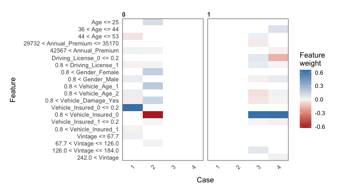

``` r
library(haven)
library(data.table)
library(tidyverse)
```

    ## ── Attaching packages ──────────────────────────────────────────────────────────────────── tidyverse 1.3.0 ──

    ## ✓ ggplot2 3.3.2     ✓ purrr   0.3.4
    ## ✓ tibble  3.0.3     ✓ dplyr   1.0.2
    ## ✓ tidyr   1.1.0     ✓ stringr 1.4.0
    ## ✓ readr   1.3.1     ✓ forcats 0.5.0

    ## ── Conflicts ─────────────────────────────────────────────────────────────────────── tidyverse_conflicts() ──
    ## x dplyr::between()   masks data.table::between()
    ## x dplyr::filter()    masks stats::filter()
    ## x dplyr::first()     masks data.table::first()
    ## x dplyr::lag()       masks stats::lag()
    ## x dplyr::last()      masks data.table::last()
    ## x purrr::transpose() masks data.table::transpose()

``` r
library(dplyr)
train <- fread("data/insurance_train.csv")
test <- fread("data/insurance_test.csv")
```

# Executive Summary

This data set is from Kaggle
(<https://www.kaggle.com/anmolkumar/health-insurance-cross-sell-prediction>),
which describes a health insurance company collecting customers’
demographics, vehicle information, and some insurance policy. The
purpose of this project is to perform two types of analysis: inference
and prediction.

As for the inference perspective, we performed various analysis on
correlation (numeric), association (categorical), interaction, and mixed
models. One of the interesting insights from this data is that top 2
regions (28 and 8) and bottom 2 regions (31 and 48) shows almost the
same customers’ demographics. The only difference is that top 2 regions
have more population (data). Another insights is that when customers do
not have vehicle insurance, customers who are interested in the
company’s insurance are willing to pay higher annual premium than
customers that have no interests.

As for the prediction point of view, we built random forest model and
XGBoost models. We obtained 67.81% for accuracy and 94.78% for
sensitivity. That result demonstrates us a decent model. Surprisingly,
XGBoost model does not perform as well as random forest model in terms
of sensitivity score that is almost 15% lower than random forest model
performed. Furthermore, I think this modeling shows us sometimes the
orginal XGBoost setting works for the best. That also concludes why
programmers who created XGBoost model set those initial parameters as
the standard. However, XGBoost still generated AUC for 0.83. As we know
higher AUC can have better performance on differentiating positive and
negative classes. Therefore, we still think XGBoost model is not the
worst model but not as well as random forest especially for this data
set.

# Inference Analysis

## Data Exploration and Cleaning

``` r
str(train)
```

    ## Classes 'data.table' and 'data.frame':   381109 obs. of  12 variables:
    ##  $ id                  : int  1 2 3 4 5 6 7 8 9 10 ...
    ##  $ Gender              : chr  "Male" "Male" "Male" "Male" ...
    ##  $ Age                 : int  44 76 47 21 29 24 23 56 24 32 ...
    ##  $ Driving_License     : int  1 1 1 1 1 1 1 1 1 1 ...
    ##  $ Region_Code         : num  28 3 28 11 41 33 11 28 3 6 ...
    ##  $ Previously_Insured  : int  0 0 0 1 1 0 0 0 1 1 ...
    ##  $ Vehicle_Age         : chr  "> 2 Years" "1-2 Year" "> 2 Years" "< 1 Year" ...
    ##  $ Vehicle_Damage      : chr  "Yes" "No" "Yes" "No" ...
    ##  $ Annual_Premium      : num  40454 33536 38294 28619 27496 ...
    ##  $ Policy_Sales_Channel: num  26 26 26 152 152 160 152 26 152 152 ...
    ##  $ Vintage             : int  217 183 27 203 39 176 249 72 28 80 ...
    ##  $ Response            : int  1 0 1 0 0 0 0 1 0 0 ...
    ##  - attr(*, ".internal.selfref")=<externalptr>

``` r
summary(train)
```

    ##        id            Gender               Age        Driving_License 
    ##  Min.   :     1   Length:381109      Min.   :20.00   Min.   :0.0000  
    ##  1st Qu.: 95278   Class :character   1st Qu.:25.00   1st Qu.:1.0000  
    ##  Median :190555   Mode  :character   Median :36.00   Median :1.0000  
    ##  Mean   :190555                      Mean   :38.82   Mean   :0.9979  
    ##  3rd Qu.:285832                      3rd Qu.:49.00   3rd Qu.:1.0000  
    ##  Max.   :381109                      Max.   :85.00   Max.   :1.0000  
    ##   Region_Code    Previously_Insured Vehicle_Age        Vehicle_Damage    
    ##  Min.   : 0.00   Min.   :0.0000     Length:381109      Length:381109     
    ##  1st Qu.:15.00   1st Qu.:0.0000     Class :character   Class :character  
    ##  Median :28.00   Median :0.0000     Mode  :character   Mode  :character  
    ##  Mean   :26.39   Mean   :0.4582                                          
    ##  3rd Qu.:35.00   3rd Qu.:1.0000                                          
    ##  Max.   :52.00   Max.   :1.0000                                          
    ##  Annual_Premium   Policy_Sales_Channel    Vintage         Response     
    ##  Min.   :  2630   Min.   :  1          Min.   : 10.0   Min.   :0.0000  
    ##  1st Qu.: 24405   1st Qu.: 29          1st Qu.: 82.0   1st Qu.:0.0000  
    ##  Median : 31669   Median :133          Median :154.0   Median :0.0000  
    ##  Mean   : 30564   Mean   :112          Mean   :154.3   Mean   :0.1226  
    ##  3rd Qu.: 39400   3rd Qu.:152          3rd Qu.:227.0   3rd Qu.:0.0000  
    ##  Max.   :540165   Max.   :163          Max.   :299.0   Max.   :1.0000

``` r
colnames(train) # check column names for the dataset
```

    ##  [1] "id"                   "Gender"               "Age"                 
    ##  [4] "Driving_License"      "Region_Code"          "Previously_Insured"  
    ##  [7] "Vehicle_Age"          "Vehicle_Damage"       "Annual_Premium"      
    ## [10] "Policy_Sales_Channel" "Vintage"              "Response"

``` r
train <- train%>%
  rename(Vehicle_Insured=Previously_Insured)%>%  #change the column name to vehicle_insured 
  mutate(id=as.character(id),
         Gender=as.factor(Gender),
         Driving_License=as.factor(Driving_License),
         Vehicle_Insured=as.factor(Vehicle_Insured),
         Vehicle_Age=as.factor(Vehicle_Age),
         Vehicle_Damage=as.factor(Vehicle_Damage),
         Policy_Sales_Channel=as.factor(as.character(Policy_Sales_Channel)),
         Region_Code=as.factor(as.character(Region_Code)),
         Response=as.factor(as.character(Response)))

train$Vehicle_Age <-  fct_relevel(train$Vehicle_Age,"< 1 Year","1-2 Year","> 2 Years") #reorder level
```

### Density Plot

    ## 
    ## Attaching package: 'scales'

    ## The following object is masked from 'package:purrr':
    ## 
    ##     discard

    ## The following object is masked from 'package:readr':
    ## 
    ##     col_factor

    ## Loading required package: viridisLite

    ## 
    ## Attaching package: 'viridis'

    ## The following object is masked from 'package:scales':
    ## 
    ##     viridis_pal

    ## NOTE: Either Arial Narrow or Roboto Condensed fonts are required to use these themes.

    ##       Please use hrbrthemes::import_roboto_condensed() to install Roboto Condensed and

    ##       if Arial Narrow is not on your system, please see https://bit.ly/arialnarrow

<!-- --><!-- -->

We cannot really obtain too much insights from the annual premium density plot, while it 
seems that young adults around 20s are not very likely to be interested in auto insurance 
than elder people around 40s.

## Correlation between Numeric Variables

    ##                         Age Annual_Premium       Vintage
    ## Age             1.000000000   0.0675070016 -0.0012640787
    ## Annual_Premium  0.067507002   1.0000000000 -0.0006084172
    ## Vintage        -0.001264079  -0.0006084172  1.0000000000

    ## corrplot 0.84 loaded

<!-- -->

Not too much correlation between those three numeric variables

## Association between Categorical Variables

``` r
chisq.test(train$Response, train$Driving_License, correct = FALSE)
```

    ## 
    ##  Pearson's Chi-squared test
    ## 
    ## data:  train$Response and train$Driving_License
    ## X-squared = 39.303, df = 1, p-value = 3.629e-10

``` r
chisq.test(train$Response, train$Vehicle_Damage, correct = FALSE)
```

    ## 
    ##  Pearson's Chi-squared test
    ## 
    ## data:  train$Response and train$Vehicle_Damage
    ## X-squared = 47867, df = 1, p-value < 2.2e-16

``` r
chisq.test(train$Response, train$Vehicle_Insured,  correct = FALSE)
```

    ## 
    ##  Pearson's Chi-squared test
    ## 
    ## data:  train$Response and train$Vehicle_Insured
    ## X-squared = 44360, df = 1, p-value < 2.2e-16

``` r
chisq.test(train$Response, train$Vehicle_Age,  correct = FALSE)
```

    ## 
    ##  Pearson's Chi-squared test
    ## 
    ## data:  train$Response and train$Vehicle_Age
    ## X-squared = 18772, df = 2, p-value < 2.2e-16

Since all p values are less than 0.01, we have up to 99% confidence that
all four pairs of variables are associated. We can use assoc to see some
directions of the association.

    ## Loading required package: grid

<!-- --><!-- --><!-- --><!-- -->

We can see customers without a driving license, they are way much less
likely to be interested in vehicle insurance, which totally makes sense.
A larger amount of customers are interested in the vehicle insurance if
their car had some damages in the past. And we can see customers who
does not have vehicle insurance are more likely to be interested in
company’s vehicle insurance. When Vehicles’ ages are 1-2 year or 2 years
older, customers are more likey to be interested in the vehicle
insurance.

## Interaction

``` r
intMod<- lm(Annual_Premium ~ Vehicle_Age*Gender , data = train)

summary(intMod)
```

    ## 
    ## Call:
    ## lm(formula = Annual_Premium ~ Vehicle_Age * Gender, data = train)
    ## 
    ## Residuals:
    ##    Min     1Q Median     3Q    Max 
    ## -33559  -6029   1182   8793 509866 
    ## 
    ## Coefficients:
    ##                                 Estimate Std. Error t value Pr(>|t|)    
    ## (Intercept)                     29974.88      56.85 527.305  < 2e-16 ***
    ## Vehicle_Age1-2 Year               714.25      83.76   8.528  < 2e-16 ***
    ## Vehicle_Age> 2 Years             6213.99     234.39  26.511  < 2e-16 ***
    ## GenderMale                        324.51      85.14   3.812 0.000138 ***
    ## Vehicle_Age1-2 Year:GenderMale   -595.61     115.95  -5.137 2.80e-07 ***
    ## Vehicle_Age> 2 Years:GenderMale -1154.96     295.98  -3.902 9.54e-05 ***
    ## ---
    ## Signif. codes:  0 '***' 0.001 '**' 0.01 '*' 0.05 '.' 0.1 ' ' 1
    ## 
    ## Residual standard error: 17180 on 381103 degrees of freedom
    ## Multiple R-squared:  0.004056,   Adjusted R-squared:  0.004043 
    ## F-statistic: 310.4 on 5 and 381103 DF,  p-value: < 2.2e-16

``` r
library(effects)
```

    ## Loading required package: carData

    ## lattice theme set by effectsTheme()
    ## See ?effectsTheme for details.

``` r
modEffects <- effect("Vehicle_Age*Gender", intMod)

plot(modEffects)
```

<!-- -->

We can see a huge comparison that the annual premium is much higher for
`> 2 years of vehicle age` than the other vehicle ages. Female pays
lower for &lt; 1 year of vehicle age than male do, however female pays
higher for &gt;2 years and 1-2 year of vehicle age than male do.

``` r
intMod3<- lm(Annual_Premium ~ Response*Vehicle_Insured , data = train)

summary(intMod3)
```

    ## 
    ## Call:
    ## lm(formula = Annual_Premium ~ Response * Vehicle_Insured, data = train)
    ## 
    ## Residuals:
    ##    Min     1Q Median     3Q    Max 
    ## -28990  -6197   1105   8838 509995 
    ## 
    ## Coefficients:
    ##                            Estimate Std. Error t value Pr(>|t|)    
    ## (Intercept)                30169.85      43.03 701.179  < 2e-16 ***
    ## Response1                   1450.24      90.62  16.004  < 2e-16 ***
    ## Vehicle_Insured1             477.83      59.57   8.022 1.05e-15 ***
    ## Response1:Vehicle_Insured1 -5207.22    1372.54  -3.794 0.000148 ***
    ## ---
    ## Signif. codes:  0 '***' 0.001 '**' 0.01 '*' 0.05 '.' 0.1 ' ' 1
    ## 
    ## Residual standard error: 17210 on 381105 degrees of freedom
    ## Multiple R-squared:  0.0007095,  Adjusted R-squared:  0.0007017 
    ## F-statistic:  90.2 on 3 and 381105 DF,  p-value: < 2.2e-16

``` r
#library(effects)

modEffects3 <- effect("Response*Vehicle_Insured", intMod3)

plot(modEffects3)
```

<!-- -->

When customers do not have vehicle insurance, customers who are
interested in the company’s insurance are willing to pay higher annual
premium than customers that have no interests.

## Logistic model

``` r
logTest <- glm(Response ~ Annual_Premium +Gender+ Age + Driving_License + Vehicle_Insured + 
               Vehicle_Age + Vehicle_Damage + Region_Code+Policy_Sales_Channel, data = train, 
               family = binomial)  

exp(logTest$coefficients)
```

    ##             (Intercept)          Annual_Premium              GenderMale 
    ##            9.853508e-03            1.000001e+00            1.069864e+00 
    ##                     Age        Driving_License1        Vehicle_Insured1 
    ##            9.748606e-01            3.258313e+00            1.931880e-02 
    ##     Vehicle_Age1-2 Year    Vehicle_Age> 2 Years       Vehicle_DamageYes 
    ##            1.416712e+00            1.748184e+00            7.098916e+00 
    ##            Region_Code1           Region_Code10           Region_Code11 
    ##            1.259826e+00            1.959343e+00            3.062594e+00 
    ##           Region_Code12           Region_Code13           Region_Code14 
    ##            2.108934e+00            1.945287e+00            2.237348e+00 
    ##           Region_Code15           Region_Code16           Region_Code17 
    ##            1.751443e+00            1.800972e+00            1.590645e+00 
    ##           Region_Code18           Region_Code19            Region_Code2 
    ##            2.864196e+00            2.102573e+00            1.711856e+00 
    ##           Region_Code20           Region_Code21           Region_Code22 
    ##            1.394682e+00            2.415606e+00            1.388902e+00 
    ##           Region_Code23           Region_Code24           Region_Code25 
    ##            2.480685e+00            2.181193e+00            1.234608e+00 
    ##           Region_Code26           Region_Code27           Region_Code28 
    ##            1.349297e+00            1.777084e+00            2.305060e+00 
    ##           Region_Code29            Region_Code3           Region_Code30 
    ##            2.905942e+00            2.574024e+00            2.531169e+00 
    ##           Region_Code31           Region_Code32           Region_Code33 
    ##            1.477425e+00            2.234846e+00            2.051887e+00 
    ##           Region_Code34           Region_Code35           Region_Code36 
    ##            1.457986e+00            2.851716e+00            1.925769e+00 
    ##           Region_Code37           Region_Code38           Region_Code39 
    ##            1.829341e+00            2.533270e+00            1.835849e+00 
    ##            Region_Code4           Region_Code40           Region_Code41 
    ##            2.406219e+00            1.821875e+00            2.774700e+00 
    ##           Region_Code42           Region_Code43           Region_Code44 
    ##            1.336884e+00            1.535996e+00            1.107198e+00 
    ##           Region_Code45           Region_Code46           Region_Code47 
    ##            2.186958e+00            2.106658e+00            1.624818e+00 
    ##           Region_Code48           Region_Code49            Region_Code5 
    ##            1.238351e+00            1.491691e+00            2.064996e+00 
    ##           Region_Code50           Region_Code51           Region_Code52 
    ##            1.408681e+00            2.225525e+00            2.014308e+00 
    ##            Region_Code6            Region_Code7            Region_Code8 
    ##            2.499135e+00            2.017844e+00            1.801555e+00 
    ##            Region_Code9  Policy_Sales_Channel10 Policy_Sales_Channel100 
    ##            1.497633e+00            1.432521e+00            3.141439e+00 
    ## Policy_Sales_Channel101 Policy_Sales_Channel102 Policy_Sales_Channel103 
    ##            2.802917e+00            3.506028e-05            1.688883e+00 
    ## Policy_Sales_Channel104 Policy_Sales_Channel105 Policy_Sales_Channel106 
    ##            1.838440e-05            2.634800e-03            2.700943e+00 
    ## Policy_Sales_Channel107 Policy_Sales_Channel108 Policy_Sales_Channel109 
    ##            1.469057e+00            1.257454e+00            9.863087e-01 
    ##  Policy_Sales_Channel11 Policy_Sales_Channel110 Policy_Sales_Channel111 
    ##            1.015830e+00            6.464468e-01            1.080588e+00 
    ## Policy_Sales_Channel112 Policy_Sales_Channel113 Policy_Sales_Channel114 
    ##            9.664295e-06            1.291642e+00            9.982590e-01 
    ## Policy_Sales_Channel115 Policy_Sales_Channel116 Policy_Sales_Channel117 
    ##            4.010099e-05            1.194200e+00            2.268444e-03 
    ## Policy_Sales_Channel118 Policy_Sales_Channel119  Policy_Sales_Channel12 
    ##            2.301435e-05            1.267946e+00            1.402216e+00 
    ## Policy_Sales_Channel120 Policy_Sales_Channel121 Policy_Sales_Channel122 
    ##            1.360771e+00            3.541755e+00            1.540404e+00 
    ## Policy_Sales_Channel123 Policy_Sales_Channel124 Policy_Sales_Channel125 
    ##            3.152755e+06            1.686755e+00            1.184971e+00 
    ## Policy_Sales_Channel126 Policy_Sales_Channel127 Policy_Sales_Channel128 
    ##            3.917392e-05            8.215244e-01            1.161199e+00 
    ## Policy_Sales_Channel129  Policy_Sales_Channel13 Policy_Sales_Channel130 
    ##            6.009114e-01            1.324345e+00            2.215353e+00 
    ## Policy_Sales_Channel131 Policy_Sales_Channel132 Policy_Sales_Channel133 
    ##            8.941124e-01            7.479615e-01            7.704644e-01 
    ## Policy_Sales_Channel134 Policy_Sales_Channel135 Policy_Sales_Channel136 
    ##            3.448084e-05            9.258593e-01            1.990981e+00 
    ## Policy_Sales_Channel137 Policy_Sales_Channel138 Policy_Sales_Channel139 
    ##            2.371497e-05            1.099938e+00            8.261695e-01 
    ##  Policy_Sales_Channel14 Policy_Sales_Channel140 Policy_Sales_Channel143 
    ##            1.493492e+00            7.482290e-01            1.533142e-05 
    ## Policy_Sales_Channel144 Policy_Sales_Channel145 Policy_Sales_Channel146 
    ##            3.163175e-03            1.808581e+00            2.750247e-05 
    ## Policy_Sales_Channel147 Policy_Sales_Channel148 Policy_Sales_Channel149 
    ##            1.640470e+00            1.430763e+00            4.112118e-06 
    ##  Policy_Sales_Channel15 Policy_Sales_Channel150 Policy_Sales_Channel151 
    ##            1.720815e+00            1.857636e+00            4.717569e-01 
    ## Policy_Sales_Channel152 Policy_Sales_Channel153 Policy_Sales_Channel154 
    ##            5.699400e-01            8.466877e-01            1.727738e+00 
    ## Policy_Sales_Channel155 Policy_Sales_Channel156 Policy_Sales_Channel157 
    ##            2.557241e+00            1.400644e+00            1.819644e+00 
    ## Policy_Sales_Channel158 Policy_Sales_Channel159  Policy_Sales_Channel16 
    ##            1.822974e+00            2.424293e-01            1.328914e+00 
    ## Policy_Sales_Channel160 Policy_Sales_Channel163  Policy_Sales_Channel17 
    ##            2.190984e-01            2.112460e+00            2.911532e+00 
    ##  Policy_Sales_Channel18  Policy_Sales_Channel19   Policy_Sales_Channel2 
    ##            7.116562e-01            1.184812e+00            1.650624e+00 
    ##  Policy_Sales_Channel20  Policy_Sales_Channel21  Policy_Sales_Channel22 
    ##            1.718634e+00            1.163160e+00            9.015174e-01 
    ##  Policy_Sales_Channel23  Policy_Sales_Channel24  Policy_Sales_Channel25 
    ##            1.458758e+00            1.401279e+00            2.172175e+00 
    ##  Policy_Sales_Channel26  Policy_Sales_Channel27  Policy_Sales_Channel28 
    ##            2.038070e+00            2.680875e+00            3.295917e+00 
    ##  Policy_Sales_Channel29   Policy_Sales_Channel3  Policy_Sales_Channel30 
    ##            1.404171e+00            2.820068e+00            1.426433e+00 
    ##  Policy_Sales_Channel31  Policy_Sales_Channel32  Policy_Sales_Channel33 
    ##            2.149890e+00            1.150714e+00            7.797249e-06 
    ##  Policy_Sales_Channel34  Policy_Sales_Channel35  Policy_Sales_Channel36 
    ##            9.941175e-06            1.302218e+00            2.925531e+00 
    ##  Policy_Sales_Channel37  Policy_Sales_Channel38  Policy_Sales_Channel39 
    ##            9.735786e-01            3.003185e-05            5.426305e-01 
    ##   Policy_Sales_Channel4  Policy_Sales_Channel40  Policy_Sales_Channel41 
    ##            1.920911e+00            1.016903e+00            4.034052e-03 
    ##  Policy_Sales_Channel42  Policy_Sales_Channel43  Policy_Sales_Channel44 
    ##            1.832904e+00            2.919075e+06            1.935279e+00 
    ##  Policy_Sales_Channel45  Policy_Sales_Channel46  Policy_Sales_Channel47 
    ##            9.414355e-01            1.691265e-05            1.122736e+00 
    ##  Policy_Sales_Channel48  Policy_Sales_Channel49  Policy_Sales_Channel50 
    ##            5.071720e-01            1.788308e+00            6.222509e-06 
    ##  Policy_Sales_Channel51  Policy_Sales_Channel52  Policy_Sales_Channel53 
    ##            7.461570e-01            1.124465e+00            1.844549e+00 
    ##  Policy_Sales_Channel54  Policy_Sales_Channel55  Policy_Sales_Channel56 
    ##            1.108895e+00            1.348916e+00            1.626228e+00 
    ##  Policy_Sales_Channel57  Policy_Sales_Channel58  Policy_Sales_Channel59 
    ##            1.139310e+00            7.578888e-01            1.591559e+00 
    ##   Policy_Sales_Channel6  Policy_Sales_Channel60  Policy_Sales_Channel61 
    ##            2.514745e-05            1.103589e+00            9.440892e-01 
    ##  Policy_Sales_Channel62  Policy_Sales_Channel63  Policy_Sales_Channel64 
    ##            4.086023e+00            1.368971e+00            7.867685e-01 
    ##  Policy_Sales_Channel65  Policy_Sales_Channel66  Policy_Sales_Channel67 
    ##            8.564121e-01            1.213748e+00            5.682621e-06 
    ##  Policy_Sales_Channel68  Policy_Sales_Channel69   Policy_Sales_Channel7 
    ##            2.049881e+01            2.543915e+00            1.732198e+00 
    ##  Policy_Sales_Channel70  Policy_Sales_Channel71  Policy_Sales_Channel73 
    ##            8.891807e-06            1.492018e-05            5.502805e-01 
    ##  Policy_Sales_Channel74  Policy_Sales_Channel75  Policy_Sales_Channel76 
    ##            2.102030e-05            1.605207e-05            2.163791e-05 
    ##  Policy_Sales_Channel78  Policy_Sales_Channel79   Policy_Sales_Channel8 
    ##            1.990876e+00            6.378437e-06            1.383993e+00 
    ##  Policy_Sales_Channel80  Policy_Sales_Channel81  Policy_Sales_Channel82 
    ##            3.072350e+00            5.847039e+00            3.371404e-05 
    ##  Policy_Sales_Channel83  Policy_Sales_Channel84  Policy_Sales_Channel86 
    ##            3.781093e-05            3.490225e-03            1.948901e+00 
    ##  Policy_Sales_Channel87  Policy_Sales_Channel88  Policy_Sales_Channel89 
    ##            2.509383e+00            3.575398e-01            1.524093e+00 
    ##   Policy_Sales_Channel9  Policy_Sales_Channel90  Policy_Sales_Channel91 
    ##            1.516845e+00            3.238570e+00            2.019868e+00 
    ##  Policy_Sales_Channel92  Policy_Sales_Channel93  Policy_Sales_Channel94 
    ##            1.998723e+00            1.146002e+00            2.203668e+00 
    ##  Policy_Sales_Channel95  Policy_Sales_Channel96  Policy_Sales_Channel97 
    ##            2.516867e-05            2.037564e-05            1.641869e+00 
    ##  Policy_Sales_Channel98  Policy_Sales_Channel99 
    ##            6.028701e-01            3.001775e-05

Male customers are about 9.5% likely to be interested in the vehicle
insurance than female customers. Customers with driving license are
about 231.7% likely to be interested in the vehicle insurance. Older
vehicles(elder than 2 years) are about 331% likely to be interested in
the vehicle insurance. Damaged vehicles are about 658.7% likely to be
interested in the vehicle insurance.

## Mixed Models

``` r
library(lme4)
```

    ## Loading required package: Matrix

    ## 
    ## Attaching package: 'Matrix'

    ## The following objects are masked from 'package:tidyr':
    ## 
    ##     expand, pack, unpack

``` r
riMod <- lmer(Annual_Premium ~ Age+Driving_License+Vehicle_Insured+Vehicle_Age+Vehicle_Damage+(1|Region_Code), 
              data = train)

summary(riMod)
```

    ## Linear mixed model fit by REML ['lmerMod']
    ## Formula: 
    ## Annual_Premium ~ Age + Driving_License + Vehicle_Insured + Vehicle_Age +  
    ##     Vehicle_Damage + (1 | Region_Code)
    ##    Data: train
    ## 
    ## REML criterion at convergence: 8434758
    ## 
    ## Scaled residuals: 
    ##    Min     1Q Median     3Q    Max 
    ## -2.750 -0.362  0.083  0.496 32.499 
    ## 
    ## Random effects:
    ##  Groups      Name        Variance  Std.Dev.
    ##  Region_Code (Intercept)  57718281  7597   
    ##  Residual                239375116 15472   
    ## Number of obs: 381109, groups:  Region_Code, 53
    ## 
    ## Fixed effects:
    ##                       Estimate Std. Error t value
    ## (Intercept)          24332.083   1186.038  20.515
    ## Age                    101.728      2.669  38.111
    ## Driving_License1     -2295.120    545.729  -4.206
    ## Vehicle_Insured1      1443.688     89.722  16.091
    ## Vehicle_Age1-2 Year  -4196.045     87.253 -48.091
    ## Vehicle_Age> 2 Years -1611.922    159.702 -10.093
    ## Vehicle_DamageYes      348.658     89.776   3.884
    ## 
    ## Correlation of Fixed Effects:
    ##             (Intr) Age    Drv_L1 Vhc_I1 V_A1-Y V_A>2Y
    ## Age         -0.091                                   
    ## Drvng_Lcns1 -0.465  0.079                            
    ## Vhcl_Insrd1 -0.065 -0.028  0.000                     
    ## Vhcl_Ag1-2Y  0.041 -0.737 -0.036  0.083              
    ## Vhcl_Ag>2Yr  0.033 -0.508 -0.029  0.069  0.580       
    ## Vehcl_DmgYs -0.065  0.019  0.004  0.789 -0.091 -0.108

``` r
ranef(riMod)
```

    ## $Region_Code
    ##     (Intercept)
    ## 0  -20651.65273
    ## 1  -21213.16320
    ## 10   -147.68266
    ## 11   2726.53543
    ## 12  -1312.95276
    ## 13    -84.77034
    ## 14    914.33830
    ## 15   4843.00651
    ## 16  -1910.67697
    ## 17   6660.80414
    ## 18   2134.79338
    ## 19   2467.35038
    ## 2    2108.39115
    ## 20 -21278.33696
    ## 21     43.28032
    ## 22    -31.60830
    ## 23  -1041.83073
    ## 24   1407.56848
    ## 25    688.82709
    ## 26   4579.62448
    ## 27  -1981.15039
    ## 28  14476.55587
    ## 29   4695.36672
    ## 3     -10.41331
    ## 30    464.17926
    ## 31 -21582.39785
    ## 32   -800.18670
    ## 33   3037.85761
    ## 34   1968.77490
    ## 35   2194.71230
    ## 36   4590.67252
    ## 37   3671.25441
    ## 38   -437.57099
    ## 39   2497.26706
    ## 4    -567.60186
    ## 40   1877.55652
    ## 41   6191.66846
    ## 42     68.49937
    ## 43   1587.32187
    ## 44   -645.98843
    ## 45    684.52092
    ## 46   2591.93037
    ## 47   5577.74789
    ## 48 -21418.70083
    ## 49  -1242.72248
    ## 5    -553.59495
    ## 50   6161.94353
    ## 51   3558.81421
    ## 52   5800.67866
    ## 6     -67.50510
    ## 7    1201.12309
    ## 8   11837.26847
    ## 9    3670.27283
    ## 
    ## with conditional variances for "Region_Code"

``` r
MuMIn::r.squaredGLMM(riMod)
```

    ## Warning: 'r.squaredGLMM' now calculates a revised statistic. See the help page.

    ##              R2m       R2c
    ## [1,] 0.008368457 0.2010192

Our model accounts for about 19% (0.2010-0.0084) of the variation in
region alone.

We can also use `lmerTest::lmer` to show the p values associated with
the riMod model.

``` r
riModP <- lmerTest::lmer(Annual_Premium ~ Age+Driving_License+Vehicle_Insured+Vehicle_Age+Vehicle_Damage+(1|Region_Code), 
              data = train) 

summary(riModP)
```

    ## Linear mixed model fit by REML. t-tests use Satterthwaite's method [
    ## lmerModLmerTest]
    ## Formula: 
    ## Annual_Premium ~ Age + Driving_License + Vehicle_Insured + Vehicle_Age +  
    ##     Vehicle_Damage + (1 | Region_Code)
    ##    Data: train
    ## 
    ## REML criterion at convergence: 8434758
    ## 
    ## Scaled residuals: 
    ##    Min     1Q Median     3Q    Max 
    ## -2.750 -0.362  0.083  0.496 32.499 
    ## 
    ## Random effects:
    ##  Groups      Name        Variance  Std.Dev.
    ##  Region_Code (Intercept)  57718281  7597   
    ##  Residual                239375116 15472   
    ## Number of obs: 381109, groups:  Region_Code, 53
    ## 
    ## Fixed effects:
    ##                        Estimate Std. Error         df t value Pr(>|t|)    
    ## (Intercept)           24332.083   1186.038     86.398  20.515  < 2e-16 ***
    ## Age                     101.728      2.669 381053.220  38.111  < 2e-16 ***
    ## Driving_License1      -2295.120    545.729 381050.254  -4.206  2.6e-05 ***
    ## Vehicle_Insured1       1443.688     89.722 381055.067  16.091  < 2e-16 ***
    ## Vehicle_Age1-2 Year   -4196.045     87.253 381071.164 -48.091  < 2e-16 ***
    ## Vehicle_Age> 2 Years  -1611.922    159.702 381058.495 -10.093  < 2e-16 ***
    ## Vehicle_DamageYes       348.658     89.776 381051.765   3.884 0.000103 ***
    ## ---
    ## Signif. codes:  0 '***' 0.001 '**' 0.01 '*' 0.05 '.' 0.1 ' ' 1
    ## 
    ## Correlation of Fixed Effects:
    ##             (Intr) Age    Drv_L1 Vhc_I1 V_A1-Y V_A>2Y
    ## Age         -0.091                                   
    ## Drvng_Lcns1 -0.465  0.079                            
    ## Vhcl_Insrd1 -0.065 -0.028  0.000                     
    ## Vhcl_Ag1-2Y  0.041 -0.737 -0.036  0.083              
    ## Vhcl_Ag>2Yr  0.033 -0.508 -0.029  0.069  0.580       
    ## Vehcl_DmgYs -0.065  0.019  0.004  0.789 -0.091 -0.108

``` r
library(sjPlot)
```

    ## #refugeeswelcome

``` r
plot_model(riMod, type = "re") + 
  theme_minimal()
```

<!-- -->

``` r
library(merTools)
```

    ## Loading required package: arm

    ## Loading required package: MASS

    ## 
    ## Attaching package: 'MASS'

    ## The following object is masked from 'package:dplyr':
    ## 
    ##     select

    ## 
    ## arm (Version 1.11-2, built: 2020-7-27)

    ## Working directory is /Users/Caspar/Documents/GitHub_Project/insurance_cross_sell

    ## 
    ## Attaching package: 'arm'

    ## The following object is masked from 'package:corrplot':
    ## 
    ##     corrplot

    ## The following object is masked from 'package:scales':
    ## 
    ##     rescale

    ## Registered S3 method overwritten by 'broom.mixed':
    ##   method      from 
    ##   tidy.gamlss broom

``` r
plotREsim(REsim(riMod), labs = TRUE)
```

<!-- -->

From the two graphs above, we can see region 28 and 8’s annual premium
are significantly above average among all the regions. We can extract
region top 2 and bottom 2 data from the train data to do further
analysis.

``` r
region28 <- train[Region_Code=="28",]  #extract region 28

region8 <- train[Region_Code=="8",]  #extract region 8

region31 <- train[Region_Code=="31",] # extract region 31

region48 <- train[Region_Code=="48",]  #extract region 48
```

    ## `stat_bin()` using `bins = 30`. Pick better value with `binwidth`.

    ## Warning: Removed 588 rows containing non-finite values (stat_bin).

    ## Warning: Removed 4 rows containing missing values (geom_bar).

<!-- -->

    ## `stat_bin()` using `bins = 30`. Pick better value with `binwidth`.

<!-- -->

    ## `stat_bin()` using `bins = 30`. Pick better value with `binwidth`.

    ## Warning: Removed 14 rows containing non-finite values (stat_bin).

<!-- -->

    ## `stat_bin()` using `bins = 30`. Pick better value with `binwidth`.

<!-- -->

Top 2 regions: After we limit annual premium from 0 to 100K, we can see
that top 2 regions cover almost the same range from 25K to 75K for the
majority group of the annual premium. The age histogram shows almost the
same pattern that the peaks are similar shown in around 26, 48, 53, 67
and 72 years old in both 28 and 8 regions. Thus, region 28 and 8 are not
so different from each other.

Bottom 2 regions: And it is surprised to see the bottom 2 regions also
have similarities in annual premium and age too. There is only one price
for annual premium for both regions. We can see more close match in age
histogram.

# Prediction Analysis (Machine Learning)

We will use random forest and xgboost to build model respectively and
then we can determine which model is the best fit for the data, but we
need to create some dummy variables for some factor variables.

## Data Cleaning (Machine Learning purpose)

``` r
library(fastDummies)

train <- train%>%
  mutate(Vehicle_Age=ifelse(Vehicle_Age=="< 1 Year","1",
                            ifelse(Vehicle_Age=="1-2 Year","2","3")))
#mark "< 1 Year" as 1, "1-2 Year" as 2, "> 2 Years" as 3
                            
train_dum <- dummy_cols(train[,c("Gender","Driving_License","Vehicle_Insured","Vehicle_Age","Vehicle_Damage")]) #make dummy variables 

train_dum <- train_dum%>%
  dplyr::select(-c(1:5)) #get rid of some columns

train_data <- cbind(train[,c("Age","Annual_Premium","Vintage")],train_dum,train[,"Response"])
# combine dummy data and normal data together
```

``` r
train_data <- train_data%>% #adjust response(dependent) variable into human friendly text
  mutate(Response=ifelse(Response=="0","NOInterest","Interest"))%>%
  mutate(Response=as.factor(Response))

summary(train_data$Response) # we have a very imbalanced data set, around 14% of the customers are interested, around 86% of the customers are NOT interested. we can use SMOTE to deal with that later
```

    ##   Interest NOInterest 
    ##      46710     334399

``` r
set.seed(12345)
# for this project we only use 50000 subset to build the model
train_subset <- train_data[1:50000,]  # this train_subset would be imbalanced as well

test_subset <- train_data[50001:70000,] # we use the other 20000 subset for validation set 
```

## Random Forest

``` r
library(randomForest)
```

    ## randomForest 4.6-14

    ## Type rfNews() to see new features/changes/bug fixes.

    ## 
    ## Attaching package: 'randomForest'

    ## The following object is masked from 'package:dplyr':
    ## 
    ##     combine

    ## The following object is masked from 'package:ggplot2':
    ## 
    ##     margin

``` r
library(caret)
```

    ## Loading required package: lattice

    ## 
    ## Attaching package: 'caret'

    ## The following object is masked from 'package:purrr':
    ## 
    ##     lift

``` r
library(DMwR) # load the SMOTE dealing with imbalanced data
```

    ## Registered S3 method overwritten by 'quantmod':
    ##   method            from
    ##   as.zoo.data.frame zoo

``` r
smote_data <- SMOTE(Response ~ ., # Set prediction formula
train_subset, # Set dataset
perc.over = 100) # Select oversampling for minority class
summary(smote_data$Response) 
```

    ##   Interest NOInterest 
    ##      12248      12248

``` r
randomforest_mod <- randomForest(Response ~ ., # Set tree formula
                       data = smote_data, # Set dataset
                       ntree = 1000,
                       ) # Set number of trees to use
randomforest_mod
```

    ## 
    ## Call:
    ##  randomForest(formula = Response ~ ., data = smote_data, ntree = 1000,      ) 
    ##                Type of random forest: classification
    ##                      Number of trees: 1000
    ## No. of variables tried at each split: 3
    ## 
    ##         OOB estimate of  error rate: 20.22%
    ## Confusion matrix:
    ##            Interest NOInterest class.error
    ## Interest      11642        606  0.04947747
    ## NOInterest     4348       7900  0.35499673

Lets look at the out-of-bag error for the model over the 1000 trees:

``` r
oob_error <- randomforest_mod$err.rate[,1] # Extract oob error
plot_dat <- cbind.data.frame(rep(1:length(oob_error)), oob_error) # Create plot data
names(plot_dat) <- c("trees", "oob_error") # Name plot data

# Plot oob error
g_1 <- ggplot(plot_dat, aes(x = trees, y = oob_error)) + # Set x as trees and y as error
  geom_point(alpha = 0.3, color = "blue") + # Select geom point
  theme_bw() + # Set theme
  geom_smooth() + # Add smoothing line
  theme(panel.grid.major = element_blank(), # Remove grid
        panel.grid.minor = element_blank(), # Remove grid
        panel.border = element_blank(), # Remove grid
        panel.background = element_blank()) + # Remove grid 
  labs(x = "Number of Trees", title = "Error Rate v Number of Trees",
       y = "Error Rate")  # Set labels
g_1 # Print plot
```

    ## `geom_smooth()` using method = 'gam' and formula 'y ~ s(x, bs = "cs")'

<!-- -->

The optimal number of trees are from 700 to 800 trees from the graph
above, we will use 800 tress for tuning the model.

``` r
set.seed(111111)
randomforest_preds <- predict(randomforest_mod, test_subset, type = "prob") # Create predictions for random forest model

# Convert predictions to classes, using 0.5
randomforest_pred_class <- rep("NOInterest", nrow(randomforest_preds))
randomforest_pred_class[randomforest_preds[,1] >= 0.5] <- "Interest"

confusionMatrix(as.factor(randomforest_pred_class), 
                test_subset$Response, positive = "Interest") 
```

    ## Confusion Matrix and Statistics
    ## 
    ##             Reference
    ## Prediction   Interest NOInterest
    ##   Interest       2341       6272
    ##   NOInterest      131      11256
    ##                                           
    ##                Accuracy : 0.6798          
    ##                  95% CI : (0.6733, 0.6863)
    ##     No Information Rate : 0.8764          
    ##     P-Value [Acc > NIR] : 1               
    ##                                           
    ##                   Kappa : 0.285           
    ##                                           
    ##  Mcnemar's Test P-Value : <2e-16          
    ##                                           
    ##             Sensitivity : 0.9470          
    ##             Specificity : 0.6422          
    ##          Pos Pred Value : 0.2718          
    ##          Neg Pred Value : 0.9885          
    ##              Prevalence : 0.1236          
    ##          Detection Rate : 0.1171          
    ##    Detection Prevalence : 0.4306          
    ##       Balanced Accuracy : 0.7946          
    ##                                           
    ##        'Positive' Class : Interest        
    ## 

For our original random forest model we have 68.32% accuracy and 94.09%
sensitivity. We hope we can enhance accuracy rate and sensitivity rate
by tuning the model.

This model predicts 68.32% accuracy for all correct predictions
including true positive and true negative and predicts 94.09%
sensitivity for actual interested customers are correctly predicted as
interested

Note that for this problem we are particularly interested in predicting
the positive class corresponding to INTEREST customers, so we will look
at sensitivity as well as overall accuracy.

### Tuning the randomforest model

``` r
# start parallel processing to make machine learning much more efficiently (reduce running time)
library(doParallel)
```

    ## Loading required package: foreach

    ## 
    ## Attaching package: 'foreach'

    ## The following objects are masked from 'package:purrr':
    ## 
    ##     accumulate, when

    ## Loading required package: iterators

    ## Loading required package: parallel

``` r
library(foreach)
cl <- makeCluster(detectCores() - 1) # save one core only
registerDoParallel(cl)

library(randomForest)
library(caret)
mtry_vals <- c(2, 4, 5, 7, 9, 11, 14) # last parameter is 14 because we only have 14 independent variables
nodesize_vals <- c(1, 10, 15, 50, 100, 150, 200, 500, 1000)

tuning_params <- expand.grid(mtry_vals,nodesize_vals) # make a table for two parameters 
names(tuning_params) <- c("mtry_vals", "nodesize_vals") # set up column names for the table

foreach_rf <- foreach(i = 1:nrow(tuning_params), 
              .packages='randomForest',
              .combine = 'rbind') %dopar%
  {
    rf_Mod <- randomForest(Response ~ ., # Set tree formula
                          data= smote_data, # Set dataset
                          mtry = tuning_params$mtry_vals[i],
                          nodesize = tuning_params$nodesize_vals[i],
                          ntree = 800)
    
    rf_preds <- rf_Mod$predicted # Create predictions for bagging model
    
    t <- table(rf_preds,   smote_data$Response) # Create table
    c <- caret::confusionMatrix(t, positive = "Interest") # Produce confusion matrix
  
    data.frame(acc_vec=c$overall[1], # loop the accuracy results into acc_vec
               sens_vec=c$byClass[1], # loop the sensitivity results into sens_vec
               spec_vec=c$byClass[2], # loop the specificity results into sens_vec
               mtry=tuning_params[i,"mtry_vals"],
               nodesize=tuning_params[i,"nodesize_vals"])
    
  }
```

<!-- --><!-- --><!-- -->

Since we cannot use one set of parameter to satisfy both accuracy and
sensitivity, however we want to predict the positive class corresponding
to INTEREST customers, so we will focus on the highest sensitivity score
on second graph (g\_2). It looks like the best set of parameters for
this tree are mtry 2 and node size 1000.

``` r
set.seed(111111)
rf_mod_final <- randomForest(Response ~ ., # Set tree formula
                       data = smote_data[,1:15], # Set dataset
                       ntree = 800,
                       nodesize=1000,
                       mtry=2
                       ) # Set number of trees to use
rf_mod_final # final random forest model
```

    ## 
    ## Call:
    ##  randomForest(formula = Response ~ ., data = smote_data[, 1:15],      ntree = 800, nodesize = 1000, mtry = 2) 
    ##                Type of random forest: classification
    ##                      Number of trees: 800
    ## No. of variables tried at each split: 2
    ## 
    ##         OOB estimate of  error rate: 20.87%
    ## Confusion matrix:
    ##            Interest NOInterest class.error
    ## Interest      11723        525  0.04286414
    ## NOInterest     4587       7661  0.37451012

``` r
rf_preds_final <- predict(rf_mod_final, test_subset, type = "prob") # Create predictions for random forest model

# Convert predictions to classes, using 0.5 rule
rf_pred_class <- rep("NOInterest", nrow(rf_preds_final))
rf_pred_class[rf_preds_final[,1] >= 0.5] <- "Interest"

confusionMatrix(as.factor(rf_pred_class), 
                test_subset$Response, positive = "Interest") 
```

    ## Confusion Matrix and Statistics
    ## 
    ##             Reference
    ## Prediction   Interest NOInterest
    ##   Interest       2367       6620
    ##   NOInterest      105      10908
    ##                                           
    ##                Accuracy : 0.6638          
    ##                  95% CI : (0.6572, 0.6703)
    ##     No Information Rate : 0.8764          
    ##     P-Value [Acc > NIR] : 1               
    ##                                           
    ##                   Kappa : 0.272           
    ##                                           
    ##  Mcnemar's Test P-Value : <2e-16          
    ##                                           
    ##             Sensitivity : 0.9575          
    ##             Specificity : 0.6223          
    ##          Pos Pred Value : 0.2634          
    ##          Neg Pred Value : 0.9905          
    ##              Prevalence : 0.1236          
    ##          Detection Rate : 0.1183          
    ##    Detection Prevalence : 0.4494          
    ##       Balanced Accuracy : 0.7899          
    ##                                           
    ##        'Positive' Class : Interest        
    ## 

From the confusion matrix, we got better sensitivity 95.47%, which was a
little bit higher than the naive random forest model. And it is
reasonable that accuracy is 66.45% since we did not choose the parameter
that were the best for enhancing accuracy score. Let’s keep those scores
in mind and we will use XGBoost to build the model to see how it will
go. Now, we can plot the variable importance using `varImpPlot`:

The higher mean decrease in Gini, the higher variable importance for
that variable would be. Therefore, we can conclude that *whether vehicle
damaged or not and whether customers already have auto insurance or do
not have auto insurance* are the most important variables. Next step, we
will use XGBoost to build model and see if XGBoost model can perform
better than random forest model.

``` r
varImpPlot(rf_mod_final)
```

<!-- -->
\#\# XGBoost

``` r
library(xgboost) # load XGBoost
```

    ## 
    ## Attaching package: 'xgboost'

    ## The following object is masked from 'package:dplyr':
    ## 
    ##     slice

``` r
library(xgboostExplainer) # Load XGboost Explainer
library(pROC) # Load proc
```

    ## Type 'citation("pROC")' for a citation.

    ## 
    ## Attaching package: 'pROC'

    ## The following objects are masked from 'package:stats':
    ## 
    ##     cov, smooth, var

``` r
library(SHAPforxgboost) # Load shap for XGBoost
```

    ## Registered S3 methods overwritten by 'car':
    ##   method                          from
    ##   influence.merMod                lme4
    ##   cooks.distance.influence.merMod lme4
    ##   dfbeta.influence.merMod         lme4
    ##   dfbetas.influence.merMod        lme4

Prepare for train and test matrix for XGBoost model

``` r
smote_data$new_response =0 # set a new column to store numeric version of response 
smote_data$new_response[smote_data$Response=="Interest"] <- 1 # change "Interest" to 1
#create train matrix
dtrain_ins <- xgb.DMatrix(data = as.matrix(smote_data[, 1:14]), # set matrix
                          label =smote_data$new_response) 

# Create test matrix
test_subset$new_response =0 # set a new column to store numeric version of response 
test_subset$new_response[test_subset$Response=="Interest"] <- 1 # change "Interest" to 1
dtest_ins <- xgb.DMatrix(data = as.matrix(test_subset[, 1:14]), # set matrix
                         label = test_subset$new_response)
```

Note: Label: 0 means NOInterst Label: 1 means Interest

``` r
set.seed(111111)
bst_initial <- xgboost(data = dtrain_ins, # Set training data
               
               nrounds = 100, # Set number of rounds
               
               verbose = 1, # 1 - Prints out fit
                print_every_n = 20, # Prints out result every 20th iteration
               
               objective = "binary:logistic", # Set objective
               eval_metric = "auc",
               eval_metric = "error") # Set evaluation metric to use
```

    ## [1]  train-auc:0.848297  train-error:0.199992 
    ## [21] train-auc:0.890245  train-error:0.179213 
    ## [41] train-auc:0.923847  train-error:0.164884 
    ## [61] train-auc:0.940240  train-error:0.154352 
    ## [81] train-auc:0.950687  train-error:0.141778 
    ## [100]    train-auc:0.956885  train-error:0.132593

we will use `OptimalCutpoints` package and `0.5 cutpoint rule`to decide
which is the best optimal points for our confusion matrix

``` r
library(OptimalCutpoints) # load package for setting up optimal points
boost_preds <- predict(bst_initial, dtrain_ins) # Create predictions for xgboost model (dtrain_ins)
# Join predictions and actual
pred_dat <- cbind.data.frame(boost_preds, smote_data$new_response)
names(pred_dat) <- c("predictions", "response")

# use train train to determine the best optimal cut point
oc<- optimal.cutpoints(X = "predictions",   
                       status = "response",
                       tag.healthy = 0,
                       data = pred_dat,
                       methods = "MaxSpSe")  

boost_preds_1 <- predict(bst_initial, dtest_ins) # Create predictions for xgboost model (dtest_ins)

pred_dat <- cbind.data.frame(boost_preds_1 , test_subset$new_response)
# Convert predictions to classes, using optimal cut-off
boost_pred_class <- rep(0, length(boost_preds_1))  #create one column of 0 
boost_pred_class[boost_preds_1 >= oc$MaxSpSe$Global$optimal.cutoff$cutoff[1]] <- 1 
# replace those larger than cut off point as 1

t <- table(boost_pred_class, test_subset$new_response) # Create table
confusionMatrix(t, positive = "1") # Produce confusion matrix
```

    ## Confusion Matrix and Statistics
    ## 
    ##                 
    ## boost_pred_class     0     1
    ##                0 13869   852
    ##                1  3659  1620
    ##                                           
    ##                Accuracy : 0.7744          
    ##                  95% CI : (0.7686, 0.7802)
    ##     No Information Rate : 0.8764          
    ##     P-Value [Acc > NIR] : 1               
    ##                                           
    ##                   Kappa : 0.3002          
    ##                                           
    ##  Mcnemar's Test P-Value : <2e-16          
    ##                                           
    ##             Sensitivity : 0.6553          
    ##             Specificity : 0.7912          
    ##          Pos Pred Value : 0.3069          
    ##          Neg Pred Value : 0.9421          
    ##              Prevalence : 0.1236          
    ##          Detection Rate : 0.0810          
    ##    Detection Prevalence : 0.2640          
    ##       Balanced Accuracy : 0.7233          
    ##                                           
    ##        'Positive' Class : 1               
    ## 

``` r
 boost_preds_1_ins05 <- predict(bst_initial, dtest_ins) # Create predictions for xgboost model

 pred_dat_ins05 <- cbind.data.frame(boost_preds_1_ins05, test_subset$new_response) # col bind data 

 boost_pred_class_ins05 <- rep(0, length(boost_preds_1_ins05)) # make a vector
 boost_pred_class_ins05[boost_preds_1_ins05 >= 0.5] <- 1 # set prediction 0.5 above as 1 

 t <- table(boost_pred_class_ins05, test_subset$new_response) # Create table
 confusionMatrix(t, positive = "1") # set confusion matrix
```

    ## Confusion Matrix and Statistics
    ## 
    ##                       
    ## boost_pred_class_ins05     0     1
    ##                      0 12446   413
    ##                      1  5082  2059
    ##                                          
    ##                Accuracy : 0.7252         
    ##                  95% CI : (0.719, 0.7314)
    ##     No Information Rate : 0.8764         
    ##     P-Value [Acc > NIR] : 1              
    ##                                          
    ##                   Kappa : 0.2998         
    ##                                          
    ##  Mcnemar's Test P-Value : <2e-16         
    ##                                          
    ##             Sensitivity : 0.8329         
    ##             Specificity : 0.7101         
    ##          Pos Pred Value : 0.2883         
    ##          Neg Pred Value : 0.9679         
    ##              Prevalence : 0.1236         
    ##          Detection Rate : 0.1029         
    ##    Detection Prevalence : 0.3570         
    ##       Balanced Accuracy : 0.7715         
    ##                                          
    ##        'Positive' Class : 1              
    ## 

It seems that `0.5% cutpoint rule` performed better on
sensitivity(83.29%) and specificity(71.01%). We hope we can enhance
sensitivity rate and specificity rate by tuning the model.

This model predicts 83.29% sensitivity for actual interested customers
are correctly predicted as interested and 71.01% specificity for actual
non interested customers are correctly predicted as non interested.

Note that for this problem we are particularly interested in predicting
the positive class corresponding to INTEREST(“1”) customers, so we will
look at sensitivity as well as overall accuracy.

Visualize and decide the optimal number of iterations for XGBoost

``` r
# Use xgb.cv to run cross-validation inside xgboost
set.seed(111111)
bst <- xgb.cv(data = dtrain_ins, # Set training data
              
              nfold = 5, # Use 5 fold cross-validation
               
               eta = 0.1, # Set learning rate
              
               nrounds = 1500, # Set number of rounds
               early_stopping_rounds = 50, # Set number of rounds to stop at if there is no improvement
               
               verbose = 0, # stay silent not printing
               nthread = 1, # Set number of parallel threads
               print_every_n = 20, # Prints out result every 20th iteration
              
               objective = "binary:logistic", # Set objective
               eval_metric = "auc",  # auc means area under the curve
               eval_metric = "error") # Set evaluation metric to use
```

We can plot the results with ggplot:

``` r
ggplot(bst$evaluation_log, aes(x=iter,y=test_error_mean))+
  geom_point()+
  geom_smooth()
```

    ## `geom_smooth()` using method = 'loess' and formula 'y ~ x'

<!-- -->

Based on the graph and results, the optimal number of iterations is
around 400. We will set the number of iterations to 500

## Tuning the XGBoost model

Next, we will tune `max depth values` and `min child values`

``` r
max_depth_vals <- c(3, 5, 7, 10, 15) # Create vector of max depth values
min_child_weight <- c(1,3,5,7, 10, 15) # Create vector of min child values

# Expand grid of parameter values
cv_params <- expand.grid(max_depth_vals, min_child_weight)
names(cv_params) <- c("max_depth", "min_child_weight")
# Create results vector
auc_vec <- error_vec <- rep(NA, nrow(cv_params)) 
# Loop through results
for(i in 1:nrow(cv_params)){
  set.seed(111111)
  bst_tune <- xgb.cv(data = dtrain_ins, # Set training data
              
              nfold = 5, # Use 5 fold cross-validation
               
              eta = 0.1, # Set learning rate
              max.depth = cv_params$max_depth[i], # Set max depth
              min_child_weight = cv_params$min_child_weight[i], # Set minimum number of samples in node to split
             
               
              nrounds = 500, # Set number of rounds
              early_stopping_rounds = 20, # Set number of rounds to stop at if there is no improvement
               
              verbose = 0, # stay silent not printing
              nthread = 1, # Set number of parallel threads
              print_every_n = 20, # Prints out result every 20th iteration
               
              objective = "binary:logistic", # Set objective
              eval_metric = "auc", # Set evaluation metric to use
              eval_metric = "error") # Set evaluation metric to use
  auc_vec[i] <- bst_tune$evaluation_log$test_auc_mean[bst_tune$best_ntreelimit]
  error_vec[i] <- bst_tune$evaluation_log$test_error_mean[bst_tune$best_ntreelimit]
  
}
```

We can now the visualize the result of tuning these parameters:

<!-- --><!-- -->

Very low max depth values (1) perform poorly as the interactions in this
dataset involve multiple variables. The level of interactions is
controlled by the depth of the tree, it seems that high value of
interaction depth (15) works the best.

Extreme high values of min child weight and appear to perform poorly, it
is better for model to focus on small differences between samples.

Here we see that we have more optimal results for both highest accuracy
rate (auc\_vec) and lowest error rate when setting `max depth` to 15,
and a `minimum child weight` to 1.

Next lets tune `gamma`, the minimum loss reduction necessary to make a
further partition in a node.

``` r
gamma_vals <- c(0, 0.05, 0.1, 0.15, 0.2) # Create vector of gamma values

# Be Careful - This can take a very long time to run
set.seed(111111)
auc_vec <- error_vec <- rep(NA, length(gamma_vals))
for(i in 1:length(gamma_vals)){
  bst_tune <- xgb.cv(data = dtrain_ins, # Set training data
              
              nfold = 5, # Use 5 fold cross-validation
               
              eta = 0.1, # Set learning rate
              max.depth = 15, # Set max depth
              min_child_weight = 1, # Set minimum number of samples in node to split
              gamma = gamma_vals[i], # Set minimum loss reduction for split

              
               
              nrounds = 500, # Set number of rounds
              early_stopping_rounds = 20, # Set number of rounds to stop at if there is no improvement
               
              verbose = 0, # stay silent not printing
              nthread = 1, # Set number of parallel threads
              print_every_n = 20, # Prints out result every 20th iteration
               
              objective = "binary:logistic", # Set objective
              eval_metric = "auc", # Set evaluation metric to use
              eval_metric = "error") # Set evaluation metric to use
  auc_vec[i] <- bst_tune$evaluation_log$test_auc_mean[bst_tune$best_ntreelimit]
  error_vec[i] <- bst_tune$evaluation_log$test_error_mean[bst_tune$best_ntreelimit]
  
}
```

Lets view our results to identify the value of `gamma` to use:

``` r
# Join gamma to values
cbind.data.frame(gamma_vals, auc_vec, error_vec)
```

    ##   gamma_vals   auc_vec error_vec
    ## 1       0.00 0.9118208 0.1695378
    ## 2       0.05 0.9097510 0.1702724
    ## 3       0.10 0.9108424 0.1674558
    ## 4       0.15 0.9100072 0.1719468
    ## 5       0.20 0.9108096 0.1687622

It seems that a `gamma` value of 0 gives us the highest accuracy rate
(auc\_vec) and relatively lower error rate. Before we proceed lets
re-calibrate the number of rounds to use for an optimal model here:

``` r
# Use xgb.cv to run cross-validation inside xgboost
set.seed(111111)
bst <- xgb.cv(data = dtrain_ins, # Set training data
              
              nfold = 5, # Use 5 fold cross-validation
               
              eta = 0.1, # Set learning rate
              max.depth = 15, # Set max depth
              min_child_weight = 1, # Set minimum number of samples in node to split
              gamma = 0, # Set minimum loss reduction for split
             
               
              nrounds = 1000, # Set number of rounds
              early_stopping_rounds = 50, # Set number of rounds to stop at if there is no improvement
               
              verbose = 0, # stay silent not printing
              nthread = 1, # Set number of parallel threads
              print_every_n = 20, # Prints out result every 20th iteration
               
              objective = "binary:logistic", # Set objective
              eval_metric = "auc",
              eval_metric = "error") # Set evaluation metric to use
```

``` r
ggplot(bst$evaluation_log, aes(x=iter,y=test_error_mean))+
  geom_point()+
  geom_smooth()
```

    ## `geom_smooth()` using method = 'loess' and formula 'y ~ x'

<!-- -->

From the result we see the optimal number of trees to use with our
current set of parameters is around 400 so we are still fitting an
appropriate number of trees. We will change number of trees to 400
instead of 500.

We will now tune the `subsample` and `colsample_by_tree` parameters:

``` r
subsample <- c(0.6, 0.7, 0.8, 0.9, 1) # Create vector of subsample values
colsample_by_tree <- c(0.6, 0.7, 0.8, 0.9, 1) # Create vector of col sample values

# Expand grid of tuning parameters
cv_params <- expand.grid(subsample, colsample_by_tree)
names(cv_params) <- c("subsample", "colsample_by_tree")
# Create vectors to store results
auc_vec <- error_vec <- rep(NA, nrow(cv_params)) 
# Loop through parameter values
for(i in 1:nrow(cv_params)){
  set.seed(111111)
  bst_tune <- xgb.cv(data = dtrain_ins, # Set training data
              
              nfold = 5, # Use 5 fold cross-validation
               
              eta = 0.1, # Set learning rate
              max.depth = 15, # Set max depth
              min_child_weight = 1, # Set minimum number of samples in node to split
              gamma = 0, # Set minimum loss reduction for split
              subsample = cv_params$subsample[i], # Set proportion of training data to use in tree
              colsample_bytree = cv_params$colsample_by_tree[i], # Set number of variables to use in each tree
               
              nrounds = 400, # Set number of rounds
              early_stopping_rounds = 20, # Set number of rounds to stop at if there is no improvement
               
              verbose = 0, # stay silent not printing
              nthread = 1, # Set number of parallel threads
              print_every_n = 20, # Prints out result every 20th iteration
               
              objective = "binary:logistic", # Set objective
              eval_metric = "auc", # Set evaluation metric to use
              eval_metric = "error") # Set evaluation metric to use
  auc_vec[i] <- bst_tune$evaluation_log$test_auc_mean[bst_tune$best_ntreelimit]
  error_vec[i] <- bst_tune$evaluation_log$test_error_mean[bst_tune$best_ntreelimit]
  
}
```

We can now the visualize the result of tuning these parameters:

<!-- --><!-- -->

    ##    subsample colsample_by_tree       auc     error
    ## 1        0.6               0.6 0.9107198 0.1706812
    ## 2        0.7               0.6 0.9120830 0.1706396
    ## 3        0.8               0.6 0.9128660 0.1684354
    ## 4        0.9               0.6 0.9138858 0.1682720
    ## 5          1               0.6 0.9107444 0.1724362
    ## 6        0.6               0.7 0.9099420 0.1705990
    ## 7        0.7               0.7 0.9115770 0.1694972
    ## 8        0.8               0.7 0.9125574 0.1689252
    ## 9        0.9               0.7 0.9139356 0.1678640
    ## 10         1               0.7 0.9126166 0.1705172
    ## 11       0.6               0.8 0.9098688 0.1679046
    ## 12       0.7               0.8 0.9114212 0.1673740
    ## 13       0.8               0.8 0.9126140 0.1652512
    ## 14       0.9               0.8 0.9124304 0.1686804
    ## 15         1               0.8 0.9124512 0.1711708
    ## 16       0.6               0.9 0.9072462 0.1697828
    ## 17       0.7               0.9 0.9104444 0.1672926
    ## 18       0.8               0.9 0.9127678 0.1660270
    ## 19       0.9               0.9 0.9127636 0.1639044
    ## 20         1               0.9 0.9127020 0.1682722
    ## 21       0.6                 1 0.9058678 0.1681910
    ## 22       0.7                 1 0.9079108 0.1663536
    ## 23       0.8                 1 0.9106072 0.1651288
    ## 24       0.9                 1 0.9114596 0.1660678
    ## 25         1                 1 0.9118208 0.1695378

It seems that the optimal values of the parameters are a subsample
parameter of 0.9 and a column sample by tree parameter of 0.7. This
shows us that the model performs better when more of the samples are
included. We will use `subsample parameter of 0.9` and a
`column sample by tree parameter of 0.7` for our model.

The final step in our tuning process is to lower the learning rate `eta`
and add more trees, lets try a couple of different eta values here:

``` r
# Use xgb.cv to run cross-validation inside xgboost
set.seed(111111)
bst_mod_1 <- xgb.cv(data = dtrain_ins, # Set training data
              
              nfold = 5, # Use 5 fold cross-validation
               
              eta = 0.3, # Set learning rate
              max.depth = 15, # Set max depth
              min_child_weight = 1, # Set minimum number of samples in node to split
              gamma = 0, # Set minimum loss reduction for split
              subsample = 0.9, # Set proportion of training data to use in tree
              colsample_bytree =  0.7, # Set number of variables to use in each tree
               
              nrounds = 400, # Set number of rounds
              early_stopping_rounds = 20, # Set number of rounds to stop at if there is no improvement
               
              verbose = 0, # stay silent not printing
              nthread = 1, # Set number of parallel threads
              print_every_n = 20, # Prints out result every 20th iteration
              
              objective = "binary:logistic", # Set objective
              eval_metric = "auc",
              eval_metric = "error") # Set evaluation metric to use


set.seed(111111)
bst_mod_2 <- xgb.cv(data = dtrain_ins, # Set training data
              
              nfold = 5, # Use 5 fold cross-validation
               
              eta = 0.1, # Set learning rate
              max.depth =  15, # Set max depth
              min_child_weight = 1, # Set minimum number of samples in node to split
              gamma = 0, # Set minimum loss reduction for split
              subsample = 0.9 , # Set proportion of training data to use in tree
              colsample_bytree = 0.7, # Set number of variables to use in each tree
               
              nrounds = 400, # Set number of rounds
              early_stopping_rounds = 20, # Set number of rounds to stop at if there is no improvement
               
              verbose = 0, # stay silent not printing
              nthread = 1, # Set number of parallel threads
              print_every_n = 20, # Prints out result every 20th iteration
              
              objective = "binary:logistic", # Set objective
              eval_metric = "auc",
              eval_metric = "error") # Set evaluation metric to use

set.seed(111111)
bst_mod_3 <- xgb.cv(data = dtrain_ins, # Set training data
              
              nfold = 5, # Use 5 fold cross-validation
               
              eta = 0.05, # Set learning rate
              max.depth = 15, # Set max depth
              min_child_weight = 1 , # Set minimum number of samples in node to split
              gamma = 0, # Set minimum loss reduction for split
              subsample = 0.9 , # Set proportion of training data to use in tree
              colsample_bytree =  0.7, # Set number of variables to use in each tree
               
              nrounds = 400, # Set number of rounds
              early_stopping_rounds = 20, # Set number of rounds to stop at if there is no improvement
               
              verbose = 0, # stay silent not printing
              nthread = 1, # Set number of parallel threads
              print_every_n = 20, # Prints out result every 20th iteration
              
              objective = "binary:logistic", # Set objective
              eval_metric = "auc",
              eval_metric = "error") # Set evaluation metric to use
set.seed(111111)
bst_mod_4 <- xgb.cv(data = dtrain_ins, # Set training data
              
              nfold = 5, # Use 5 fold cross-validation
               
              eta = 0.01, # Set learning rate
              max.depth = 15, # Set max depth
              min_child_weight = 1, # Set minimum number of samples in node to split
              gamma = 0.1, # Set minimum loss reduction for split
              subsample = 0.9 , # Set proportion of training data to use in tree
              colsample_bytree = 0.7, # Set number of variables to use in each tree
               
              nrounds = 400, # Set number of rounds
              early_stopping_rounds = 20, # Set number of rounds to stop at if there is no improvement
               
              verbose = 0, # stay silent not printing
              nthread = 1, # Set number of parallel threads
              print_every_n = 20, # Prints out result every 20th iteration
              
              objective = "binary:logistic", # Set objective
              eval_metric = "auc",
              eval_metric = "error") # Set evaluation metric to use

set.seed(111111)
bst_mod_5 <- xgb.cv(data = dtrain_ins, # Set training data
              
              nfold = 5, # Use 5 fold cross-validation
               
              eta = 0.005, # Set learning rate
              max.depth = 15, # Set max depth
              min_child_weight = 1, # Set minimum number of samples in node to split
              gamma = 0, # Set minimum loss reduction for split
              subsample = 0.9 , # Set proportion of training data to use in tree
              colsample_bytree = 0.7, # Set number of variables to use in each tree
               
              nrounds = 400, # Set number of rounds
              early_stopping_rounds = 20, # Set number of rounds to stop at if there is no improvement
               
              verbose = 0, # stay silent not printing
              nthread = 1, # Set number of parallel threads
              print_every_n = 20, # Prints out result every 20th iteration
               
              objective = "binary:logistic", # Set objective
              eval_metric = "auc",
              eval_metric = "error") # Set evaluation metric to use
```

We can then plot the error rate over different learning rates:

<!-- -->

    ## `geom_smooth()` using method = 'loess' and formula 'y ~ x'

<!-- -->

From this it looks like an eta value of 0.05 gives the best results for
this dataset. We can now fit our final model using our tuned hyper
parameters:

``` r
set.seed(111111)
bst_final <- xgboost(data = dtrain_ins, # Set training data
              eta = 0.05, # Set learning rate
              max.depth =  15, # Set max depth
              min_child_weight = 1, # Set minimum number of samples in node to split
              gamma = 0, # Set minimum loss reduction for split
              subsample =  0.9, # Set proportion of training data to use in tree
              colsample_bytree = 0.7, # Set number of variables to use in each tree
               
              nrounds = 300, # Set number of rounds
              early_stopping_rounds = 20, # Set number of rounds to stop at if there is no improvement
               
              verbose = 0, # stay silent not printing
              nthread = 1, # Set number of parallel threads
              print_every_n = 20, # Prints out result every 20th iteration
              
              objective = "binary:logistic", # Set objective
              eval_metric = "auc",
              eval_metric = "error") # Set evaluation metric to use
```

``` r
boost_preds <- predict(bst_final, dtrain_ins) # Create predictions for XGBoost model on training data

pred_dat <- cbind.data.frame(boost_preds, smote_data$new_response)
names(pred_dat) <- c("predictions", "response")
oc<- optimal.cutpoints(X = "predictions",
                       status = "response",
                       tag.healthy = 0,
                       data = pred_dat,
                       methods = "MaxSpSe") # MaxSpSe

boost_preds <- predict(bst_final, dtest_ins) # Create predictions for XGBoost model

pred_dat <- cbind.data.frame(boost_preds , test_subset$new_response)
# Convert predictions to classes, using optimal cut-off
boost_pred_class <- rep(0, length(boost_preds))
boost_pred_class[boost_preds >= oc$MaxSpSe$Global$optimal.cutoff$cutoff[1]] <- 1


t <- table(boost_pred_class, test_subset$new_response) # Create table
confusionMatrix(t, positive = "1") # Produce confusion matrix
```

    ## Confusion Matrix and Statistics
    ## 
    ##                 
    ## boost_pred_class     0     1
    ##                0 13622   787
    ##                1  3906  1685
    ##                                           
    ##                Accuracy : 0.7654          
    ##                  95% CI : (0.7594, 0.7712)
    ##     No Information Rate : 0.8764          
    ##     P-Value [Acc > NIR] : 1               
    ##                                           
    ##                   Kappa : 0.2976          
    ##                                           
    ##  Mcnemar's Test P-Value : <2e-16          
    ##                                           
    ##             Sensitivity : 0.68163         
    ##             Specificity : 0.77716         
    ##          Pos Pred Value : 0.30138         
    ##          Neg Pred Value : 0.94538         
    ##              Prevalence : 0.12360         
    ##          Detection Rate : 0.08425         
    ##    Detection Prevalence : 0.27955         
    ##       Balanced Accuracy : 0.72940         
    ##                                           
    ##        'Positive' Class : 1               
    ## 

``` r
boost_preds_2_ins05 <- predict(bst_final, dtest_ins) # Create predictions for xgboost model

 pred_dat_ins05 <- cbind.data.frame(boost_preds_2_ins05, test_subset$new_response)

 boost_pred_class_2_ins05 <- rep(0, length(boost_preds_2_ins05))
 boost_pred_class_2_ins05[boost_preds_2_ins05 >= 0.5] <- 1

 t <- table(boost_pred_class_2_ins05, test_subset$new_response) # Create table
 confusionMatrix(t, positive = "1")
```

    ## Confusion Matrix and Statistics
    ## 
    ##                         
    ## boost_pred_class_2_ins05     0     1
    ##                        0 12643   493
    ##                        1  4885  1979
    ##                                           
    ##                Accuracy : 0.7311          
    ##                  95% CI : (0.7249, 0.7372)
    ##     No Information Rate : 0.8764          
    ##     P-Value [Acc > NIR] : 1               
    ##                                           
    ##                   Kappa : 0.296           
    ##                                           
    ##  Mcnemar's Test P-Value : <2e-16          
    ##                                           
    ##             Sensitivity : 0.80057         
    ##             Specificity : 0.72130         
    ##          Pos Pred Value : 0.28832         
    ##          Neg Pred Value : 0.96247         
    ##              Prevalence : 0.12360         
    ##          Detection Rate : 0.09895         
    ##    Detection Prevalence : 0.34320         
    ##       Balanced Accuracy : 0.76093         
    ##                                           
    ##        'Positive' Class : 1               
    ## 

As you may recall that our original XGBoost model’s sensitivity is
83.29% and specificity is 71.01%, but now we have 80.06% and 72.13% for
accuracy and sensitivity. The slight decreasing percentages on both
stats show us that sometimes the orginal XGBoost setting works for the
best. That also concludes why programmers who created XGBoost model set
those initial parameters as the standard.

The winner of two models will be random forest based on the nearly 12%
gap between the sensitivity score.

### Compare methods

We can compare different models by plotting their auc curves. For this
we will compare our first model against our final balanced model.

``` r
library(pROC) 
# Calculate first model ROC
roc_1 = roc(test_subset$Response, boost_preds_1) # naive model
```

    ## Setting levels: control = Interest, case = NOInterest

    ## Setting direction: controls > cases

``` r
# Calculate final model ROC
roc_2 = roc(test_subset$Response, boost_preds) # final model
```

    ## Setting levels: control = Interest, case = NOInterest
    ## Setting direction: controls > cases

``` r
# Print initial model AUC
plot.roc(roc_1, print.auc = TRUE, col = "red", print.auc.col = "red")
# Print final model AUC
plot.roc(roc_2, print.auc = TRUE, print.auc.x = 0, print.auc.y = 0.6, col ="blue", print.auc.col = "blue", add = TRUE)
```

<!-- -->

And naive models (marked in red) still performs a little better than our
final model.

### Variable Importance with XGBoost - Global Interpretation

We can extract importance measures from XGBoost:

``` r
library(SHAPforxgboost)
source("a_insights_shap_functions.r")
shap_result <- shap.score.rank(xgb_model = bst_initial, 
                X_train =  dtrain_ins,
                shap_approx = F)
```

    ## make SHAP score by decreasing order

``` r
var_importance(shap_result, top_n=10)
```

<!-- -->

We can see the top three variables impacting the response whether
customers will be interested in company’s vehicle insurance or not: 1.
Vehicle\_Insured\_No 2. Vehicle\_Damage\_No 3. Age

We can plot SHAP graph to see much more details of those variables.

``` r
shap_long = shap.prep(shap = shap_result, as.matrix(smote_data[,1:14]), top_n = 10)
```

    ## Loading required package: ggforce

``` r
plot.shap.summary(data_long = shap_long)
```

<!-- -->

From the SHAP graph we can see that the customers who did have vehicle
insurance will be less likely to purchase company’s vehicle insurance.
We can recommend company adjust advertisement strategies towards
customers who did not have vehicle insurance yet. Customers have no
vehicle damages will be less likely to purchase the vehicle insurance.
Companies can analyze further the extent to which vehicles are damaged
to adjust marketing campagin. And customers with low annual premium
quote will be more likely to purchase the vehicle insurance. We cannot
always use “price war” methodology to apply this insight; however, if we
can use competitors’ data to dig deeper and find the right price premium
for customers, we are confident in increasing revenue.

### Variable Importance with XGBoost - Local Interpretation

``` r
library(lime)       # ML local interpretation
```

    ## 
    ## Attaching package: 'lime'

    ## The following object is masked from 'package:dplyr':
    ## 
    ##     explain

``` r
library(vip)        # ML global interpretation
```

    ## 
    ## Attaching package: 'vip'

    ## The following object is masked from 'package:utils':
    ## 
    ##     vi

``` r
library(pdp)        # ML global interpretation
```

    ## 
    ## Attaching package: 'pdp'

    ## The following object is masked from 'package:purrr':
    ## 
    ##     partial

``` r
library(caret)      # ML model building

explainer_caret <- lime(smote_data, bst_initial, n_bins = 5)
```

    ## Warning: Gender_Female does not contain enough variance to use quantile binning.
    ## Using standard binning instead.

    ## Warning: Gender_Male does not contain enough variance to use quantile binning.
    ## Using standard binning instead.

    ## Warning: Driving_License_0 does not contain enough variance to use quantile
    ## binning. Using standard binning instead.

    ## Warning: Driving_License_1 does not contain enough variance to use quantile
    ## binning. Using standard binning instead.

    ## Warning: Vehicle_Insured_0 does not contain enough variance to use quantile
    ## binning. Using standard binning instead.

    ## Warning: Vehicle_Insured_1 does not contain enough variance to use quantile
    ## binning. Using standard binning instead.

    ## Warning: Vehicle_Age_1 does not contain enough variance to use quantile binning.
    ## Using standard binning instead.

    ## Warning: Vehicle_Age_2 does not contain enough variance to use quantile binning.
    ## Using standard binning instead.

    ## Warning: Vehicle_Age_3 does not contain enough variance to use quantile binning.
    ## Using standard binning instead.

    ## Warning: Vehicle_Damage_No does not contain enough variance to use quantile
    ## binning. Using standard binning instead.

    ## Warning: Vehicle_Damage_Yes does not contain enough variance to use quantile
    ## binning. Using standard binning instead.

    ## Warning: new_response does not contain enough variance to use quantile binning.
    ## Using standard binning instead.

``` r
explanation_caret <- explain(
  x = test_subset[6:9,1:14],  # choose 2 rows for local interpretation
  explainer = explainer_caret, # use explainer
  n_permutations = 500, # set the number of permutations for each explanation
  n_features = 10, # the number of features to explain
  n_labels = 1, # the number of label to explain 
  dist_fun = "manhattan",
  kernel_width = 3,
  feature_select = "lasso_path" # use optimal method to select feature
  )
```

Here are the actual data for case 1 to case 4 from row 6 to 9 in
test\_subset:

``` r
test_subset[6:9,15]
```

    ##      Response
    ## 1: NOInterest
    ## 2: NOInterest
    ## 3: NOInterest
    ## 4: NOInterest

Note: Label: 0 means NOInterst Label: 1 means Interest

``` r
plot_explanations(explanation_caret)
```

<!-- --> The heatmap
informed us of vehicle\_insured strong impact versus other variables
even just in four cases.

``` r
plot_features(explanation_caret,ncol=2)
```

<!-- -->

Case 1: When vehicle\_insured\_0 is less than 0.2, our model deemed case
response as 0 (“NOInterest”), which means this customer who did have
purchased vehicle insurance is less likely to be interested in buying
company’s vehicle insurance. Our model predicted Case 1 successfully as
no interest.

Case 2: Although vehicle\_insured\_0 is a contradicted variable to the
prediction in case 2, model still predicted correctly for case 2.

Case 3 & 4: We can see that when vehicle\_insured\_0 is larger than 0.8,
our model deemed case response as 1 (“Interest”), which means customers
who did not purchase vehicle insurance before will be interested for
case three and four; nevertheless, the model’s result is contrary to the
actual response even with the supportive variable.

## Recommendations

Insurance company should make advertisements towards customers who have
the following traits to maximize cross sell revenue on auto insurance. 

• Have driving license already and do not have auto insurance yet o Send
customers advertisements of auto insurance Immediately 

• Owned older vehicles (&gt; 2 years) 
    
    o Set price level strategically based on the age of vehicles 

• Damaged his/her vehicles in the past 
    
    o Set price level strategically based on damage frequency and damage level 

• Male customers 
    
    o Make customized advertisements toward males customers
especially 

Insurance company should further analyze the following
regions: 

• Top 2: Region 8 and 28: 

    o Identify the peak age groups: 26,48, 53, 67 and 72 years old; Annual premium 25K to 75K (majority); mean premium around 37K 

    o Research the successful elements ex: manager effectiveness, advertisements, geographical information, etc.

    o Promote successful elements/model to other similar regions 
    
• Bottom 2: Region 31 and 48: 

    o Figure out the reasons why only a few samples from those two regions 

    o Investigate the reasons of low annual premium quotes 

    o Adjust sales strategy based on further analysis

## Considerations

We did not spend too much time on policy sales channel, because we would
not know what each code stand for. Insurance company can use group by
each channel and analyze them further. While we do not know exactly
whether the vehicle insurance that were bought already are from
competitors or this company itself. We assume all the vehicle insurance
that were bought already from the competitors.
